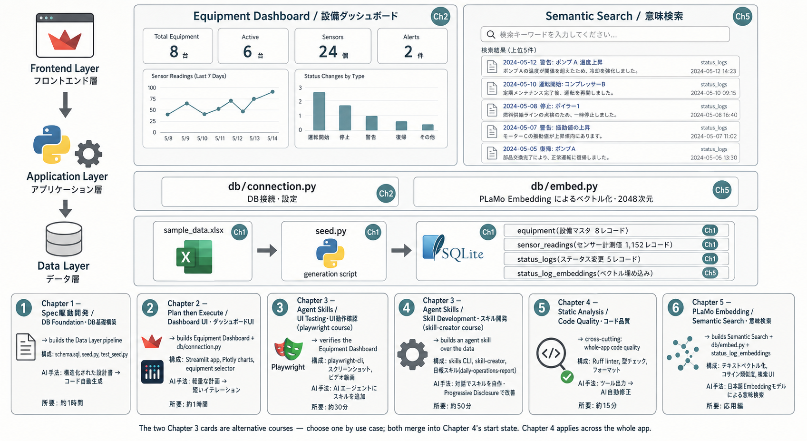

# 製造設備モニタリングダッシュボード - AI駆動開発ハンズオン

製造業向け設備稼働状況可視化アプリを、AI駆動開発の手法で段階的に構築するハンズオン教材です。

本リポジトリは Kiro IDE 版と Claude Code（CLI）版を **完全に別ディレクトリ** で提供します。両者は別物として運用しており、章構成・セットアップ手順・ツール固有の操作はそれぞれ独立に管理しています。最初にどちらのツールで進めるかを選び、以降は対応するディレクトリだけを参照してください。

## ツールを選ぶ

- Kiro IDE で進めたい人 → [`kiro/`](./kiro/README.md)
- Claude Code（CLI）で進めたい人 → [`claude-code/`](./claude-code/README.md)

それぞれのディレクトリ直下に `SETUP.md`（セットアップガイド）と各章（`ch1/`, `ch2/`, ...）が揃っています。



<!--
Image generation prompt for the overview diagram (assets/root/all.png) / gpt-image-2 (codex-image-gen)
Instructions are in English; the in-image labels stay mixed Japanese + English (render the exact text below).

Create a wide flat infographic / technical architecture diagram, ~2816x1536 px landscape.
CALM, LOW-SATURATION palette, easy on the eyes: off-white background, neutral light-gray cards with thin
slate-gray borders and soft subtle shadows, dark slate-gray text, and ONE muted accent (desaturated teal /
blue-gray) used sparingly for headings and small chapter badges. Avoid bright/vivid colors and rainbow-colored
cards; keep everything monochrome-leaning with the single accent — EXCEPT keep recognizable real service/tool
icons (Microsoft Excel, Python, SQLite, Streamlit, Plotly, Playwright) in their familiar shape and colors so
they are easy to identify; just don't oversaturate the surrounding card backgrounds. Do NOT invent a "Ruff"
logo; for code quality use a plain generic icon (a magnifying glass over code with a small checkmark).

GOAL: make it obvious WHICH CHAPTER builds WHICH PART, but WITHOUT any connector lines or arrows between the
chapter cards and the diagram (those look cluttered — do NOT draw them). Convey the mapping in two quiet ways
only: (a) tag each architecture component with a small round chapter badge (e.g. "Ch1"); (b) give each bottom
chapter card a short scope note ("→ builds ..."). The only arrows allowed are (i) the vertical layer-flow
arrows between the three architecture layers and (ii) the horizontal data-pipeline arrows inside the Data Layer
(Excel → seed.py → SQLite). Do NOT add any other connector lines. Cross-cutting chapters are noted as spanning the whole app.

== TOP: 3-layer architecture ==
On the left, stack each layer's label (icon + English name + Japanese name) vertically, connected top-to-bottom with arrows.

1) Frontend Layer / フロントエンド層 (Streamlit / browser icon)
   - Two app-screenshot-style cards:
     * "Equipment Dashboard / 設備ダッシュボード" [badge Ch2]: dashboard with line charts, bar charts, KPI metrics
     * "Semantic Search / 意味検索" [badge Ch5]: search box with a result list
2) Application Layer / アプリケーション層 (Python / gear icon)
   - Two code-file boxes:
     * db/connection.py (DB接続・設定) [badge Ch2]
     * db/embed.py (PLaMo Embedding によるベクトル化・2048次元) [badge Ch5]
3) Data Layer / データ層 — show a LEFT-TO-RIGHT data pipeline with small horizontal arrows between the three
   stages (this is the Chapter 1 build flow):
   sample_data.xlsx (green Microsoft Excel icon) [Ch1]  →  seed.py (blue/yellow Python icon, generation script) [Ch1]
   →  SQLite database (SQLite cylinder/logo icon) holding 4 tables:
      equipment(設備マスタ 8レコード)[Ch1] / sensor_readings(センサー計測値 1,152レコード)[Ch1]
      / status_logs(ステータス変更 5レコード)[Ch1] / status_log_embeddings(ベクトル埋め込み)[Ch5]

== BOTTOM: chapter roadmap, 6 UNIFORM neutral cards in a horizontal row (left-to-right progression) ==
All cards share the same light-gray style; differentiate only by a numbered badge + the single muted accent,
plus a small recognizable tool icon per card: Ch1 spec/document, Ch2 Streamlit+Plotly, Ch3 Playwright,
Ch3 skill/gear, Ch4 generic code-quality icon (magnifying glass over code with a checkmark — NOT a Ruff logo),
Ch5 embedding/vector.
Each card: heading "Chapter N — method (EN) / method (JP)" + subtitle (EN/JP) + 3 lines (構成: / AI手法: / 所要:).
No connector lines between cards and the diagram; the scope note inside each card carries the mapping.

1) Chapter 1 — Spec駆動開発 / DB Foundation・DB基礎構築   → builds the Data Layer
   構成: schema.sql, seed.py, test_seed.py
   AI手法: 構造化された設計書 → コード自動生成
   所要: 約1時間
2) Chapter 2 — Plan then Execute / Dashboard UI・ダッシュボードUI   → builds Equipment Dashboard + db/connection.py
   構成: Streamlit app, Plotly charts, equipment selector
   AI手法: 軽量な計画 → 短いイテレーション
   所要: 約1時間
3) Chapter 3 — Agent Skills / UI Testing・UI動作確認 [playwright course]   → verifies the Equipment Dashboard
   構成: playwright-cli, スクリーンショット, ビデオ録画
   AI手法: AIエージェントにスキルを追加
   所要: 約30分
4) Chapter 3 — Agent Skills / Skill Development・スキル開発 [skill-creator course]   → builds an agent skill over the data
   構成: skills CLI, skill-creator, 日報スキル(daily-operations-report)
   AI手法: 対話でスキルを自作・Progressive Disclosure で改善 (pnpm + minimum-release-age でサプライチェーン防御)
   所要: 約50分
5) Chapter 4 — Static Analysis / Code Quality・コード品質   → cross-cutting: whole-app code quality
   構成: Ruff linter, 型チェック, フォーマット
   AI手法: ツール出力 → AI自動修正
   所要: 約15分
6) Chapter 5 — PLaMo Embedding / Semantic Search・意味検索   → builds Semantic Search + db/embed.py + status_log_embeddings
   構成: テキストベクトル化, コサイン類似度, 検索UI
   AI手法: 日本語Embeddingモデルによる意味検索
   所要: 応用編

Note (small print): the two Chapter 3 cards are alternative courses — choose one by use case; both merge into
Chapter 4's start state. Chapter 4 applies across the whole app.
Output size: 2816x1536.
-->

## ディレクトリ構成

```
manufacturing-monitor-ai-handson/
├── README.md         # このファイル（入口・ツール選択ガイド）
├── assets/           # 共有画像（両ディレクトリから ../assets/ で参照）
├── tools/            # サンプル Excel 生成ツールなどの共有ユーティリティ
├── kiro/             # Kiro IDE 版のセットアップ + 各章
│   ├── README.md
│   ├── SETUP.md
│   ├── ch1/ … ch5_fin/
│   └── works/
└── claude-code/      # Claude Code 版のセットアップ + 各章
    ├── README.md
    ├── SETUP.md
    ├── .claude/      # rules / skills（sync-chapters など）
    └── ch1/ … ch5_fin/（および ch3-playwright / ch3-skill-creator）
```

> [!NOTE]
> リポジトリ全体の lint / format（cspell・textlint・prettier）と Git フック（lefthook）はリポジトリ直下で一元管理しています。設定ファイルは `package.json` / `turbo.json` / `lefthook.yml` / `.cspell.json` / `.textlintrc.json` です。

> [!NOTE]
> 本ハンズオン全体で約100クレジットを使用します。

> [!WARNING]
> 各チャプターは続きから行うことを推奨します。これは LLM が非決定的な出力をした結果として進行が詰まる可能性があるためです。
