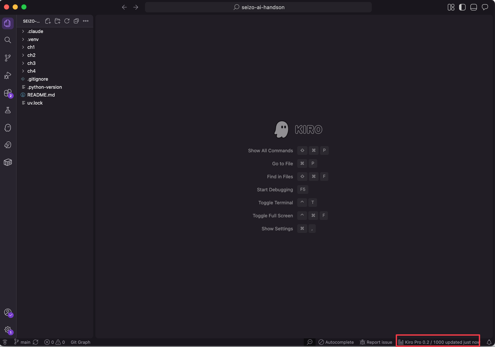
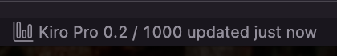
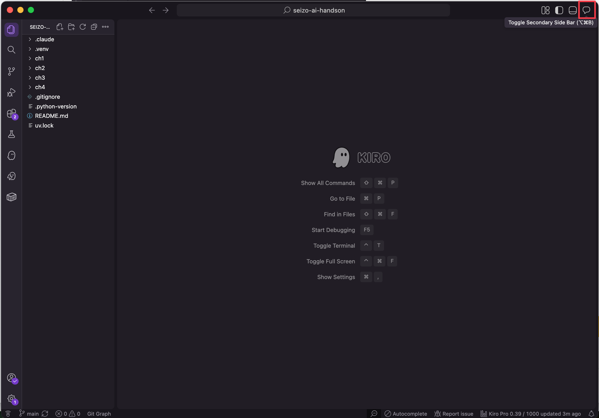
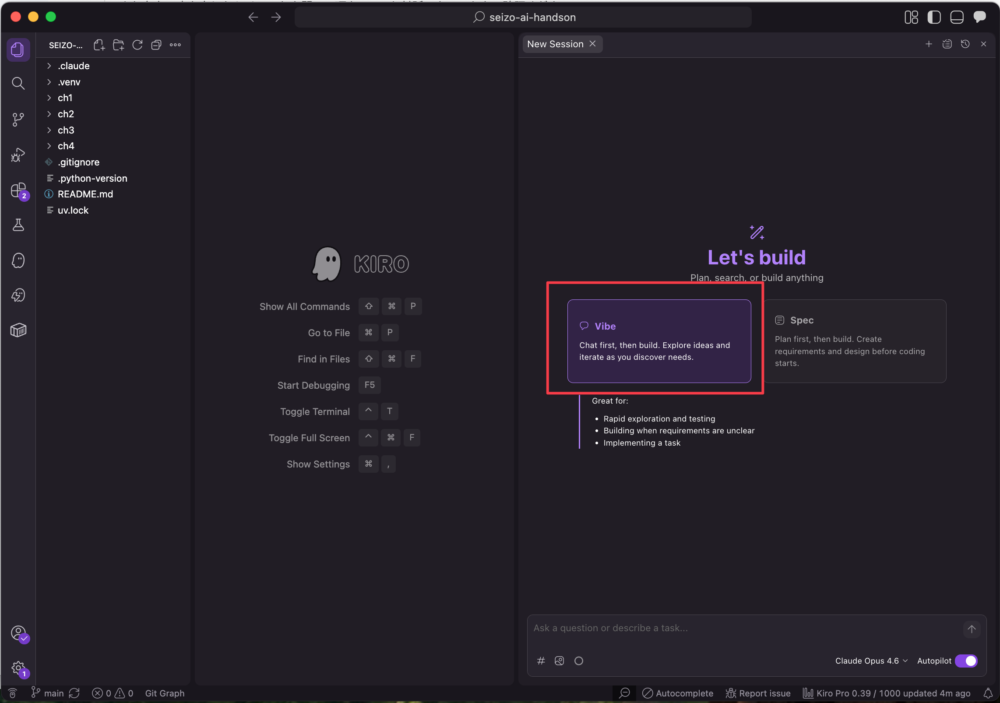
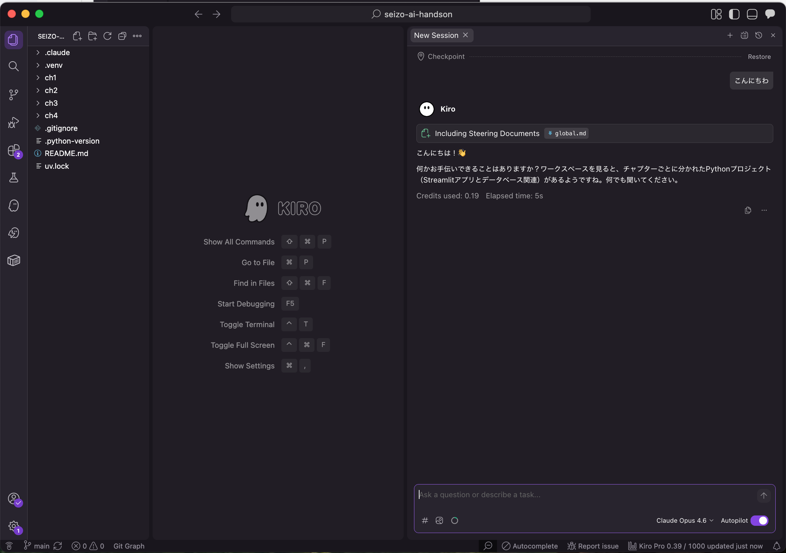

# セットアップガイド

このハンズオンに必要なツールのインストール手順です。Windows環境を対象としています。

## 必須ツール（全チャプター共通）

| ツール                             | バージョン | 提供元                     | 用途                             |
| ---------------------------------- | ---------- | -------------------------- | -------------------------------- |
| [Python](https://www.python.org/)  | 3.12以上   | Python Software Foundation | アプリケーション実行             |
| [uv](https://docs.astral.sh/uv/)   | 0.10.4     | Astral                     | Pythonパッケージ管理・タスク実行 |
| [Kiro](https://kiro.dev/)          | 最新       | Amazon                     | AI駆動開発IDE                    |
| [SQLite3](https://www.sqlite.org/) | 3.x        | SQLite Consortium          | DBレコード確認                   |

## チャプター別の追加ツール

| ツール                                                        | 対象チャプター                     | 提供元            | 用途                         |
| ------------------------------------------------------------- | ---------------------------------- | ----------------- | ---------------------------- |
| [Node.js](https://nodejs.org/)                                | ch3-playwright / ch3-skill-creator | OpenJS Foundation | playwright-cli / skills 実行 |
| [playwright-cli](https://github.com/microsoft/playwright-cli) | ch3-playwright                     | Microsoft         | ブラウザ自動操作             |
| [pnpm](https://pnpm.io/)                                      | ch3-skill-creator                  | pnpm              | Node パッケージマネージャ    |
| [skills](https://www.npmjs.com/package/skills)                | ch3-skill-creator                  | vercel-labs       | Agent Skills 導入・管理 CLI  |

### Pythonライブラリ一覧

各チャプターディレクトリで `uv sync` を実行すると自動インストールされます。

| ライブラリ    | バージョン | ch1 | ch2 | ch3 | ch4 | ch5 | 用途                        |
| ------------- | ---------- | --- | --- | --- | --- | --- | --------------------------- |
| streamlit     | >=1.45.0   | ✓   | ✓   | ✓   | ✓   | ✓   | UIフレームワーク            |
| pandas        | >=2.2.0    | ✓   | ✓   | ✓   | ✓   | ✓   | データフレーム処理          |
| plotly        | >=6.0.0    | ✓   | ✓   | ✓   | ✓   | ✓   | インタラクティブチャート    |
| openpyxl      | >=3.1.0    | ✓   | ✓   | ✓   | ✓   | ✓   | Excel読み込み               |
| pytest        | >=8.0.0    | ✓   | ✓   | ✓   | ✓   | ✓   | テスト実行                  |
| ruff          | >=0.11.0   |     |     |     | ✓   | ✓   | リンター・フォーマッター    |
| torch         | 最新       |     |     |     |     | ✓   | PyTorch（推論バックエンド） |
| transformers  | 最新       |     |     |     |     | ✓   | Hugging Face Transformers   |
| sentencepiece | 最新       |     |     |     |     | ✓   | トークナイザー              |

## インストール手順

### 1. Python

wingetでインストールします。

```powershell
winget install -e --id Python.Python.3.12
```

インストール後、バージョンを確認します。

```powershell
python --version
# Python 3.12.x と表示されればOK
```

> 公式サイトからインストーラーをダウンロードする場合は、インストール時に「Add Python to PATH」にチェックを入れてください。

### 2. uv

PowerShellで以下を実行します。

```powershell
powershell -ExecutionPolicy ByPass -c "irm https://astral.sh/uv/0.10.4/install.ps1 | iex"
```

インストール後、ターミナルを再起動してバージョンを確認します。

```powershell
uv --version
# uv 0.10.4 と表示されればOK
```

### 3. Kiro

管理者にライセンスを付与してもらった上で、[公式サイト](https://kiro.dev/)からインストーラーをダウンロードし、画面の指示に従ってインストールしてください。

#### 3.1. ライセンスの確認

Kiro IDE を起動し、画面右下のステータスバーでライセンス情報を確認します。



拡大すると以下のように表示されます。**Free になっていないこと**（Pro、Pro+、Power のいずれかであること）をご確認ください。



> ライセンスが正しく付与されているかの確認です。

#### 3.2. チャットが開始できることの確認

右上の吹き出しアイコンからチャットパネルを開きます。



**Vibe** モードを選択します。



チャット欄に「こんにちは」などメッセージを入力し、応答が返却されることをご確認ください。



> 生成AIへリクエストが正常に送信できるかの確認です。

### 4. SQLite3

wingetでインストールします。

```powershell
winget install -e --id SQLite.SQLite
```

インストール後、ターミナルを再起動してバージョンを確認します。

```powershell
sqlite3 --version
# 3.x.x と表示されればOK
```

動作確認として、インメモリDBで簡単な操作を試します。

```powershell
sqlite3 ":memory:" "CREATE TABLE test(id INTEGER, name TEXT); INSERT INTO test VALUES(1, 'hello'); SELECT * FROM test;"
# 1|hello と表示されればOK
```

### 5. Node.js（ch3-playwright で必要）

wingetでインストールします。

```powershell
winget install -e --id OpenJS.NodeJS.LTS
```

インストール後、バージョンを確認します。

```powershell
node --version
# v22.x.x 以上であればOK
```

### 6. playwright-cli（ch3-playwright で必要）

Node.jsインストール後に以下を実行します。

```powershell
npm install -g @playwright/cli@0.1.1
```

ブラウザバイナリをインストールします。

```powershell
npx playwright install
```

動画録画機能を使う場合は、ffmpegも追加でインストールします。

```powershell
npx playwright install ffmpeg
```

インストール後、動作確認します。

```powershell
npx playwright-cli --version
```

### 7. pnpm + skills CLI（ch3-skill-creator で必要）

ch3-skill-creator では `vercel-labs/skills` CLI を使って Agent Skills を導入します。pnpm の `minimum-release-age` を使ったサプライチェーン防御が学習ポイントです。

Node.js 付属の Corepack で pnpm を有効化します。

```powershell
corepack enable
corepack prepare pnpm@10.33.0 --activate
pnpm --version
# 10.16 以上であればOK（minimum-release-age 対応）
```

skills CLI はグローバルインストールせず、章ディレクトリの `package.json` に devDependency として固定されています。章ディレクトリでの動作確認:

```powershell
cd ch3-skill-creator
pnpm install
pnpm exec -- skills --version
# 1.4.6 と表示されればOK
```

章の詳細は [ch3-skill-creator/README.kiro.md](./ch3-skill-creator/README.kiro.md) を参照してください。

各チャプターの起動方法は [README.md](./README.md) のチャプター構成を参照してください。
