# ch1: Spec駆動開発 - プロジェクト基盤 & DB

## 概要

製造設備モニタリングダッシュボードのデータ基盤を構築します。

Excelファイル(`sample_data.xlsx`) が用意されています。こちらを解析して、

- テーブルを作成する `schema.sql`
  - 設備マスタ
  - センサー時系列データ
  - ステータス変更履歴
- テーブルへ投入するスクリプト `seed.py`

## 体験すること（約10分｜経過 約10分）

KiroのSpec駆動ワークフローを使い、製造設備モニタリングダッシュボードのデータ基盤を構築します。
Vibeモードでのデータ解析、Specモードでの仕様策定（要件定義→設計→タスク分解）、タスク実行によるコード生成を一連の流れで体験します。

### Spec駆動開発とは

Spec駆動開発は、AIに対して構造化された仕様書を入力として与え、コードを生成させる開発手法です。自然言語プロンプトから即座にコードを生成するVibe Codingとは異なり、Requirements（要件定義）→ Design（設計）→ Tasks（タスク分解）の3ステップで進行します。成果物はバージョン管理されるMarkdownファイルとして永続化されます。

### Spec駆動開発の課題

Spec駆動開発にはいくつかの課題が指摘されています。

- 要件→設計→実装という順序的プロセスがウォーターフォールに似ており、ソフトウェア開発の非決定的な性質と相性が悪い
- 単純なバグ修正が4つのユーザーストーリー・16の受け入れ基準に膨張するなど、小さな変更に対して過剰になりやすい
- コードの進化に合わせて仕様を同期し続けるメンテナンスコストが増大する
- 包括的な仕様を与えても、AIエージェントが指示を誤解・無視するケースがある
- LLMの出力は確率的であり、Specどおりに実装される保証はない。正確性を検証する仕組みは未整備で、テストやコードレビューは人間が担わなければならない
- 既存の開発プロセスを変えずにSDDを導入した場合、Specレビューという重い工程が単純に1つ追加されるだけになる


### それでもSpec駆動が重要な理由

SDDはウォーターフォールではなく、繰り返しを前提としたループ構造です。AIが実装→テスト→フィードバックのサイクルを高速化することで、日単位での反復が可能になります。

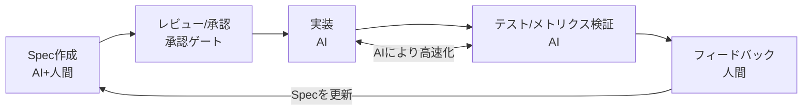

このループ構造には2つの重要なポイントがあります。

1つ目は検証可能性です。Specの振る舞い仕様がユニットテストと結びつくことで、Specから下流の検証まで自動化されます。理想的にはコードレビューを大幅に軽減できます。

2つ目はフィードバックループです。Specは一度きりのものではなく、仮説と要件を一時的にFixした反復プロセスです。フィードバックから得られた知見をSpecに反映し、永続的な仕様として蓄積していきます。このサイクルが短いことを前提に成り立っている考え方です。

歴史的にも、COBOL（1959年）は「英語でプログラムを書ける」ことを目指しましたが、プログラマーは不要とならず、仕事がより高い抽象度へ移行しました。MDD（2000年代）やNo-Code（2010年代）も同様のパターンを辿っています。Spec駆動開発もコードをなくすことが目的ではなく、AIへ渡す前に意図を構造化し、高速なフィードバックループの中で仕様を洗練させていく手法です。

## 1. Vibeモードでエクセルの内容を解析する（約10分｜経過 約20分）

### 1.1. モード選択

- Vibeモードを選択
- モデルがOpus 4.6になっていることを確認

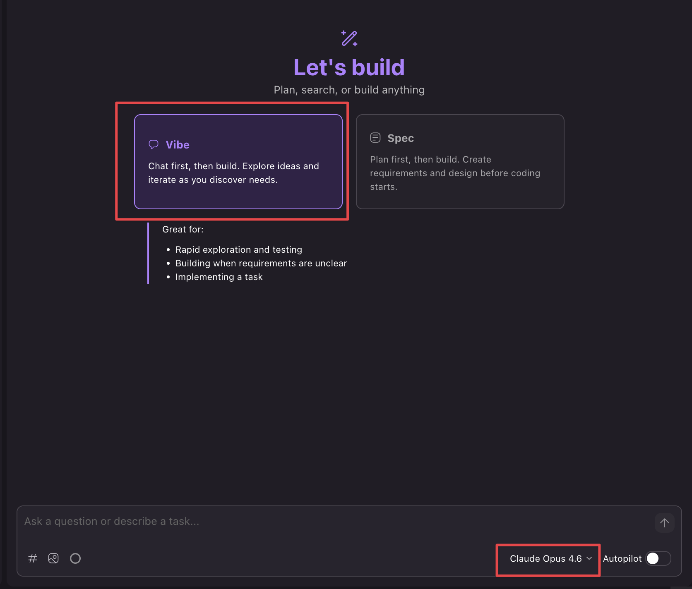

### 1.2. エクセル解析プロンプトを入力

> [!IMPORTANT]
> `#sample_data.xlsx` の部分はコピペせず、`#` を入力してファイル選択UIから選んでください。それ以外の部分はコピペで問題ありません。以下のプロンプトを入力します。

```text
#sample_data.xlsx を添付します。

以下の観点で構造を分析してください。

1. シート一覧と各シートの役割
2. 各シートのカラム構成（列名・データ型・サンプル値）
3. シート間の関連性（IDの参照関係など）
4. データの件数や値の傾向

結果はシートごとにまとめてください。
```

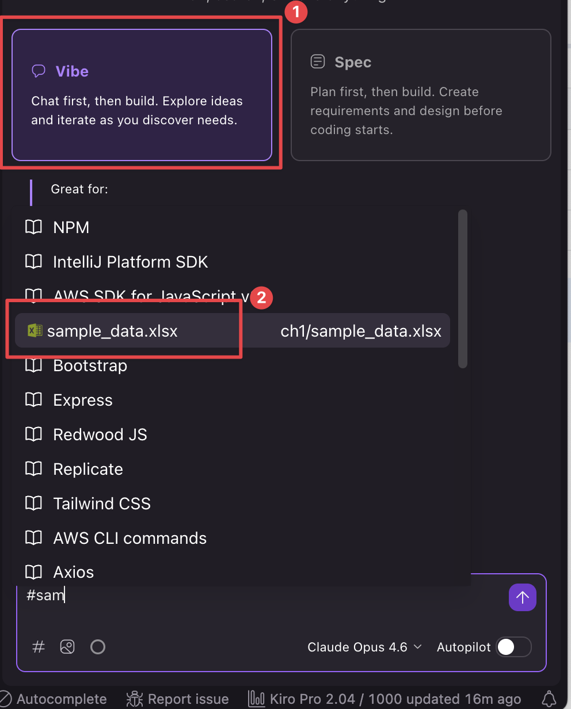

#### チェック項目

- [ ] エクセルシートと比較して、ざっくりあっていることを確認してください

### 1.3. 解析結果をSteeringに登録する

1.2のチャットの続きで、以下のプロンプトを入力して解析結果をSteeringに登録します。

```text
上記の解析結果をSteeringに登録してください。
```

`.kiro/steering/` 配下にファイルが作成されていることを確認してください。

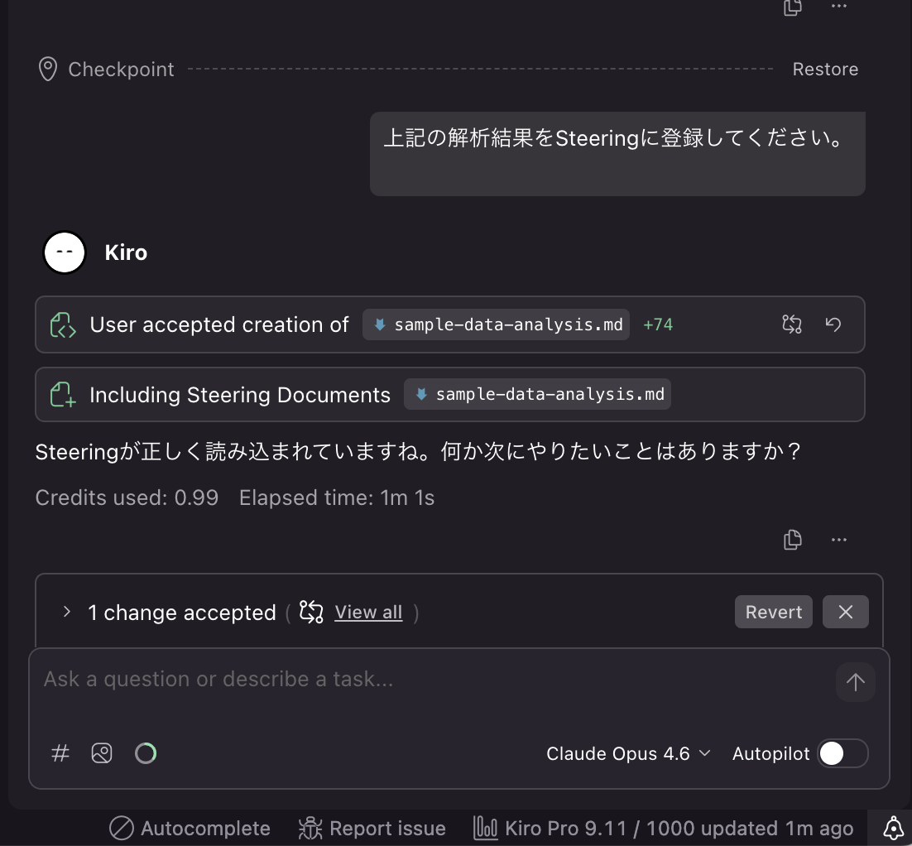
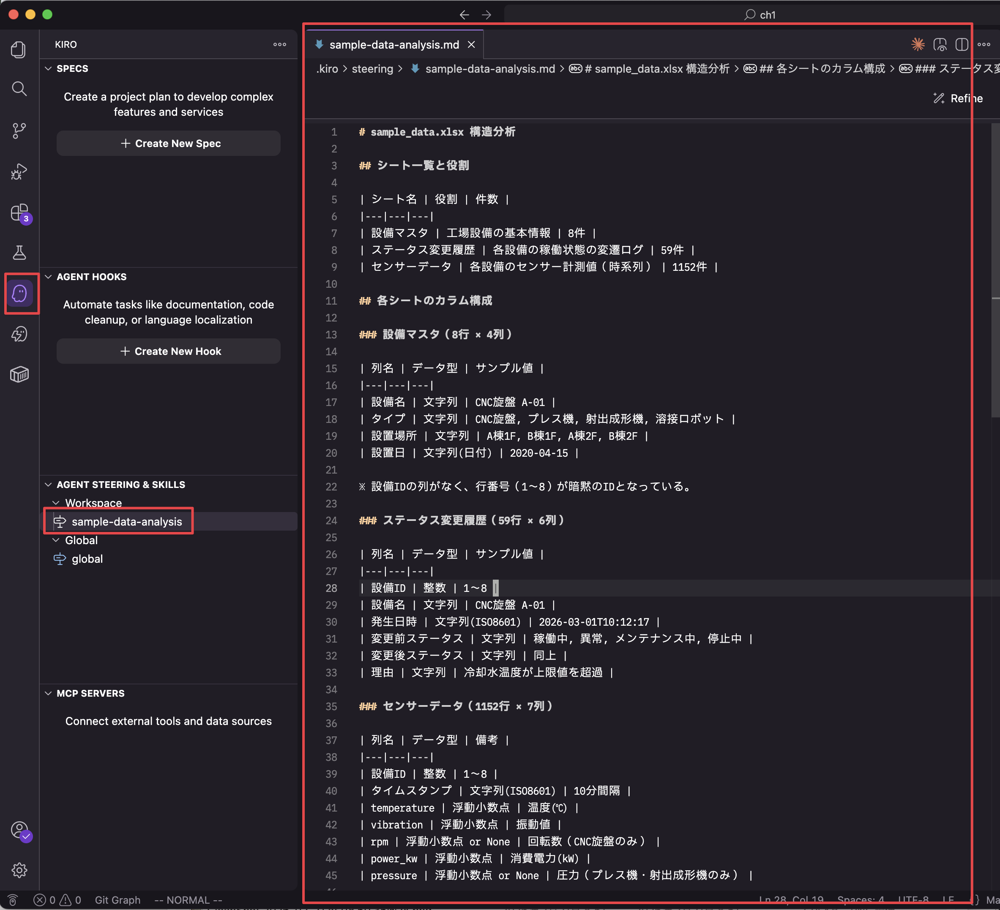

> [!NOTE]
> 今回は機能紹介も含めてSteeringに登録しています。そのまま内容をコピーして渡しても問題ないです。ただしエクセルフォーマットなどは、今後も活用する可能性が高いケースは、このようにxxxエクセルの仕様ということで登録すると効率がよくなります。

#### チェック項目

- [ ] `sample_data.xlsx` を開き、シート構成・カラム情報・データ件数がSteeringの内容と一致していることを確認してください

## 2. SpecモードでSQLiteに登録するseed.pyを作成する（約30分｜経過 約50分）

### 2.1. モード選択

- Specモードを選択
- モデルがOpus 4.6になっていることを確認
- Build a Featureを選択
- Requirementsを選択

```text
エクセルをインプットに、データを投入する seed.py を作成します。
seed.py にハードコードされたデータ定数は一切持たせず、全てのデータをExcelから読み込んでください。
Excelのシート構造の詳細はSteeringを参照してください。

## 作りたいもの

製造設備の稼働状況をリアルタイムで監視するダッシュボードアプリのデータ基盤です。シードスクリプトで初期データを投入します。

## 技術スタック

- Python 3.12以上
- SQLite（ファイルベースDB）

## specに含めてほしい内容

1. ディレクトリ構成
2. DBスキーマ定義 — Excelのデータ構造をもとにCREATE TABLE文を設計
3. シードデータ投入ロジック
4. 検証方法 — 動作確認コマンド
```

> [!NOTE]
> **Feature Specの2つのワークフロー**
>
> KiroのFeature Specには[Requirements-First](https://kiro.dev/docs/specs/feature-specs/requirements-first/)と[Tech Design-First](https://kiro.dev/docs/specs/feature-specs/tech-design-first/)の2つのワークフローがあります。
>
> |                | Requirements-First                             | Tech Design-First                                                    |
> | -------------- | ---------------------------------------------- | -------------------------------------------------------------------- |
> | 流れ           | 要件 → 設計 → タスク                           | 設計 → 要件 → タスク                                                 |
> | 起点           | **何を作るか**（ユーザーストーリー・振る舞い） | **どう作るか**（アーキテクチャ・技術制約）                           |
> | 向いている場面 | ユーザー要求が明確で技術制約が少ない新規開発   | 非機能要件（レイテンシ・スループット等）が厳しい場合や既存設計の移植 |
>
> 今回は「Excelからデータを読み込んでSQLiteに投入する」というユーザー要求が明確なため、Requirements-Firstを選択しています。

### 2.2. 要件定義書(requirements.md) の作成

- 作成されたら、Open Previewでマークダウンをレビュー

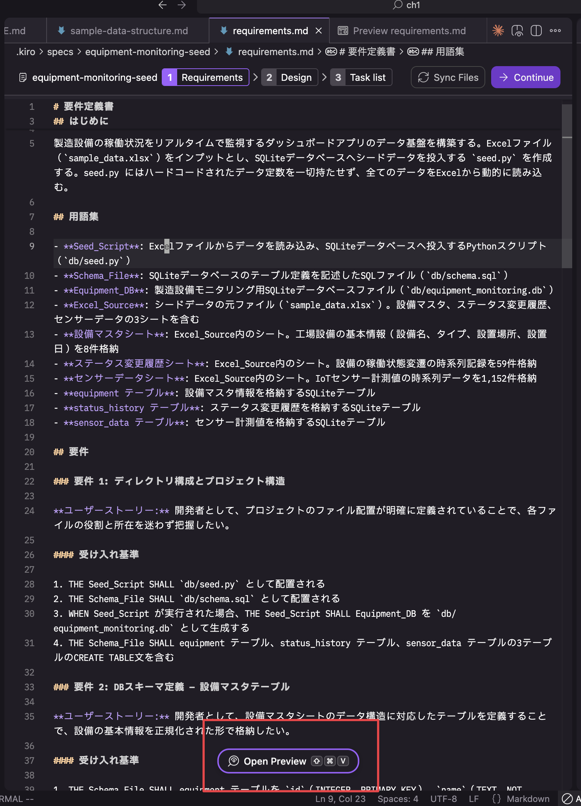

- 今回はハンズオンのためレビューは以下のみ確認で問題ないです(後の進行に影響はないため)
  - seed.pyやdata/factory.dbが作成されること
  - テーブルが3つ作成されること
- 問題なければ、Continueを押下し、Generate Designを押下します。

<details>
<summary>要件例</summary>

1. 要件 1: ディレクトリ構成とプロジェクト構造
2. 要件 2: DBスキーマ定義 — 設備マスタテーブル
3. 要件 3: DBスキーマ定義 — ステータス変更履歴テーブル
4. 要件 4: DBスキーマ定義 — センサーデータテーブル
5. 要件 5: Excelデータ読み込みロジック
6. 要件 6: シードデータ投入ロジック
7. 要件 7: データ整合性の検証
8. 要件 8: エラーハンドリング

</details>

### 2.3. 設計ファイル(design.md) の作成

- 作成されたら、Open Previewでマークダウンをレビュー
- 今回はハンズオンのためレビューは以下のみ確認で問題ないです(後の進行に影響はないため)
  - seed.pyやdata/factory.dbが作成されること
  - テーブルが3つ作成されること

こんな感じのアーキテクチャ図が出てくれば問題ないです
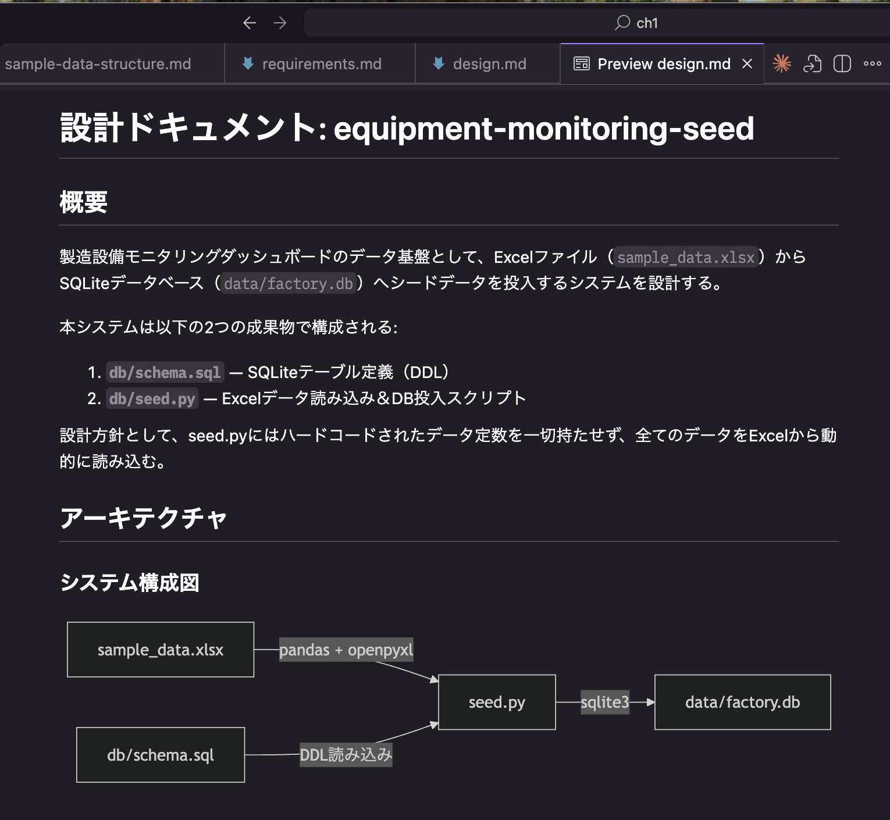

- 問題なければ、Continueを押下し、Generate Tasksを押下します。

### 2.4. 設計ファイル(task.md) の作成

作成したら、Sonnet 4.6に変更してタスクを進めます。クレジット消費を抑えるため、タスク実行にはSonnetを使用します。

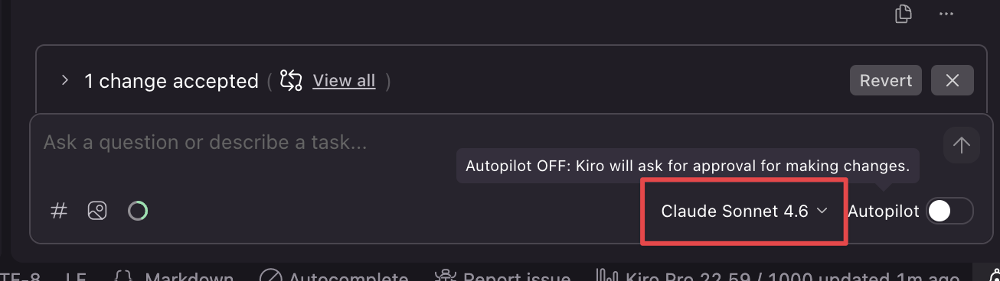

タスクは1つずつ実行してください

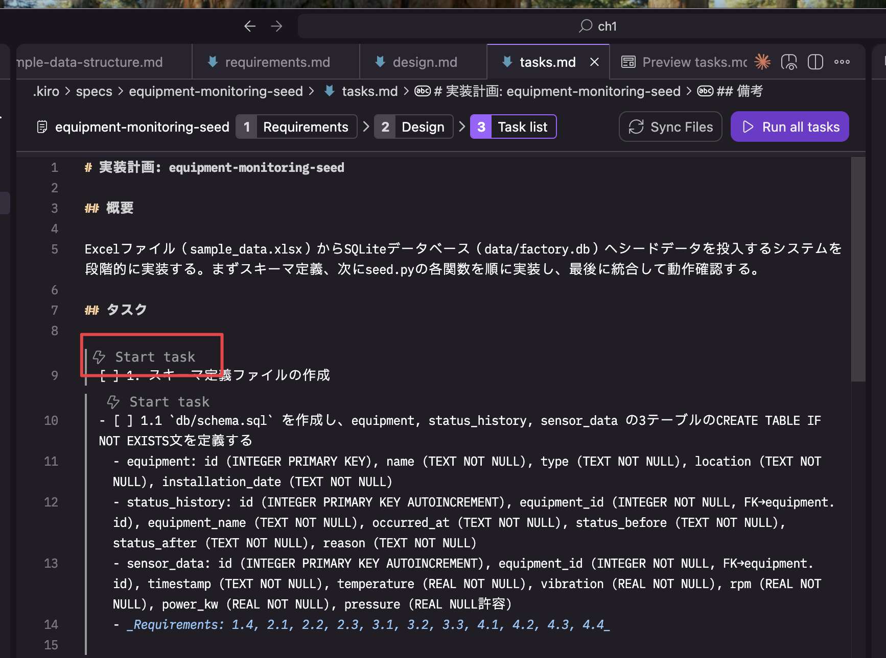

- タスクが全て終わるまでトライしてみてください(以下の画像のようにタスクのところに♻️マークがない場合、承認待ちの可能性があるのでチャット欄を確認してください)

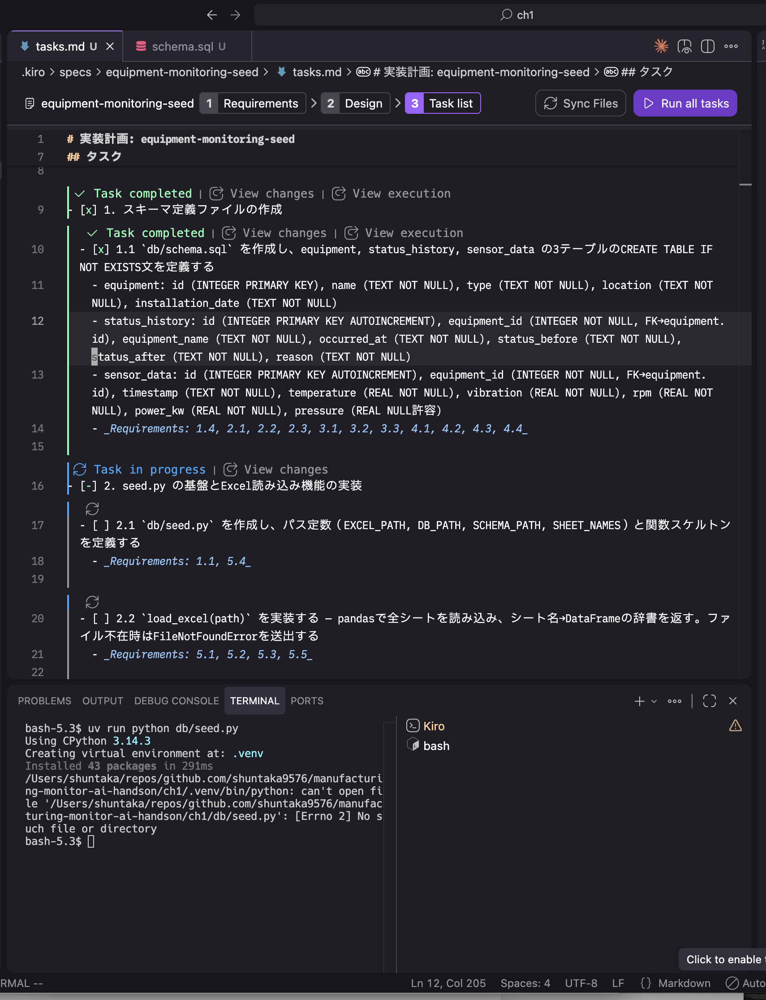

グレーアウトされているタスクはオプショナルタスク（テスト関連など）です。Spec作成時に「Keep optional tasks (faster MVP)」が選択された場合に生成されます。これらは実行しなくて問題ないです。必要に応じて「Make task required」で必須に変更することもできます。
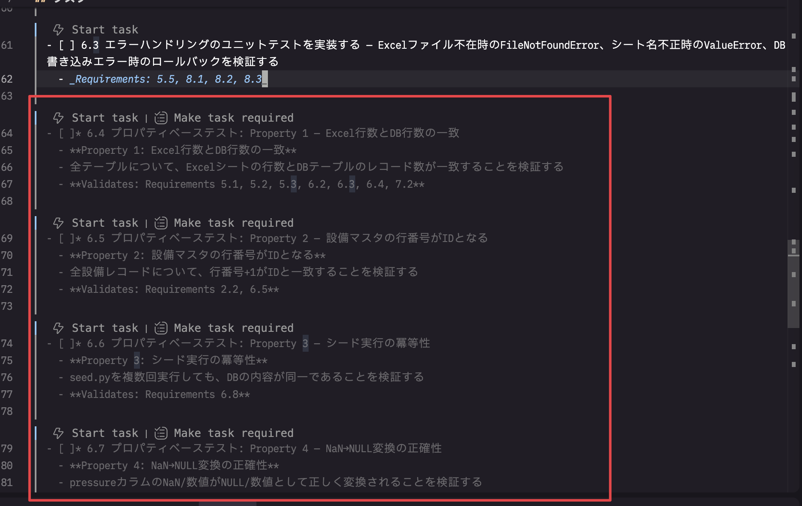

```
自分でテストしたい場合、テストの実行方法とSQLiteの実行方法両方教えて
```

## 3. 検証（約10分｜経過 約60分）

ターミナルを起動し、スクリプトを検証してください

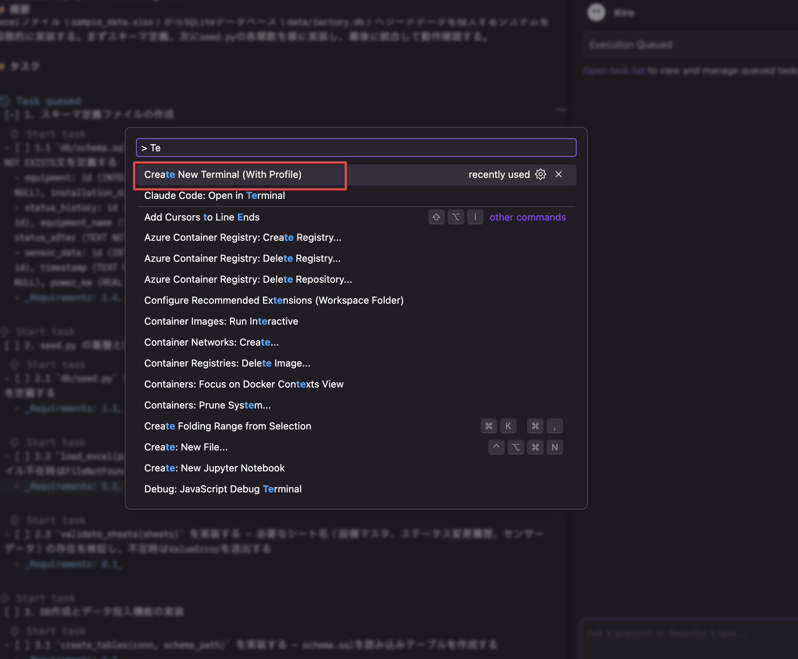

エクセルの内容がDBに入っていることがざっくり確認できること

> [!NOTE]
> AIの出力により、DBファイルのパスやテーブル名が以下の例と異なる場合があります。実際に生成されたコードに合わせて読み替えてください。

```bash
# シードスクリプト単体実行
uv run python db/seed.py

# テスト実行（現在はフィクスチャのみ）
uv run pytest tests/test_seed.py -v
```

sqlite3 CLIで接続し、データを確認します。

```bash
sqlite3 data/factory.db
```

```sql
.tables                          -- テーブル一覧
.schema equipment                -- スキーマ確認

-- レコード数をカウント
SELECT COUNT(*) FROM equipment;
SELECT COUNT(*) FROM status_logs;
SELECT COUNT(*) FROM sensor_readings;

-- データの中身が正しく入っていることを確認
SELECT * FROM equipment;
SELECT * FROM sensor_readings WHERE equipment_id = 1 LIMIT 5;

-- 外部キー確認
PRAGMA foreign_key_list(status_logs);

.quit
```

## 4. 時間が余ったら（約10分）

### 4.1. テストケースに関して

AIに任せたテストケースは冗長であるケースが多いです。生成されたテストコードを見て、どのような点が冗長か考えてみてください。

<details>
<summary>回答例</summary>

### 1. プロパティベーステスト(hypothesis)の誤用

`@given(st.data())` + `max_examples=100` を使っているが、入力データは固定のExcelファイルです。ランダム生成する対象がないため、同一テストを100回繰り返すだけで意味がありません。

### 2. スキーマのテキスト解析テスト

`test_schema_has_all_tables`、`test_schema_if_not_exists` など、schema.sqlの文字列をパースして検証しています。DDLを実行してテーブルが使えれば十分であり、SQLテキストの構文をテストする必要はありません。

### 3. フィクスチャと重複するテスト

`test_seed_creates_db_file`（DBファイルが作成されること）や `test_foreign_keys_enabled`（外部キーが有効なこと）は、他のテストのフィクスチャ（`seeded_db`）内で暗黙的に検証済みです。独立したテストケースにする意味がありません。

### 4. 全テーブルのフルラウンドトリップテスト

3テーブル全てに対してExcel全行とDB全行を1行ずつ比較しています。件数チェック＋サンプル数行の比較で十分なケースが多く、1,152行のセンサーデータを全行比較するのは過剰です。

</details>

### 4.2. 設備の稼働状況を分析するSQLをAIに生成させる

作成したDBに対して、以下のような分析要件のSQLをAIに生成させてみてください。以下はプロンプト例です。

```text
各設備について、ステータスごとの滞在時間（分）を計算したSQLを作成し、実行できることを確認したのち提供してください
```

```text
各設備のセンサーデータについて、直近6件の移動平均温度を計算し、現在値が移動平均の1.5倍を超えるレコードを異常候補として抽出してください
```

生成されたSQLを `sqlite3 data/factory.db` で実行して、結果を確認してみてください（パスはAIの出力に合わせて読み替えてください）。
