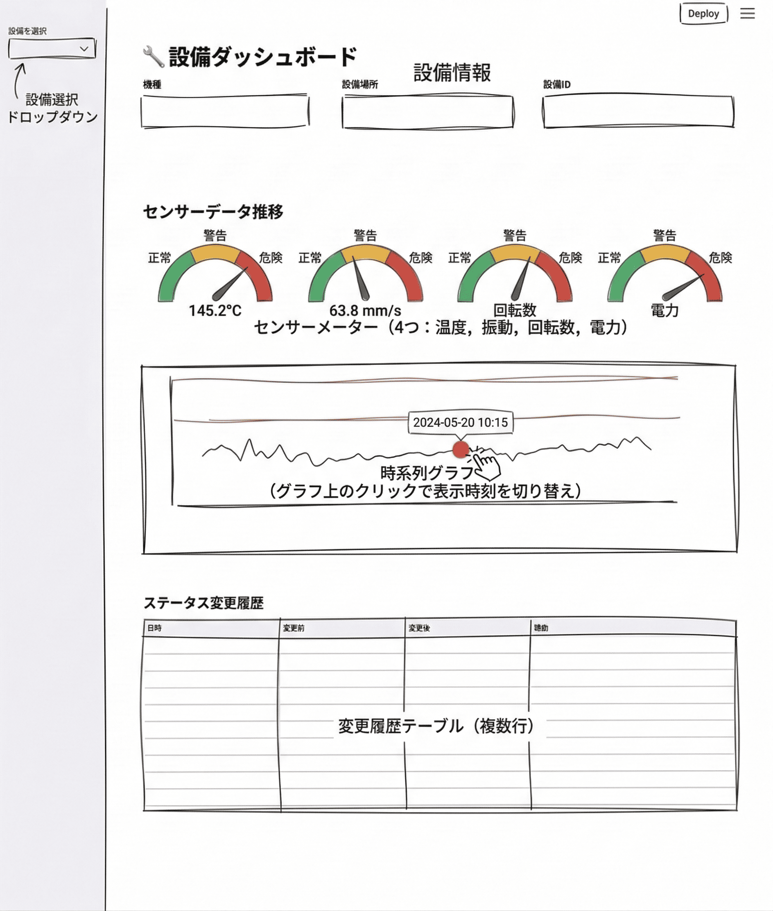

# ch2: Plan then Execute - 設備ダッシュボード（Claude Code 版）

Kiro IDE で進めたい方は [README.kiro.md](./README.kiro.md) を参照してください。

## 概要

ch1で構築したDB基盤を活用して、Streamlitによる製造設備モニタリングダッシュボードのUIを作成します。

- エントリーポイント `app.py`
- 設備ダッシュボードページ `pages/01_equipment_dashboard.py`
  - ゲージチャート・時系列チャート・ステータス変更履歴

## 体験すること（約5分｜経過 約5分）

Claude Code の **ネイティブ プランモード**（`Shift+Tab` で切り替え）を使い、Plan then Execute パターンを体験します。
完成イメージの画像を AI に渡して UI 仕様をプロジェクト知識に登録し、その仕様をもとにコードを生成させるという2段階の流れで進めます。

### Plan then Executeとは

AIコーディングエージェントにはプランモードがついています。これを使った短いイテレーションで実装、動作確認をするのが今の主流です。

1. **Plan（計画）**: AIに小さいタスクを投げ、仕様や実装計画を先に作らせる
2. **Execute（実装）**: 計画を確認したうえで、「実装してください」と指示する。足りない場合は1を継続。

Spec駆動と違い自分の頭で必要な最低限のことをAIが提案してくれるため、読むドキュメントや実装→動作確認のイテレーション間隔が短く、アジャイルに開発が可能です。

Claude Code では `Shift+Tab` でプランモードに切り替えると、ファイル編集やコマンド実行を抑制して計画立案のみを行わせることができます。計画を承認したうえで通常モードに戻して実装を指示します。

### Spec駆動開発との違い

| 観点               | Spec駆動（ch1）                                   | Plan then Execute（ch2）            |
| ------------------ | ------------------------------------------------- | ----------------------------------- |
| モード             | spec-kit + 通常モード                             | プランモード + 通常モード           |
| 実装前の成果物     | requirements.md → plan.md → tasks.md（3ファイル） | 必須の成果物なし（計画後すぐ実装）  |
| レビューの重さ     | 要件定義・設計の2段階レビュー                     | 仕様・計画の軽い確認                |
| 実装の進め方       | タスクを1つずつ実行                               | フェーズ単位で実装→動作確認のループ |
| フィードバック間隔 | 仕様確定後にまとめて実装                          | フェーズごとに動作確認              |

### 使い分けの指針

- **Spec駆動が向くケース**: 下流への影響が大きい基盤設計（DB、API）、仕様を永続的に残したい場合、複数人でのレビューが必要な場合
- **Plan then Executeが向くケース**: UIなど視覚的に検証できるもの、既存基盤の上に構築する場合、短いイテレーションで進めたい場合

## 前提

- ch1で作成したDB基盤（`db/schema.sql`, `db/seed.py`）が存在する
- Claude Code にログイン済み

## 0. ch2 プロジェクトを開く

```bash
cd ch2
uv sync
uv run python db/seed.py   # ch1 相当のDB準備
claude
```

```text
/model opus
```

## 1. UI仕様を作成する（約10分｜経過 約15分）

### 1.1. プランモードに切り替え

`Shift+Tab` を押して **plan mode** に切り替えます。入力欄の下に「plan mode」と表示されていることを確認してください。

### 1.2. ダッシュボード画像を渡してUI仕様を作成させる

ダッシュボードのざっくりとした画像が用意されています。こちらをベースに実装を行なっていきます。

> [!NOTE]
> **画像入力の実務的な位置づけ**
>
> 実務ではFigma MCP連携でデザインデータを直接AIに渡す方法が理想的です。コンポーネント名・カラーコード・レイアウト構造などのメタ情報をそのまま活用できます。
> 画像入力ではこれらのメタ情報が欠落し、解像度や手描き度合いによって認識精度にばらつきが出る欠点があります。
> ただしPoCや社内ツール開発では画像で十分回せます。



以下のプロンプトを入力します。画像は `@dashboard.png` で添付してください。

```text
@dashboard.png は製造設備モニタリングダッシュボードの完成イメージです。
この画像を分析して、UI仕様を `.claude/rules/dashboard-spec.md` に作成してください。

仕様には以下を含めてください。
- ページ構成とファイル配置
- 各UIコンポーネントの詳細（レイアウト、表示項目、チャートの種類と設定）
- 使用するライブラリとデータソース
```

プランモードなので、Claude Code は計画を提示するのみでファイルは作成しません。内容を確認し、問題なければ通常モードに戻して実装を指示します。

### 1.3. 計画承認・UI仕様の書き出し

`Shift+Tab` で通常モードに戻し、以下を入力します。

```text
計画に沿って `.claude/rules/dashboard-spec.md` を作成してください。
```

#### チェック項目

- [ ] `.claude/rules/dashboard-spec.md` が作成されていることを確認してください
- [ ] 仕様にゲージチャート・時系列チャート・ステータス変更履歴の仕様が含まれていることを確認してください

仕様に不足や問題があれば、この時点で修正を依頼してください。

## 2. UI仕様をもとに実装する（約30分｜経過 約45分）

### 2.1. 実装計画を作成させる

新しいセッションに切り替えたい場合、`/clear` でコンテキストをリセットしてください。再度 `Shift+Tab` でプランモードに入ります。

> [!NOTE]
> **計画の外部化**
>
> 今回は実装計画をマークダウンファイルとして書き出します。
> コンテキストの圧縮が起きるようなロングランの実装では、最初に立てたプランがコンテキストウィンドウから失われ、実装計画や受け入れ条件を忘れてしまいます。ファイルとして外部化しておけばAIはいつでも読み直せるため、長い実装でも一貫性を保てます。

```text
`.claude/rules/dashboard-spec.md` の UI 仕様に従い、実装計画を `plan/dashboard-tasks.md` に作成してください。

計画には以下を含めてください。
- 作成するファイルの一覧と役割
- 実装タスクのチェックリスト（TODO管理用）
- 各タスクの依存関係（実装順序）

まだ実装には着手せず、計画の作成のみ行ってください。
```

### 2.2. 実装計画の確認

`Shift+Tab` で通常モードに戻し、計画ファイルを作成させます。

```text
計画に沿って `plan/dashboard-tasks.md` を作成してください。
```

#### チェック項目

- [ ] `plan/dashboard-tasks.md` が作成されていることを確認してください
- [ ] タスクの粒度と実装順序が妥当であることを確認してください

### 2.3. 計画に沿って実装を実行する

タスク実行のクレジットを抑えるため、ここで Sonnet に切り替えます。

```text
/model sonnet
```

以下のプロンプトで実装を開始します。AIが生成する計画のフェーズ分割は毎回異なる場合があります。フェーズ数や粒度が異なっても問題ありません。

```text
`plan/dashboard-tasks.md` の計画に沿って、ダッシュボードを実装してください。
まずはフェーズ1を実装してください。動作確認方法を教えてください。

その後確認して問題ない場合、完了したタスクにはチェックを入れて進捗を管理してください。
```

```text
確認できました。次のフェーズに進んでください。
```

フェーズごとに動作確認を行い、問題がなければ次のフェーズに進む流れを繰り返します。

## 3. グラフクリックによるセンサー値連動を実装する（約10分｜経過 約55分）

`/clear` で新しいセッションを開始します（セクション2でコンテキストが大きくなっているため）。

### 3.1. プランモードで計画を立てさせる

`Shift+Tab` でプランモードに入ります。

```text
時系列グラフのデータ点をクリックしたら、ゲージチャートがその時刻のセンサー値に更新される機能を追加したいです。
まず実装計画を立ててください。
```

### 3.2. 計画を確認して実装させる

`Shift+Tab` で通常モードに戻し、実装させます。

```text
実装してください。
```

## 4. 検証（約5分｜経過 約60分）

ダッシュボードが正しく動作することを確認します。

```bash
uv run streamlit run app.py
```

#### チェック項目

- [ ] サイドバーから設備を選択し、設備情報カードが表示されること
- [ ] ゲージチャートにセンサー値と閾値による色分けが表示されること
- [ ] 時系列チャートに警告・危険の閾値ラインが表示されること
- [ ] ステータス変更履歴テーブルが表示されること
- [ ] グラフで選択した時刻に赤マーカーが表示されること
- [ ] 時系列グラフのデータ点をクリックすると、ゲージチャートが選択時刻の値に更新されること
