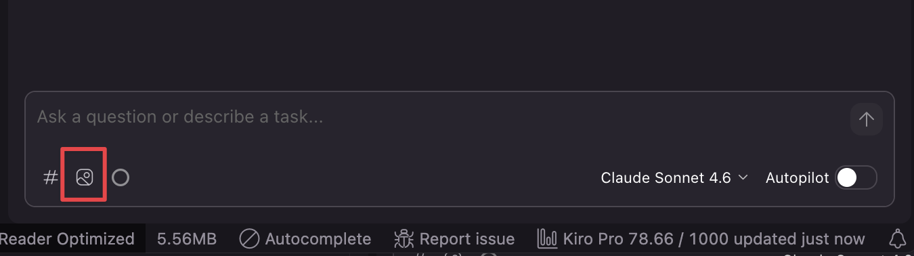
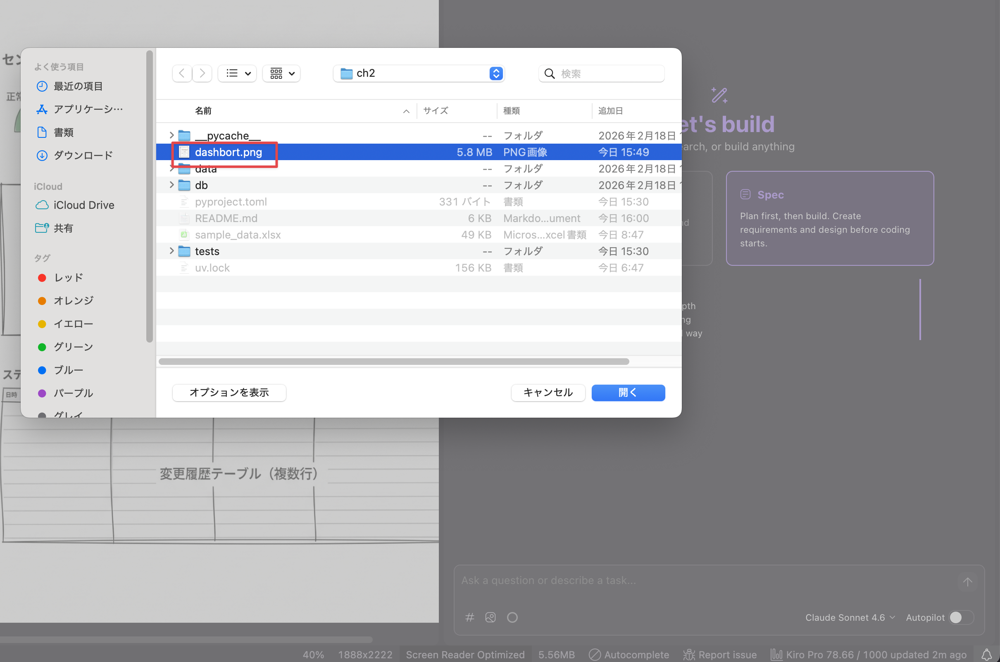
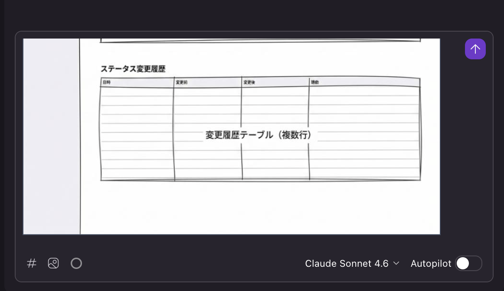
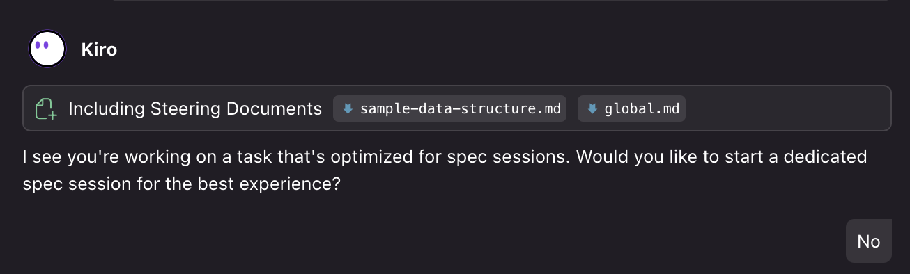
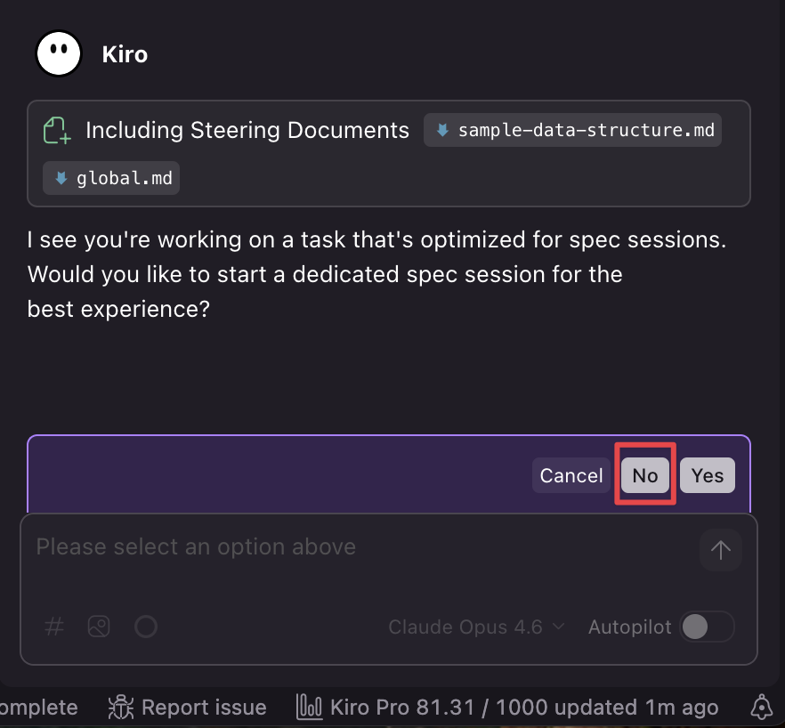
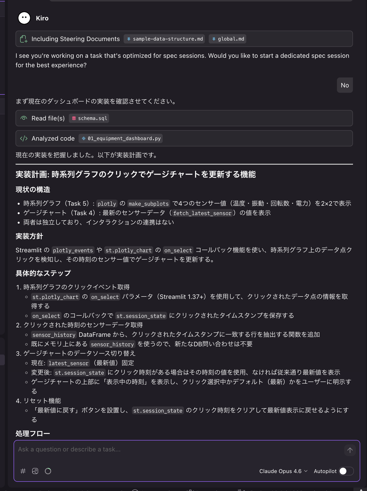

# ch2: Plan then Execute - 設備ダッシュボード

## 概要

ch1で構築したDB基盤を活用して、Streamlitによる製造設備モニタリングダッシュボードのUIを作成します。

- エントリーポイント `app.py`
- 設備ダッシュボードページ `pages/01_equipment_dashboard.py`
  - ゲージチャート・時系列チャート・ステータス変更履歴

## 体験すること（約5分｜経過 約5分）

KiroのVibeモードで「Plan then Execute」パターンを体験します。
完成イメージの画像をAIに渡してUI仕様をSteeringに登録し、その仕様をもとにコードを生成させるという2段階の流れで進めます。

### Plan then Executeとは

AIコーディングエージェントにはプランモードがついています。これを使った短いイテレーションで実装、動作確認をするのが今の主流です。

1. **Plan（計画）**: AIに小さいタスクを投げ、仕様や実装計画を先に作らせる
2. **Execute（実装）**: 計画を確認したうえで、「実装してください」と指示する。足りない場合は1を継続。

Spec駆動と違い自分の頭で必要な最低限のことをAIが提案してくれるため、読むドキュメントや実装→動作確認のイテレーション間隔が短いため、アジャイルに開発が可能です。

※ Kiroはプランモード組み込まれていないため(Kiro CLIには有)、プロンプト側で計画→実行の流れを指示します。

### Spec駆動開発との違い

| 観点               | Spec駆動（ch1）                                     | Plan then Execute（ch2）            |
| ------------------ | --------------------------------------------------- | ----------------------------------- |
| モード             | Vibe + Spec                                         | Vibe のみ                           |
| 実装前の成果物     | requirements.md → design.md → tasks.md（3ファイル） | 必須の成果物なし（計画後すぐ実装）  |
| レビューの重さ     | 要件定義・設計の2段階レビュー                       | 仕様・計画の軽い確認                |
| 実装の進め方       | タスクを1つずつ実行                                 | フェーズ単位で実装→動作確認のループ |
| フィードバック間隔 | 仕様確定後にまとめて実装                            | フェーズごとに動作確認              |

### Spec駆動開発が「重い」と感じる理由

1. **実装前のレビュー対象が多い** — requirements.md + design.md の2ファイルを確認してからでないと実装に進めない。Plan then Executeは計画を確認したらすぐ実装に入れる
2. **仕様の粒度が細かい** — Specモードは受け入れ基準（ACs）を網羅的に列挙するため、ドキュメント量が膨らむ。Plan then Executeは必要な粒度を自分で決められる
3. **動作確認までの距離が遠い** — 要件→設計→タスク分解→実装と4段階を経て初めてコードが動く。Plan then Executeは計画後すぐに動作確認できる

### 使い分けの指針

- **Spec駆動が向くケース**: 下流への影響が大きい基盤設計（DB、API）、仕様を永続的に残したい場合、複数人でのレビューが必要な場合
- **Plan then Executeが向くケース**: UIなど視覚的に検証できるもの、既存基盤の上に構築する場合、短いイテレーションで進めたい場合

## 前提

- ch1で作成したDB基盤（`db/schema.sql`, `db/seed.py`）が存在する

## 1. UI仕様を作成する（約10分｜経過 約15分）

### 1.1. モード選択

- Vibeモードを選択
- モデルがOpus 4.6になっていることを確認

### 1.2. ダッシュボード画像を渡してUI仕様を作成させる

ダッシュボードのざっくりとした画像が用意されています。こちらをベースに実装を行なっていきます。

> [!NOTE]
> **画像入力の実務的な位置づけ**
>
> 実務ではFigma MCP連携でデザインデータを直接AIに渡す方法が理想的です。コンポーネント名・カラーコード・レイアウト構造などのメタ情報をそのまま活用できます。
> 画像入力ではこれらのメタ情報が欠落し、解像度や手描き度合いによって認識精度にばらつきが出る欠点があります。
> ただしPoCや社内ツール開発では画像で十分回せます。ざっくりした完成イメージから仕様を起こし、動作確認しながら詰めていくフローでは画像の粒度で問題ありません。


> [!IMPORTANT]
> プロンプト入力時に `#` を入力してファイル選択UIから `dashboard.png` を選んでください（ch1と同様の操作です）。





以下のプロンプトを入力します。

```text
添付した画像(ch2/dashboard.png)は製造設備モニタリングダッシュボードの完成イメージです。
この画像を分析して、UI仕様を `.kiro/steering/dashboard-spec.md` としてSteeringに登録してください。

仕様には以下を含めてください。
- ページ構成とファイル配置
- 各UIコンポーネントの詳細（レイアウト、表示項目、チャートの種類と設定）
- 使用するライブラリとデータソース
```

Specモードに促されるが、Noを押下します。今回はPlan then Executeパターンで進めるため、Specモードは使用しません。以降も同じメッセージが出たら同様にNoを押下してください。



### 1.3. UI仕様の確認

`.kiro/steering/dashboard-spec.md` にUI仕様がSteeringとして登録されます。

#### チェック項目

- [ ] `.kiro/steering/dashboard-spec.md` が作成されていることを確認してください
- [ ] 以下の内容が仕様に含まれていることを確認してください
  - ゲージチャート・時系列チャート・ステータス変更履歴の仕様

仕様に不足や問題があれば、この時点で修正を依頼してください。

## 2. UI仕様をもとに実装する（約30分｜経過 約45分）

### 2.1. 実装計画を作成させる

新しいSessionを立ち上げてください。SteeringにUI仕様が登録されているため、Kiroは仕様を自動的に参照します。まず実装計画のmdファイルを作成させます。

> [!NOTE]
> 今回は実装計画をマークダウンファイルとして出力しますが、タスクが小さい場合や計画を保存するまでもない場合は、この手順は省略しても問題ありません。

```text
SteeringのUI仕様に従って、実装計画を `plan/dashboard-tasks.md` に作成してください。

計画には以下を含めてください。
- 作成するファイルの一覧と役割
- 実装タスクのチェックリスト（TODO管理用）
- 各タスクの依存関係（実装順序）

まだ実装には着手せず、計画の作成のみ行ってください。
```

こちらでもSpecモードに促されるが、同様にNoを押下


### 2.2. 実装計画の確認

#### チェック項目

- [ ] `plan/dashboard-tasks.md` が作成されていることを確認してください
- [ ] タスクの粒度と実装順序が妥当であることを確認してください

計画に問題があれば、この時点で修正を依頼してください。

### 2.3. 計画に沿って実装を実行する

計画の確認後、以下のプロンプトで実装を開始します。AIが生成する計画のフェーズ分割は毎回異なる場合があります。フェーズ数や粒度が異なっても問題ありません。最初のフェーズから順に進めてください。

```text
`plan/dashboard-tasks.md` の計画に沿って、ダッシュボードを実装してください。
まずはフェーズ1を実装してください。動作確認方法を教えてください。

その後確認して問題ない場合、完了したタスクにはチェックを入れて進捗を管理してください。
```

```text
確認できました。次のフェーズに進んでください。
```

フェーズごとに動作確認を行い、問題がなければ次のフェーズに進む流れを繰り返します。

## 3. グラフクリックによるセンサー値連動を実装する（約10分｜経過 約55分）

新しいSessionを立ち上げてください。セクション2のSessionはコンテキストが大きくなっているため、新しいSessionで進める方が安定します。

### 3.1. モード選択

- Vibeモードを選択
- モデルがOpus 4.6になっていることを確認

### 3.2. 計画を立てさせる

```text
時系列グラフのデータ点をクリックしたら、ゲージチャートがその時刻のセンサー値に更新される機能を追加したいです。
まず実装計画を立ててください。まだ実装には着手しないでください。
```



### 3.3. 計画を確認して実装させる

計画に問題がなければ、実装を指示します。

```text
実装してください。
```

## 4. 検証（約5分｜経過 約60分）

ダッシュボードが正しく動作することを確認します。

```bash
uv run streamlit run app.py
```

以下の項目を満たせているか確認してください。満たされていない場合、チャットプロンプトへその項目を渡し修正させてください。

#### チェック項目

- [ ] サイドバーから設備を選択し、設備情報カードが表示されること
- [ ] ゲージチャートにセンサー値と閾値による色分けが表示されること
- [ ] 時系列チャートに警告・危険の閾値ラインが表示されること
- [ ] ステータス変更履歴テーブルが表示されること
- [ ] グラフで選択した時刻に赤マーカーが表示されること
- [ ] 時系列グラフのデータ点をクリックすると、ゲージチャートが選択時刻の値に更新されること
