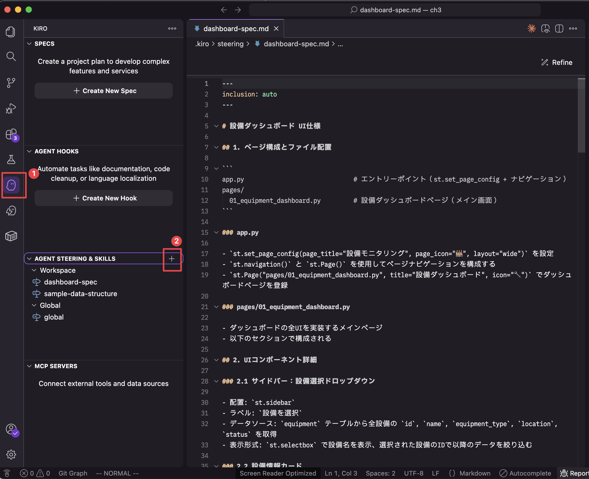
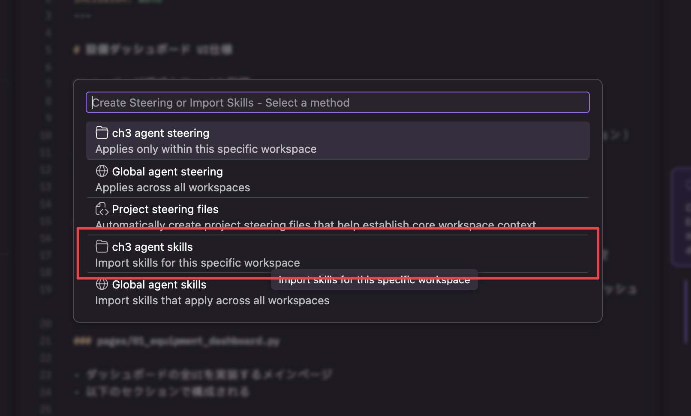
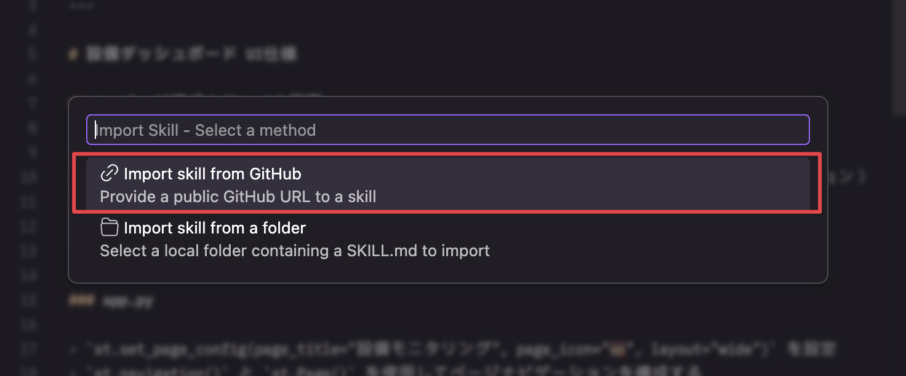
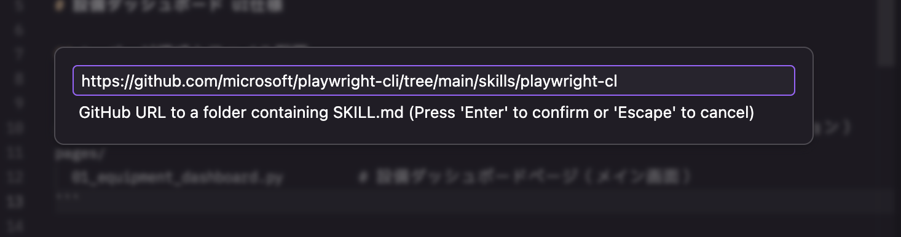
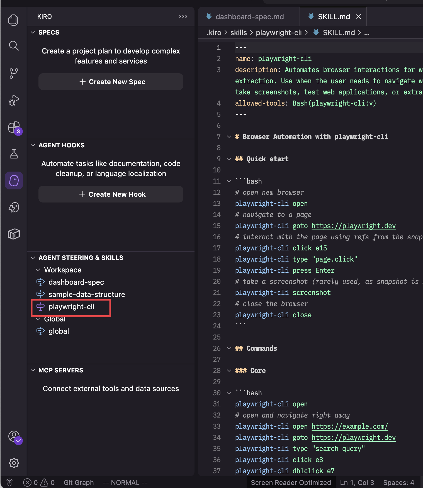
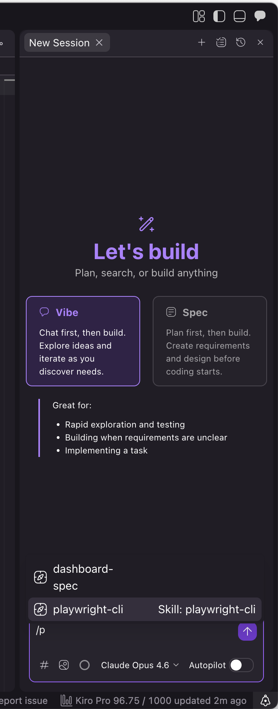
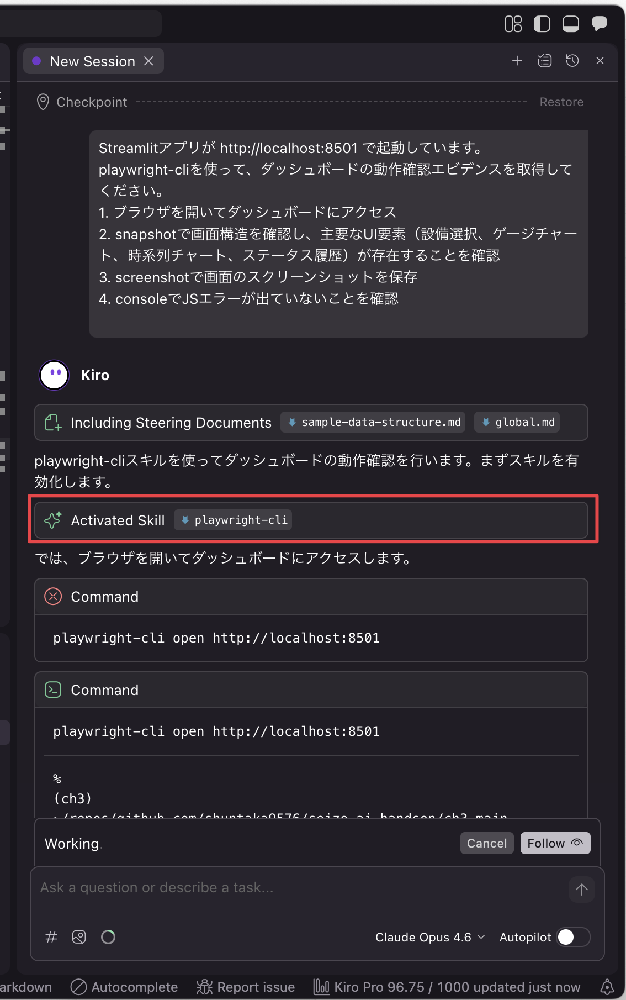
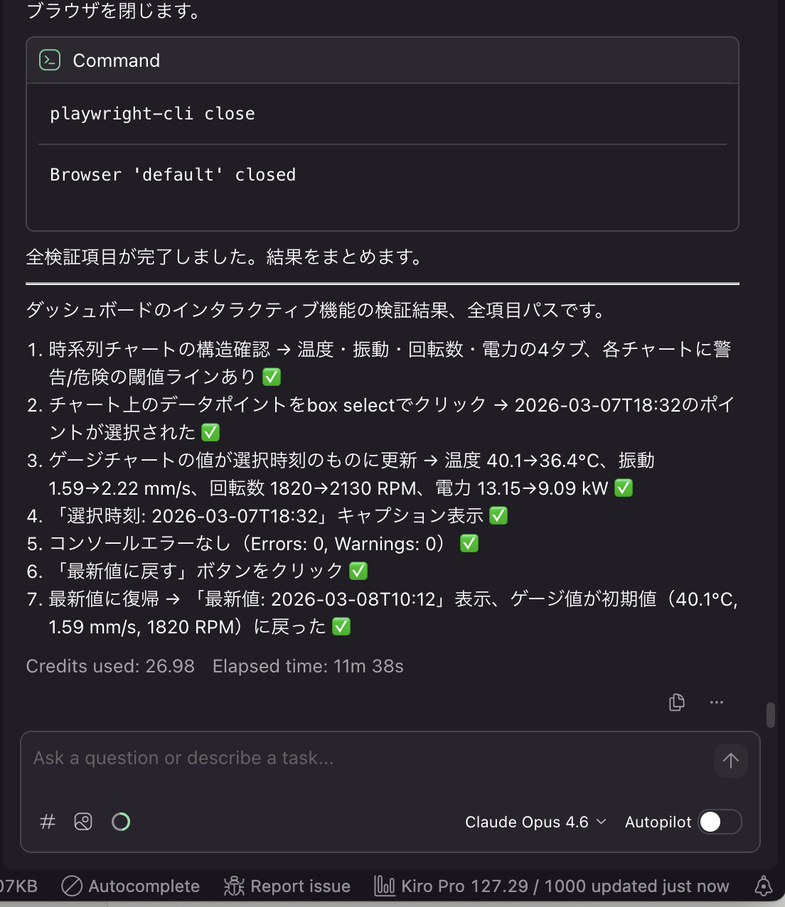

# ch3: Agent Skills - playwright-cliによるUI動作確認

## 概要

ch2で構築した設備ダッシュボードに対して、Agent Skills（playwright-cli）を使ったUI動作確認を体験します。

- playwright-cliスキルのセットアップ
- ダッシュボードの画面表示・設備切り替え・インタラクティブ機能の動作確認エビデンス取得

## 体験すること（約3分｜経過 約3分）

KiroのAgent Skills機能を使い、playwright-cliでブラウザを自動操作して動作確認エビデンスを取得する体験をします。

### Agent Skillsとは

Agent Skillsは、AIエージェントに新しい能力を追加するためのポータブルな命令パッケージです（[agentskills.io](https://agentskills.io) 標準）。
`.kiro/skills/` にスキルフォルダを配置するだけで、Kiroがコンテキストに応じて自動的にスキルを活性化します。

1. **Discovery（発見）**: 起動時にスキル名と説明のみを読み込む
2. **Activation（活性化）**: リクエストがスキルの説明にマッチすると、全文を読み込む
3. **Execution（実行）**: スクリプトや参照ファイルを必要に応じて読み込む

### playwright-cliとは

Microsoftが提供するブラウザ自動操作のCLIツールです。以下のコマンドでエビデンスを取得できます。

| コマンド      | 用途                             |
| ------------- | -------------------------------- |
| `screenshot`  | UI表示のスクリーンショット撮影   |
| `console`     | コンソールログ・JSエラーの確認   |
| `network`     | ネットワークリクエストの確認     |
| `snapshot`    | DOM構造・アクセシビリティの確認  |
| `click`       | 要素のクリック操作               |
| `video-start` | 操作の動画録画を開始             |
| `video-stop`  | 録画を停止して動画ファイルを保存 |

## 前提

- ch2で作成した設備ダッシュボード（`app.py`, `pages/01_equipment_dashboard.py`）が存在する
- Node.js 18以上がインストール済み

## 0. 環境セットアップ（約5分｜経過 約8分）

> [!NOTE]
> [セットアップガイド](../SETUP.md)で playwright-cli と ffmpeg をインストール済みの場合、0.1 と 0.2 はスキップして 0.3 から進めてください。

### 0.1. playwright-cliのインストール

```bash
npm install -g @playwright/cli@0.1.1
```

### 0.2. ffmpegのインストール（動画録画に必要）

動画録画機能を使う場合は、ffmpegのインストールが必要です。

```bash
npx playwright install ffmpeg
```

### 0.3. アプリケーションの起動

```bash
uv sync
uv run python db/seed.py
uv run streamlit run app.py
```

`http://localhost:8501` でダッシュボードが表示されることを確認してください。

## 1. playwright-cliスキルをセットアップする（約2分｜経過 約10分）

### 1.1. モード選択

- Vibeモードを選択
- モデルがOpus 4.6になっていることを確認

### 1.2. スキルのインポート

Kiro IDEの「Agent Steering & Skills」パネルからplaywright-cliスキルをインポートします。

パネルの「+」から以下の手順で導入します。





以下のURLを入力: `https://github.com/microsoft/playwright-cli/tree/main/skills/playwright-cli`


スキルが `.kiro/skills/playwright-cli/` にインポートされる


#### チェック項目

- [ ] `.kiro/skills/playwright-cli/SKILL.md` が作成されていることを確認してください
- [ ] Kiroのチャットで `/` を入力し、以下の画像のようにplaywright-cliがスラッシュコマンドとして認識されていることを確認してください
      

## 2. 画面表示のエビデンスを取得する（約5分｜経過 約15分）

以降全てVibeモードで実行してください。

> [!NOTE]
> playwright-cliで取得したscreenshotや動画は `.playwright-cli/` ディレクトリに保存されます。

### 2.1. 初期表示の確認

以下のプロンプトを入力します。

```text
Streamlitアプリが http://localhost:8501 で起動しています。

playwright-cliを使って、ダッシュボードの動作確認エビデンスを取得してください。

1. ブラウザを開いてダッシュボードにアクセス
2. snapshotで画面構造を確認し、主要なUI要素（設備選択、ゲージチャート、時系列チャート、ステータス履歴）が存在することを確認
3. screenshotで画面のスクリーンショットを保存
4. consoleでJSエラーが出ていないことを確認
```

自動でSkillがロードされていることを確認


### 2.2. エビデンスの確認

#### チェック項目

- [ ] ダッシュボード初期表示のscreenshotが取得できていること
- [ ] consoleにエラーが報告されていないこと

## 3. 設備切り替えのエビデンスを取得する（約12分｜経過 約27分）

### 3.1. 設備選択の動作確認

```text
サイドバーから異なる設備を選択して、表示が正しく切り替わることを確認してください。

1. 現在の設備のscreenshotを取得
2. snapshotでサイドバーの設備選択ドロップダウンを見つけ、別の設備（例: プレス機 B-01）を選択
3. 切り替え後のsnapshotとscreenshotを取得
4. ゲージチャートや時系列グラフが選択した設備のデータに切り替わっていることを確認
5. consoleにエラーがないことを確認
```

> [!IMPORTANT]
> この操作は完了まで約11分かかります。クレジットを27程度消費します。



### 3.2. エビデンスの確認

#### チェック項目

- [ ] 切り替え前後のscreenshotが取得できていること
- [ ] ゲージチャートのパラメータが設備タイプに応じて変化していること（例: CNC旋盤はrpmあり、プレス機はpressureあり）

## 4. 動画録画のエビデンスを取得する（約5分｜経過 約32分）

### 4.1. 設備切り替え操作の動画録画

> [!WARNING]
> `video-start` / `video-stop` はCLIコマンドとして単独では動作しません。各コマンドが独立したプロセスとして実行されるため、`video-start` で開始した録画状態が次のコマンド呼び出し時に失われます。動画録画には `run-code` を使った方法を使用してください。

```text
run-codeを使って、設備切り替え操作を動画として録画してください。

video-start/video-stopはプロセス間で状態が保持されないため使えません。

run-codeでは引数として page オブジェクトが直接渡されます。browserを取得するには page._browserContext._browser を使用してください。

以下の手順で実装してください：
1. page._browserContext._browser から browser を取得
2. browser.newContext({ recordVideo: { dir: '.playwright-cli/videos/' } }) で録画用コンテキストを作成
3. 新しいページでダッシュボードにアクセス
4. getByRole('combobox') でサイドバーの設備選択を見つけてクリック
5. getByText('プレス機 B-01') で設備を選択
6. context.close() で録画を保存
```

プロンプトの代わりに直接 `run-code` で実行する場合の例：

```bash
playwright-cli run-code "async (page) => {
  const browser = page._browserContext._browser;
  const context = await browser.newContext({
    recordVideo: { dir: '.playwright-cli/videos/', size: { width: 1280, height: 720 } }
  });
  const newPage = await context.newPage();
  await newPage.goto('http://localhost:8501');
  await newPage.waitForLoadState('networkidle');
  await newPage.waitForTimeout(3000);
  await newPage.getByRole('combobox').click();
  await newPage.waitForTimeout(1000);
  await newPage.getByText('プレス機 B-01').click();
  await newPage.waitForTimeout(3000);
  await context.close();
  return 'Recording saved';
}"
```

録画ファイルは `.playwright-cli/videos/` に `.webm` 形式で保存されます。

### 4.2. エビデンスの確認

#### チェック項目

- [ ] 設備切り替え操作がビデオファイルとして保存されていること

## 5. 検証（約3分）

以下の項目をすべて満たしていることを確認してください。

#### チェック項目

- [ ] playwright-cliスキルが `.kiro/skills/playwright-cli/` に配置されていること
- [ ] 画面初期表示のscreenshotが取得できていること
- [ ] 設備切り替えの前後screenshotが取得できていること
- [ ] 設備切り替え操作の動画が保存されていること
- [ ] 各フェーズでconsoleにJSエラーが報告されていないこと
