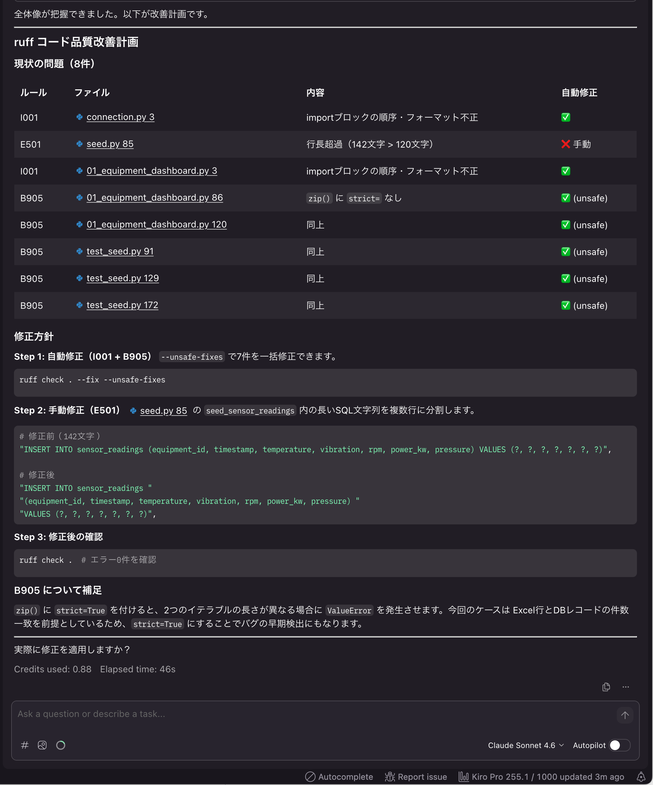
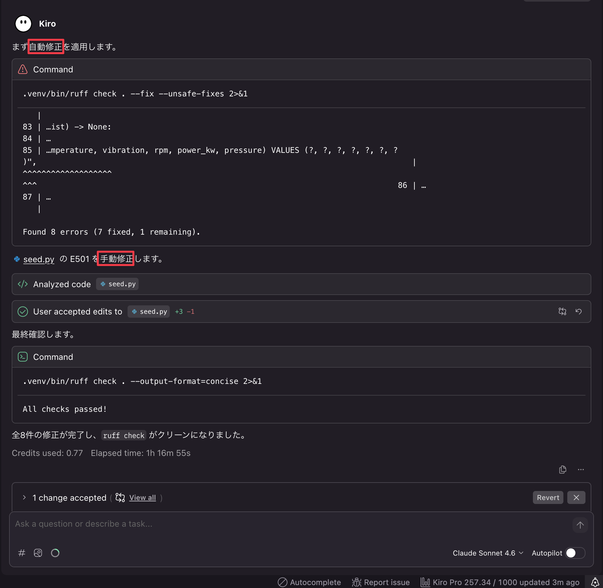

# ch4: ruffによる静的解析改善

## 概要

ruff（Pythonの高速リンター・フォーマッター）を使い、既存コードの品質を静的解析で改善する。

## 体験すること（約2分｜経過 約2分）

Kiroを使い、ruffによるlint問題の検出・自動修正・フォーマットを体験します。
AIにruff修正を一括で依頼し、コード品質を効率的に改善する流れを学びます。

この「ツールの出力をAIに渡して一括修正させる」パターンは、ruffに限らずテストにも応用できます。例えば `pytest` の失敗出力をそのままAIに渡して修正を依頼する、テストカバレッジレポートをもとに不足しているテストケースを生成させる、といった使い方が可能です。

### ruffとは

ruffはRust製のPython向け高速リンター・フォーマッターです。Flake8やisort、pyupgradeなど複数ツールの機能を1つに統合しており、高速に静的解析できます。

本プロジェクトでは `pyproject.toml` に以下のルールが設定済みです。

| ルール | 名称                 | 検出対象                   |
| ------ | -------------------- | -------------------------- |
| E      | pycodestyle errors   | 行長超過、空白ルール等     |
| F      | pyflakes             | 未使用import、未定義変数等 |
| I      | isort                | import文の順序             |
| W      | pycodestyle warnings | スタイル警告               |
| B      | flake8-bugbear       | よくあるバグパターン       |
| UP     | pyupgrade            | Python 3.12向けモダン構文  |

## 前提

- ch3までの全ファイルが存在する
- ruff は dev 依存として `pyproject.toml` に設定済み

## 1. Kiroでlint修正を実行する（約10分｜経過 約12分）

### 1.1. モード選択

- Vibeモードを選択（手法は任意。Specモードでも可）
- モデルがOpus 4.6になっていることを確認

### 1.2. プロンプトを入力

以下のプロンプトを入力してください。

```text
このプロジェクトは製造設備モニタリングダッシュボードアプリです。DB基盤、Streamlit UI、テストスイートが実装済みです。

pyproject.toml に ruff の設定が追加されています。ruff を使って既存コードの品質を改善する計画を立ててください。
```

どのように修正するか状況を確認してくれます。



問題ないければ、修正を依頼します。

```text
計画は問題ありません。修正してください。
```

自動修正と手動修正の両方の実施を確認出来ます。



#### チェック項目

- [ ] lint修正・フォーマットの変更がコミットされていること

## 2. 検証（約3分｜経過 約15分）

以下のコマンドで修正結果を確認します。

```bash
# lint問題がないこと
uv run ruff check .

# フォーマット差分がないこと
uv run ruff format --check .

# テストが通ること
uv run pytest -v
```

### 2.1. 起動確認

アプリが正常に動作することを確認します。

```bash
uv sync
uv run python db/seed.py
uv run streamlit run app.py
```

#### チェック項目

- [ ] `uv run ruff check .` がエラーなしで通ること
- [ ] `uv run ruff format --check .` が差分なしで通ること

## 4. 時間が余ったら

### 4.1. 静的解析の拡張

よりソースコードの保守性やバグ、脆弱性を抑え込むためのルール設定を模索します。

以下のプロンプトを入力してください。

```text
より良いruffルール設定の模索をしてください
```

提案されたものを確認し、実行→修正サイクルを回してください。
