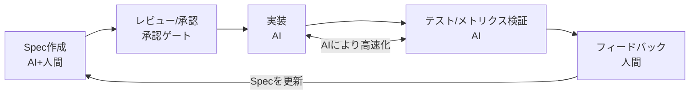

# ch1: Spec駆動開発 - プロジェクト基盤 & DB

## 概要

製造設備モニタリングダッシュボードのデータ基盤を構築します。

Excelファイル（`sample_data.xlsx`）が用意されています。こちらを解析して、

- テーブルを作成する `schema.sql`
  - 設備マスタ
  - センサー時系列データ
  - ステータス変更履歴
- テーブルへ投入するスクリプト `seed.py`

## 体験すること（約10分｜経過 約10分）

Claude Code に **[spec-kit](https://github.com/github/spec-kit)** を組み込み、Spec駆動ワークフロー（`/specify` → `/plan` → `/tasks` → `/implement`）で製造設備モニタリングダッシュボードのデータ基盤を構築します。Excel解析結果を `CLAUDE.md` などプロジェクト知識に登録してから Spec を生成する流れを体験します。

### Spec駆動開発とは

Spec駆動開発は、AIに対して構造化された仕様書を入力として与え、コードを生成させる開発手法です。自然言語プロンプトから即座にコードを生成するVibe Codingとは異なり、Requirements（要件定義）→ Design（設計）→ Tasks（タスク分解）の3ステップで進行します。成果物はバージョン管理されるMarkdownファイルとして永続化されます。

### Spec駆動開発の課題

Spec駆動開発にはいくつかの課題が指摘されています。

- 要件→設計→実装という順序的プロセスがウォーターフォールに似ており、ソフトウェア開発の非決定的な性質と相性が悪い
- 単純なバグ修正が4つのユーザーストーリー・16の受け入れ基準に膨張するなど、小さな変更に対して過剰になりやすい
- コードの進化に合わせて仕様を同期し続けるメンテナンスコストが増大する
- 包括的な仕様を与えても、AIエージェントが指示を誤解・無視するケースがある
- LLMの出力は確率的であり、Specどおりに実装される保証はない。正確性を検証する仕組みは未整備で、テストやコードレビューは人間が担わなければならない
- 既存の開発プロセスを変えずにSDDを導入した場合、Specレビューという重い工程が単純に1つ追加されるだけになる


### それでもSpec駆動が重要な理由

SDDはウォーターフォールではなく、繰り返しを前提としたループ構造です。AIが実装→テスト→フィードバックのサイクルを高速化することで、日単位での反復が可能になります。



- 検証可能性: Specの振る舞い仕様がユニットテストと結びつくことで、Specから下流の検証まで自動化できる
- フィードバックループ: Specは一度きりではなく、仮説と要件を一時的にFixした反復プロセス。短いサイクルでSpec自体を洗練させる

## 前提

- [SETUP.md](../SETUP.md) に従い、Claude Code / uv / SQLite3 をインストール済み
- Claude Code にログイン済み（`/login` 完了）

## 0. ch1 プロジェクトを開く

ターミナルで ch1 ディレクトリに移動し、Claude Code を起動します。

```bash
cd ch1
claude
```

モデルを Opus に切り替えておきます（仕様生成はクレジットを使うが品質を優先）。

```text
/model opus
```

## 1. Excelの内容を解析して知識に登録する（約10分｜経過 約10分）

### 1.1. エクセル解析プロンプトを入力

以下のプロンプトを入力します。`@sample_data.xlsx` でファイルを添付してください。

```text
@sample_data.xlsx を添付します。

以下の観点で構造を分析してください。

1. シート一覧と各シートの役割
2. 各シートのカラム構成（列名・データ型・サンプル値）
3. シート間の関連性（IDの参照関係など）
4. データの件数や値の傾向

結果はシートごとにまとめてください。
```

#### チェック項目

- [ ] エクセルシートと比較して、ざっくりあっていることを確認してください

### 1.2. 解析結果を永続化する

続けて以下を入力し、解析結果を `CLAUDE.md` に書き出してプロジェクト知識として永続化します（Kiro の Steering 相当）。

```text
上記の解析結果を CLAUDE.md にプロジェクト知識として追記してください。
「## sample_data.xlsx のシート仕様」という見出しで、シート構成・カラム情報・データ件数を記述してください。
```

> [!NOTE]
> `CLAUDE.md` は Claude Code が自動的に読み込むプロジェクト知識ファイルです。セッションをまたいでも内容が保持され、以降のプロンプトで常に参照されます。

#### チェック項目

- [ ] `CLAUDE.md` が作成（または追記）されていることを確認してください
- [ ] `sample_data.xlsx` を開き、シート構成・カラム情報・データ件数が CLAUDE.md の内容と一致していることを確認してください

## 2. spec-kit で seed.py の仕様を作成する（約30分｜経過 約50分）

### 2.1. spec-kit を導入する

Claude Code を一度終了し、ch1 ディレクトリで spec-kit を初期化します。

```bash
uvx --from git+https://github.com/github/spec-kit.git specify init --here --ai claude
```

`.specify/` と `.claude/commands/` 配下に `/specify` `/plan` `/tasks` `/implement` などのスラッシュコマンドが追加されます。

```bash
claude
```

Claude Code を再起動し、`/help` でコマンド一覧に `/specify` が現れていれば OK です。

### 2.2. Requirements: `/specify` で要件定義

以下のプロンプトをスラッシュコマンドとして入力します。

```text
/specify
エクセルをインプットに、データを投入する seed.py を作成します。
seed.py にハードコードされたデータ定数は一切持たせず、全てのデータをExcelから読み込んでください。
Excelのシート構造の詳細は CLAUDE.md の「sample_data.xlsx のシート仕様」を参照してください。

## 作りたいもの

製造設備の稼働状況をリアルタイムで監視するダッシュボードアプリのデータ基盤です。シードスクリプトで初期データを投入します。

## 技術スタック

- Python 3.12以上
- SQLite（ファイルベースDB）

## specに含めてほしい内容

1. ディレクトリ構成
2. DBスキーマ定義 — Excelのデータ構造をもとにCREATE TABLE文を設計
3. シードデータ投入ロジック
4. 検証方法 — 動作確認コマンド
```

実行すると `specs/NNN-*/spec.md` が作成されます。内容をレビューしてください。

#### チェック項目

- [ ] `specs/*/spec.md` が作成されていること
- [ ] seed.py や data/factory.db に相当する成果物が記述されていること
- [ ] テーブル3つ（設備マスタ・センサー時系列・ステータス変更履歴）が含まれていること

### 2.3. Design: `/plan` で技術設計

```text
/plan
Python 3.12 / SQLite / openpyxl を使う前提で設計してください。
data/ 配下に factory.db を生成し、db/ 配下に schema.sql と seed.py を配置してください。
```

`specs/*/plan.md`（もしくは `design.md`）が生成されます。

#### チェック項目

- [ ] アーキテクチャ図・モジュール分割・処理フローが妥当か確認
- [ ] CREATE TABLE 文が CLAUDE.md のシート仕様と整合していること

### 2.4. Tasks: `/tasks` でタスク分解

```text
/tasks
```

`specs/*/tasks.md` が生成され、実装タスクに分解されます。

### 2.5. Implement: `/implement` で実装

タスク実行のクレジット消費を抑えるため、ここでモデルを Sonnet に切り替えます。

```text
/model sonnet
/implement
```

> [!NOTE]
> spec-kit の `/implement` は `tasks.md` を上から順に実装していきます。タスクが複数に分かれている場合、「次のタスクに進んでください」と指示すれば続行します。

## 3. 検証（約10分｜経過 約60分）

Claude Code を終了し、ターミナルで検証します。

```bash
# 依存インストール & シード実行
uv sync
uv run python db/seed.py

# テスト実行（生成されていれば）
uv run pytest -v
```

sqlite3 CLIでデータを確認します。

```bash
sqlite3 data/factory.db
```

```sql
.tables
.schema equipment

SELECT COUNT(*) FROM equipment;
SELECT COUNT(*) FROM status_logs;
SELECT COUNT(*) FROM sensor_readings;

SELECT * FROM equipment;
SELECT * FROM sensor_readings WHERE equipment_id = 1 LIMIT 5;

PRAGMA foreign_key_list(status_logs);

.quit
```

> [!NOTE]
> AIの出力により、DBファイルのパスやテーブル名が異なる場合があります。実際に生成されたコードに合わせて読み替えてください。

## 4. 時間が余ったら

### 4.1. テストケースを精査する

AIが生成したテストは冗長になりがちです。生成された `tests/` 以下を眺めて、以下のような観点で冗長部分を探してみてください。

- hypothesis などのプロパティベーステストを、固定Excelに対して使っていないか
- schema.sql の文字列をパースするテストで、DDL実行＋テーブル存在チェックで代替できないか
- 1,152行のセンサーデータを全行比較していないか（件数＋数行サンプルで十分）

### 4.2. 稼働分析SQLをAIに生成させる

```text
各設備について、ステータスごとの滞在時間（分）を計算したSQLを作成し、実行できることを確認したのち提供してください
```

```text
各設備のセンサーデータについて、直近6件の移動平均温度を計算し、現在値が移動平均の1.5倍を超えるレコードを異常候補として抽出してください
```

生成されたSQLを `sqlite3 data/factory.db` で実行し、結果を確認してみてください。
