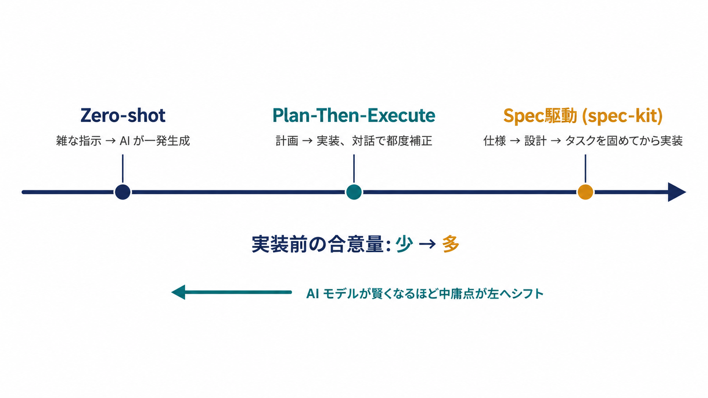
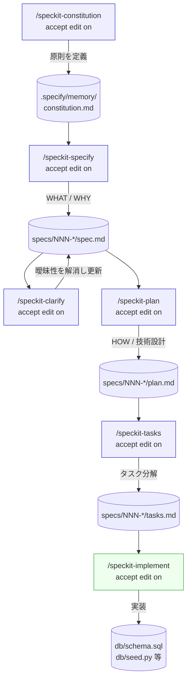
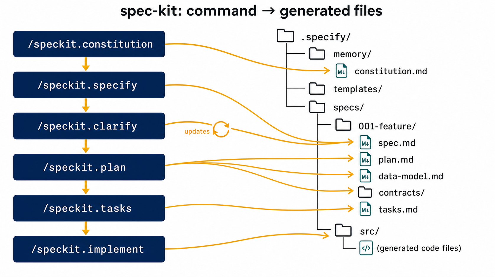

# ch1: 仕様駆動開発 - プロジェクト基盤 & DB

## 概要

製造設備モニタリングダッシュボードのデータ基盤を構築します。

Excelファイル（`sample_data.xlsx`）が用意されています。こちらを解析して、

- テーブルを作成する `schema.sql`
  - 設備マスタ
  - センサー時系列データ
  - ステータス変更履歴
- テーブルへ投入するスクリプト `seed.py`

## 体験すること（約10分｜経過 約10分）

Claude Code に **[spec-kit](https://github.com/github/spec-kit)** を組み込み、製造設備モニタリングダッシュボードのデータ基盤を構築します。`@sample_data.xlsx` を入力に、constitution で AI の過剰生成を縛ったうえで spec → plan → tasks → implement と段階的に詰めていきます（詳細フローは [§1 冒頭の図](#1-仕様駆動開発で-seedpy-を作る約40分経過-約40分) を参照）。

## 学ぶこと

### 概要

**仕様駆動開発（SDD: Spec-Driven Development）** は、コードを書き始める前に「何を / なぜ / どう作るか」を文書として固め、それを単一の真実として実装まで通すアプローチ。AI コーディングと組み合わせる文脈では、`spec.md / plan.md / tasks.md` のような構造化ドキュメントを生成・更新しながら段階的に詰めていく流れが定型になりつつある。

代表的な実装としては次のようなものがある。

- **[spec-kit](https://github.com/github/spec-kit)** — GitHub 公式の SDD フレームワーク。スラッシュコマンド (`/speckit-*`) で各工程を駆動する。本章で使用
- **[Kiro](https://kiro.dev/)** — AWS が提供する SDD 寄り IDE。spec / steering といった概念をエディタ自体に組み込んでいる
- **[cc-sdd](https://github.com/gotalab/cc-sdd)** — Claude Code / Codex / Cursor など複数エージェントに対応した SDD ハーネス

以下、本章では spec-kit を題材に SDD を実体験する。

### 仕様駆動開発の課題

- 工程が重くなる — Spec 作成・レビュー・コードとの同期で、開発リソースが大きく取られる
- 守られるとは限らない — LLM の出力は確率的で、Spec どおりの実装は保証されない。検証は結局人間が担う
- 変化に弱い — 要件→設計→実装の順序プロセスは、要件が流動的な案件と相性が悪い
- ドキュメントとして閉じない — spec.md / plan.md / tasks.md は「開発当時の意思決定スナップショット」として残るが、現行仕様を表す包括的ドキュメントにも、非開発者向け説明資料にもならない


```mermaid
graph LR
    A[Spec] --> B["Specレビュー(重い)"]
    B --> C[実装]
    C --> D["テスト/コードレビュー(人が主導)"]
    D --> E[フィードバック]

    style B fill:#fee,stroke:#c00,stroke-width:2px
    style D fill:#fee,stroke:#c00,stroke-width:2px
```

### 合意量で位置づけ、ハンズオンで体験する意味

合意量の観点で見ると、Zero-shot / Plan-Then-Execute / 仕様駆動開発 は どれだけ事前に合意してから実装するかの度合いが違うだけで、**直線上に並ぶ連続的な選択肢**だ。AI モデルが賢くなるほど、必要な合意量は減る方向に動く。

<!-- 画像生成プロンプト:
"Clean horizontal spectrum diagram. A single horizontal axis from left to right with three labeled positions:
- Left (around 10%): 'Zero-shot' / subtitle '雑な指示 → AI が一発生成'
- Middle (around 50%): 'Plan-Then-Execute' / subtitle '計画 → 実装、対話で都度補正'
- Right (around 90%): '仕様駆動 (spec-kit)' / subtitle '仕様 → 設計 → タスクを固めてから実装'
Axis label below: '実装前の合意量: 少 → 多'.
Below the main axis, a smaller secondary arrow labeled 'AI モデルが賢くなるほど中庸点が左へシフト' pointing left.
Flat design, corporate muted palette (navy, teal, warm amber accent), 16:9, clean sans-serif, white background, no extraneous decoration."
-->



このスペクトラム上のどこに合わせるかは、現場の性格で変わる。

- **準委任契約ベース・要件流動性の高い現場** — 要件変更のたびに Spec を固め直す運用はコストと釣り合わない。Plan-Then-Execute（人手でプランを吟味し、AI に実装を委ねるスタイル）で左寄りに位置取るのが自然
- **規制・監査を伴うドメイン（金融・医療・製造業の品質保証など）** — 仕様の根拠とトレーサビリティを文書で残す要請から、右寄りに位置取る。納品物は人間向けの仕様書で、`spec.md / plan.md / tasks.md`（AI 向け構造化入力）とは粒度が違う。ただし、spec-kit の出力を起点に AI で人間向けドラフトを生成する運用は十分あり得る

なお、同じ Plan-Then-Execute でも、計画を細かく詰めずに一度実装させ、出来たものを見て修正指示で詰めていくやり方の方が早いケースは多い。プロトタイプや小規模変更では、合意を固めるより試行サイクルを多く回す方がフィードバックを得やすく、結果的に短い時間で着地する。

自分が担当する案件・チーム・モデル世代において、**この直線のどのあたりが最前線（コストとリターンが釣り合う点）か**は、両端を知らないと見極められない。仕様駆動開発を一度実体験しておくことで、「ここまで合意を固める価値があるか／もっと軽くしてよいか」を肌感覚で判断できるようになる。加えて SDD 自体、次のような場面では今でも有効に機能する手法だ。

- **複数チーム・オフショア・非同期コラボレーション** — 会話履歴や Slack ログに依存できない環境で、リポジトリに残る仕様が引き継ぎ資料として機能する
- **AI コーディング経験の浅いメンバーで構成されたチーム** — フレームワークが「次に何を決めるか」を強制してくれるので、ガードレールとして機能する

そして spec-kit というフレームワーク自体にも、Plan-Then-Execute では得にくい次の利点がある。

- **進め方をフレームワークが引き受ける** — 要件 → 質問 → 設計 → タスク → 実装の順序が固定済み。「次に何を聞くか / どこまで決めるか / いつ実装に入るか」をユーザーが毎回設計しなくていいので、中身の判断に集中できる
- **プロンプトの骨格をコマンド側が持つ** — Plan-Then-Execute だと「何を / どの観点から / どの順序で聞くか」を毎回プロンプトに書き起こす必要がある。一方 spec-kit は `/speckit-*` 各コマンドにテンプレート・問いかけ・出力形式が内蔵されており、ざっくりした 1 段落の seed を渡すだけで済む。さらに生成物（spec / plan / tasks）はリポジトリに残るため、入力と経緯の両面が定型化される
- **抜け漏れが計画前に必ず出る** — `/speckit-clarify` が計画ステップの**前段に固定**されている。AI に「質問して」と頼めば質問は来るが、それは計画の補足。spec-kit では設計入力として組み込まれているので、AI が勝手に仮定して進める前に欠損を出させられる
- **ロングタームなタスクで効く** — spec / plan / tasks がリポジトリに残るため、複数セッション・複数担当にまたがる中〜長期の work で「会話履歴に依存しない引き継ぎ」ができる。次の人（または次の自分）が会話を遡らなくても再開できる

## 前提

- [SETUP.md](../SETUP.md) に従い、Claude Code / uv / SQLite3 をインストール済み
- Claude Code にログイン済み（`/login` 完了）

## 0. ch1 プロジェクトを開く

ターミナルで ch1 ディレクトリに移動し、以下の手順を順に実行します。

### 0.1. 依存インストール

`openpyxl` / `pandas` など Excel 解析・DB 投入に必要な依存を `.venv` にインストールします。

```bash
cd ch1
uv sync
```

### 0.2. Claude Code を起動

effort level を `medium` に下げて起動します。Opus のデフォルト `high` よりクレジット消費を抑えつつ、本ハンズオンの設計・実装には十分です。

```bash
claude --effort medium
```

起動したら、序盤でモデルを `opusplan` に切り替えます。本ハンズオンは全ステップ `accept edit on` で進めるため実質 Sonnet で動きますが、`opusplan` を入れておくと plan モードに入った場面だけ自動的に Opus に上がります。

```text
/model opusplan
```

## 1. 仕様駆動開発で seed.py を作る（約40分｜経過 約40分）

ch1 には spec-kit が事前に組み込まれています（`.specify/` と `.claude/skills/` がコミット済み）。`/help` で各 `/speckit-*` コマンドが見えれば OK です。


```mermaid
graph TD
    A["/speckit-constitution<br/>accept edit on"] -->|原則を定義| A1[(".specify/memory/<br/>constitution.md")]
    A1 --> B["/speckit-specify<br/>accept edit on"]
    B -->|WHAT / WHY| B1[("specs/NNN-*/spec.md")]
    B1 --> C["/speckit-clarify<br/>accept edit on"]
    C -->|曖昧性を解消し更新| B1
    B1 --> D["/speckit-plan<br/>accept edit on"]
    D -->|HOW / 技術設計| D1[("specs/NNN-*/plan.md")]
    D1 --> E["/speckit-tasks<br/>accept edit on"]
    E -->|タスク分解| E1[("specs/NNN-*/tasks.md")]
    E1 --> F["/speckit-implement<br/>accept edit on"]
    F -->|実装| F1[("db/schema.sql<br/>db/seed.py 等")]

    style A fill:#eef,stroke:#33c,stroke-width:1px
    style B fill:#eef,stroke:#33c,stroke-width:1px
    style C fill:#eef,stroke:#33c,stroke-width:1px
    style D fill:#eef,stroke:#33c,stroke-width:1px
    style E fill:#eef,stroke:#33c,stroke-width:1px
    style F fill:#efe,stroke:#3a3,stroke-width:1px
```

各コマンドがどの成果物ファイルを生成するかは次の図も参照してください。



### 1.1. Constitution: `/speckit-constitution` で AI に制約を課す

過剰な機能・抽象化を抑える原則を `.specify/memory/constitution.md` に書き出します。spec-kit は以降のステップでこの原則を参照し、AI の生成を縛ります。

> 実行モードは `accept edit on`（下部表示で確認、違っていれば `shift+tab` で切り替え）。

```text
/speckit-constitution
このプロジェクトの全機能・全変更で守る原則を定めます。AI に過剰な機能・抽象化を生成させないため、以下を厳守してください。

I. Simplicity First — 最小構成で動くことを最優先する。複数機能を 1 つに統合できるなら統合する。
II. Speed First — 1 ファイルで実装できるなら 1 ファイル。モジュール分割は反復後に必要性が明確になってからにする。
III. Anti-Abstraction — ラッパー / Repository / Manager / DTO / Factory などの抽象層を導入しない。標準ライブラリと素直な関数で書く。
IV. YAGNI — 仕様で要求されていない機能（拡張性・設定可能性・汎用性）は実装しない。
```

#### チェック項目

- [ ] `.specify/memory/constitution.md` に 4 原則が反映されていること

### 1.2. Requirements: `/speckit-specify` で要件定義

`/speckit-specify` は **WHAT（何を作るか）と WHY（なぜ作るか）** のみを記述するステップです。技術スタックやディレクトリ構成といった HOW は次の `/speckit-plan` に委ねます。ここでは詳細を書き込まず、ざっくりした 1 段落だけ渡します。曖昧な部分は次の `/speckit-clarify` で対話的に埋めるので、最初から完璧な文章を書こうとしなくて構いません。

> **まず `/clear`。** 実行モードは `accept edit on`（下部表示で確認、違っていれば `shift+tab` で切り替え）。

```text
/speckit-specify
製造設備モニタリングダッシュボード用のデータ基盤を作りたい。@sample_data.xlsx を唯一のデータソースとして、設備マスタ・センサー時系列・ステータス変更履歴の 3 種を保持し、初期データを投入する seed スクリプトを生成する。技術スタックや DDL は /speckit-plan で決めるのでここでは含めない。

ただし、gitのフックは実行しないでください。
```

実行すると `specs/NNN-*/spec.md` が作成されます。内容をレビューしてください。`NEEDS CLARIFICATION` マーカーが残っていても問題ありません。次の `/speckit-clarify` で潰します。

> [!NOTE]
> spec-kit 公式ガイドでは `/speckit-specify` で「Do not focus on the tech stack at this point」とされています。WHAT/WHY と HOW を明確に分離するのが仕様駆動開発の肝です。

#### チェック項目

- [ ] `specs/*/spec.md` が作成されていること
- [ ] `spec.md` に **技術スタック節（Python / SQLite 等）が含まれていない**こと
- [ ] 設備マスタ・センサー時系列・ステータス変更履歴の3種データが扱われていること

### 1.3. Clarify: `/speckit-clarify` で曖昧性を解消（必須）

`/speckit-specify` を最小限の文章で済ませた分、ここで対話的に詳細を詰めます。`spec.md` の `NEEDS CLARIFICATION` や曖昧な箇所を Claude が質問形式で投げてくるので、回答すると spec.md が更新されます。`/speckit-plan` 前に通すことで手戻りを減らします。

> **まず `/clear`。** 実行モードは `accept edit on`（下部表示で確認、違っていれば `shift+tab` で切り替え）。

```text
/speckit-clarify
```

質問が来たらざっくり自己判断で回答してください。(今回のケースでは大枠前項でクリアされているため)

#### チェック項目

- [ ] `spec.md` の `NEEDS CLARIFICATION` が概ね解消されていること
- [ ] 「Excel を唯一のデータソースとし、ハードコードを排する」という非機能要件が反映されていること
- [ ] 冪等性・検証手順が記述されていること

### 1.4. Design: `/speckit-plan` で技術設計

ここから HOW を指示します。`/speckit-specify` から外した技術スタック・配置・DDL 設計をまとめて渡します。

> **まず `/clear`。** 実行モードは `accept edit on`（下部表示で確認、違っていれば `shift+tab` で切り替え）。

```text
/speckit-plan
このステップは設計のみ。実装・実行はしないでください（実コードは /speckit-implement で書きます）。

技術スタックは Python 3.12 / SQLite / openpyxl を使用してください。スクリプトは db/ 配下、生成される DB は data/（.gitignore 済み）に置く想定です。

テーブル設計（スキーマ・型・インデックス）と seed の構成は、spec.md と @sample_data.xlsx の実データから設計してください。最終的に `uv sync && uv run python db/seed.py` で投入できる構成を計画します（この段階では実行しません）。
```

`specs/*/plan.md` が生成されます。

#### チェック項目

- [ ] `plan.md` に技術スタック・スキーマ設計・処理フローが記述され、`spec.md` の要件と整合していること
- [ ] CREATE TABLE 設計が `@sample_data.xlsx` のシート仕様（3エンティティ・設備タイプごとに疎なセンサー項目）と整合していること
- [ ] インデックスやファイル分割などの設計判断が spec の利用シナリオに対して妥当か（不足があればレビューで指摘し plan を更新する）
- [ ] 実コード（`schema.sql` / `seed.py` 等）はまだ生成されていないこと — このステップは設計のみ

### 1.5. Tasks: `/speckit-tasks` でタスク分解

> **まず `/clear`。** 実行モードは `accept edit on`（下部表示で確認、違っていれば `shift+tab` で切り替え）。

```text
/speckit-tasks
```

`specs/*/tasks.md` が生成され、実装タスクに分解されます。

### 1.6. Implement: `/speckit-implement` で実装

ここでも実行前に `/clear` します。**会話履歴ゼロの状態から、`tasks.md` / `plan.md` / `spec.md` だけを読んで実装が走る**ことを確認できる、SDD の継続性が最もはっきり見える場面です。

実行モードは他ステップと同じく `accept edit on`（下部表示で確認、違っていれば `shift+tab`）。`/speckit-implement` は `tasks.md` を上から順に実行し、ファイル書き込みとコマンド実行が連続します。コマンド実行の承認も省きたい場合は、さらに `shift+tab` で **auto モード**（`auto mode on` 表示）にしてください。

`/model opusplan` は `accept edit on`（plan モード外）では Sonnet で動くため、実装は Sonnet のまま進みます。

```text
/speckit-implement
```

> [!NOTE]
> spec-kit の `/speckit-implement` は `tasks.md` を上から順に実装していきます。タスクが複数に分かれている場合、「次のタスクに進んでください」と指示すれば続行します。

## 2. 検証（約10分｜経過 約50分）

Claude Code を終了し、ターミナルで検証します。

```bash
# 依存インストール & シード実行
uv sync
uv run python db/seed.py

# テスト実行（生成されていれば）
uv run pytest -v
```

sqlite3 CLIでデータを確認します。(※ db名は違う可能性があります。確認してください。)

```bash
sqlite3 data/manufacturing.db
```

(※ table名は違う可能性があります。確認してください。)
```sql
.tables
.schema equipment

SELECT COUNT(*) FROM equipment;
SELECT COUNT(*) FROM status_logs;
SELECT COUNT(*) FROM sensor_readings;

SELECT * FROM equipment;
SELECT * FROM sensor_readings WHERE equipment_id = 1 LIMIT 5;

PRAGMA foreign_key_list(status_logs);

.quit
```

> [!NOTE]
> AIの出力により、ファイル構成（`db/connection.py` の有無など）・DBファイルのパス・テーブル名が異なる場合があります。plan プロンプトを設計指示だけに絞っているぶん、Constitution（Simplicity / Speed）に沿って 1 ファイルにまとまるなどの差が出ます。実際に生成されたコードに合わせて読み替えてください。

## 3. 時間が余ったら

### 3.1. テストケースを精査する

AIが生成したテストは冗長になりがちです。生成された `tests/` 以下を眺めて、以下のような観点で冗長部分を探してみてください。

- hypothesis などのプロパティベーステストを、固定Excelに対して使っていないか
- schema.sql の文字列をパースするテストで、DDL実行＋テーブル存在チェックで代替できないか
- 1,152行のセンサーデータを全行比較していないか（件数＋数行サンプルで十分）

### 3.2. 稼働分析SQLをAIに生成させる

```text
各設備について、ステータスごとの滞在時間（分）を計算したSQLを作成し、実行できることを確認したのち提供してください
```

```text
各設備のセンサーデータについて、直近6件の移動平均温度を計算し、現在値が移動平均の1.5倍を超えるレコードを異常候補として抽出してください
```

生成されたSQLを `sqlite3 data/factory.db` で実行し、結果を確認してみてください。

### 3.3. zero-shot と比較してメリ・デメを体感する

仕様駆動の効果を実感するため、同じ要件を **zero-shot（一発生成）** で作らせて見比べます。新しいセッション（または `/clear`）で、仕様や段階を与えず、一段落だけ渡します。

```text
sample_data.xlsx を読んで、製造設備モニタリング用に設備マスタ・センサー時系列・ステータス変更履歴の3テーブルを作る schema.sql と、データを投入する seed.py を一発で作ってください。
```

生成物を SDD 版と比べ、特に `/speckit-clarify` で人間に確認した次の3点を、AI がどう「勝手に」決めたかを観察してください。

- 再実行の冪等性（全削除→再投入 / upsert / 何もしない、のどれを選んだか）
- 不正・孤立行の扱い（即停止 / スキップ / 無検証）
- 冗長な「設備名」列（正規化したか、各レコードに持たせたか）

**メリット**: SDD はこれらの判断を実装前に表へ出させ、`spec.md` に記録として残す。**デメリット**: 一発生成なら数十秒で動くものに、constitution → spec → clarify → plan → tasks → implement と工程を要する。タスクの確定度・寿命・引き継ぎ要否によって、どちらが見合うかを判断する目安になります。
