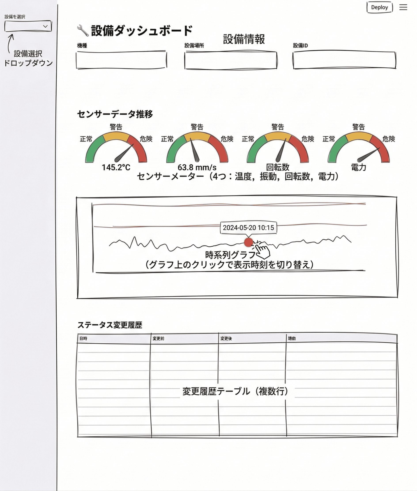

# ch2: Plan then Execute - 設備ダッシュボード

## 概要

ch1で構築したDB基盤を活用して、Streamlitによる製造設備モニタリングダッシュボードのUIを作成します。

- エントリーポイント `app.py`
- 設備ダッシュボードページ `pages/01_equipment_dashboard.py`
  - ゲージチャート・時系列チャート・ステータス変更履歴

## 体験すること（約5分｜経過 約5分）

Claude Code のプランモードで Plan then Execute パターンを通しで回します。ただしそれだけだと体験が薄いため、合間に Claude Code のさまざまな Tips を織り交ぜながら進めます。

- 画像から UI 仕様を起こす2段階フロー（プランモード ↔ 通常モードの切り替え）
- TodoWrite / `/simplify` / `claude-code-guide` といったツール・サブエージェントの使い分け
- 公式プラグイン `feature-dev` による別形態の Plan then Execute

## 学ぶこと

### Plan then Executeとは

AIコーディングエージェントにはプランモードがついています。これを使った短いイテレーションで実装、動作確認をするのが今の主流です。

1. **Plan（計画）**: AIに小さいタスクを投げ、仕様や実装計画を先に作らせる
2. **Execute（実装）**: 計画を確認したうえで、「実装してください」と指示する。足りない場合は1を継続。

ただしこれから実装する内容の合意量のバランスという話です。Opus 4.7以降planにせず実装させるやり方を@steipete(OpenClaw作者)や@thdxr(OpenCode作者)も言っていたりしますので適宜試してみてください。

### フロントエンドの実装

今回は画像入力で進めますが、本格的なフロントエンド開発では Figma MCP / Code Connect 経由のデザインデータ連携が現実解です（詳細は本章末尾のコラムを参照）。

### ポイント

- ツールの利用
  - TodoWrite を使った工程管理
  - 実装の仕上げに `/simplify` で再利用・冗長性・効率を自動レビュー
- statusline (設定済み) を使用した適切なコンテキストマネジメント
- ハーネスのカスタマイズ
  - サブエージェント `claude-code-guide` で `.claude/rules/`（path-scoped frontmatter が特徴）の仕様を確認 → プロジェクト向け rule を追加

## 前提

- ch1で作成したDB基盤（`db/schema.sql`, `db/seed.py`）が存在する
- Claude Code にログイン済み

## 0. ch2 プロジェクトを開く

```bash
cd ch2
uv sync
uv run python db/seed.py   # ch1 相当のDB準備
claude
```

```text
/model opusplan
/effort high
```

> [!NOTE]
> `opusplan` は Plan モードのみ Opus を使い、それ以外は Sonnet に自動切り替えするエイリアスです。AWS Bedrock 経由の場合も同じエイリアスが使えますが、1M コンテキストを使いたい場合は起動前に以下を設定してください。
>
> ```bash
> export ANTHROPIC_DEFAULT_OPUS_MODEL='us.anthropic.claude-opus-4-7[1m]'
> ```

> [!NOTE]
> `/effort high` は推論深度（Effort Level）を high に固定します。デフォルト（auto / max 相当）だと推論が深くなり過ぎて応答が鈍るので、ハンズオンのテンポを保つために high で運用します。もっと深く考えさせたいときは `/effort max`、軽く流したいときは `/effort medium` など適宜切り替え可能です。

## 1. UI仕様を作成する（約10分｜経過 約15分）

### 1.1. プランモードに切り替え

`Shift+Tab` を押して **plan mode** に切り替えます。入力欄の下に「plan mode」と表示されていることを確認してください。

### 1.2. ダッシュボード画像を渡してUI仕様を作成させる

ダッシュボードのざっくりとした画像が用意されています。こちらをベースに実装を行なっていきます。



以下のプロンプトを入力します。画像は `@dashboard.png` で添付してください。

```text
@dashboard.png は製造設備モニタリングダッシュボードの完成イメージです。
この画像を分析して、UI仕様を `docs/implement-snapshot/dashboard-spec.md` に作成してください。

仕様には以下を含めてください。
- ページ構成とファイル配置
- 各UIコンポーネントの詳細（レイアウト、表示項目、チャートの種類と設定）
- 使用するライブラリとデータソース
- 実装フェーズ（小さく動かせる単位に分割し、各フェーズで完成するもの・動作確認方法を明記。各フェーズは `- [ ]` チェックボックス形式で書き、完了時に `- [x]` に更新できるようにする）

仕様は `dashboard.png` に映っているコンポーネントの範囲に絞ってください。クリック・ホバーなどのインタラクションや将来の機能追加（例: グラフクリックでゲージが連動する、設備比較ビューなど）は spec に含めないでください。これらは後の工程で別途追加します。
```

<!-- 講師の体感: 1.2 の Claude 生成時間は 4 分前後。プランモードでも長めに待つ前提で待ってください。 -->

フェーズ分けまで Plan 側で固めておくのがポイントです。実装フェーズが仕様書に落ちていれば、後でセッションをリセットしても次に何を実装するかが仕様書から分かります。

プランモードなので、Claude Code は計画を提示するのみでファイルは作成しません。内容を確認し、問題なければ通常モードに戻して実装を指示します。

※ Claude Codeはsqlite3を利用して、データ構造を詳細に把握しプランを書き上げます。

### 1.3. 計画承認・UI仕様の書き出し

`Shift+Tab` で通常モードに戻し、以下を入力します。

```text
計画に沿って `docs/implement-snapshot/dashboard-spec.md` を作成してください。
```

#### チェック項目

- [ ] `docs/implement-snapshot/dashboard-spec.md` が作成されていることを確認してください
- [ ] 仕様にゲージチャート・時系列チャート・ステータス変更履歴の仕様が含まれていることを確認してください
- [ ] 仕様に実装フェーズ（小さく動かせる単位への分割と各フェーズの動作確認方法）が `- [ ]` チェックボックス形式で含まれていることを確認してください

仕様に不足や問題があれば、この時点で修正を依頼してください。

## 2. UI仕様をもとに実装する（約30分｜経過 約45分）

新しいセッションに切り替えたい場合、`/clear` でコンテキストをリセットしてください。(opusplanが適用されている場合、実装はsonnetになります)

以下のプロンプトで実装を開始します。1.2 で立てた実装フェーズに沿って、1 フェーズずつ Execute していく流れです。

```text
`docs/implement-snapshot/dashboard-spec.md` に記載された実装フェーズに沿って、まずはフェーズ1を実装してください。動作確認方法も教えてください。

完了したタスクは TodoWrite で進捗管理してください。動作確認はこちらで行います。問題なかったかAskUserQuestionで聞いてください。

`docs/implement-snapshot/dashboard-spec.md` の該当チェックボックスを `- [x]` に更新してください。
```

出来たら次に進みます。計画を外のマークダウンで管理しているので、適宜 `/clear` しても問題ありません。(5分たつとプロンプトキャッシュが消えるのでその分料金はかかります)。そのまま継続しても大丈夫です。

```text
@docs/implement-snapshot/dashboard-spec.md

確認できました。次のフェーズに進んでください。

動作確認はこちらで行います。問題なかったかAskUserQuestionで聞いてください。
```

フェーズごとに動作確認を行い、コンソールに表示されたエラーをClaude Codeにながし、問題がなければ次のフェーズに進む流れを繰り返します。

> [!TIP]
> プロンプト末尾の「完了したタスクは TodoWrite で進捗管理してください」のように、明示的に TodoWrite を指名すると Claude Code が自発的に TodoWrite を起動します。worktree などで並列に流せない場面、つまり 1 セッションで複数タスクを垂直に積んでいくときほど効きます。レビュー指摘やバグ報告がまとめて出てきたら、「これらを TODO で管理してから順に対応してください」と添えるだけで取りこぼしを減らせます。

全フェーズが終わったら、最後に `/simplify` をかけて生成コードを引き締めます。`/simplify` は Claude Code にバンドルされている公式スキルで、未コミットの差分を 3 並列のレビューエージェントが読み、**再利用機会・冗長性・効率** の観点で自動修正します。個人的にはやりとりや試行錯誤多い場合コードが残っているケースが多く、よく利用します。

```text
/simplify
```

> [!WARNING]
> `/simplify` はユーザー確認なしで自動修正まで進みます。実行前に `git status` で対象差分を把握し、`git restore` で戻せる状態にしておきます（コミット前に走らせるのが安全です）。

## 3. ハーネスの強化のためのTips（約5分｜経過 約50分）

Claude Codeの仕様はClaude Codeに聞いても不正確なことが多いです。

例えばClaude Code には CLAUDE.md とは別に `.claude/rules/` という仕組みがあり、ルールをトピック単位の Markdown ファイルに分割できます。最大の特徴は YAML frontmatter の `paths:` で glob を指定すると、マッチするファイルを編集中のときだけそのルールが自動でロードされる こと。常時ロードの CLAUDE.md と違い、関連する場面だけコンテキストに乗せられます。

仕様の確認は公式サブエージェント `claude-code-guide` を利用します。これは自動で発火するケースが少なく、明示呼び出しする場合があります。`/clear` で新しいセッションを開いて、以下を尋ねます。

```text
claude-code-guide サブエージェントを使って、`.claude/rules/` の仕様を教えてください。
特に YAML frontmatter の `paths:` でパスを絞り込む書き方と、CLAUDE.md との使い分けを知りたいです。
```

返ってきた回答をコンテキストに、ルールの作成を依頼をすると、正確に作成が可能です。

#### チェック項目

- [ ] Claude Codeの仕様はハルシネーションしやすい
- [ ] CLAUDE.md / `settings.json` / `.claude/rules/` の使い分けを説明できる

## 4. グラフクリックによるセンサー値連動を実装する（約10分｜経過 約60分）

ここまでに使ってきた Plan then Execute、TodoWrite、`/simplify` などを組み合わせて、自由なスタイルで以下の機能を追加してみましょう。固定された手順は提示しません。プランモードで計画を立てさせるか、いきなり実装させてから詰めるか、自分の好みで選んで進めてください。

> [!NOTE]
> 機能要件
>
> 時系列グラフのデータ点をクリックしたら、ゲージチャートがその時刻のセンサー値に更新される。

進め方の例として、

- プランモードで計画 → 通常モードに切り替えて実装（Plan then Execute）
- いきなり実装させて、結果を見ながら追加指示で詰める（実装ファースト）
- 修正候補が複数出たら「TODO で管理して」と添えて取りこぼしを防ぐ
- 仕上げに `/simplify` を当てて生成コードを引き締める

`/clear` でセッションを区切ってから着手するのがおすすめです（セクション 2 でコンテキストが膨らんでいるため）。

### このタイミングでショートカット・スラッシュコマンドも試してみる

実装の合間に、これまで明示的に紹介していないキー操作・スラッシュコマンドを試すと操作の幅が広がります。気になったものを 1〜2 個ピックして打鍵してみる程度で十分です。一覧はファイル末尾の [付録: ショートカット・スラッシュコマンド一覧](#appendix-shortcuts) にまとめてあります。

## 5. 検証（約5分｜経過 約65分）

ダッシュボードが正しく動作することを確認します。

```bash
uv run streamlit run app.py
```

#### チェック項目

- [ ] サイドバーから設備を選択し、設備情報カードが表示されること
- [ ] ゲージチャートにセンサー値と閾値による色分けが表示されること
- [ ] 時系列チャートに警告・危険の閾値ラインが表示されること
- [ ] ステータス変更履歴テーブルが表示されること
- [ ] グラフで選択した時刻に赤マーカーが表示されること
- [ ] 時系列グラフのデータ点をクリックすると、ゲージチャートが選択時刻の値に更新されること

## 6. feature-dev プラグインで「同じネタ」を実装してみる（約20分｜経過 約85分）

時間が余った場合です。

セクション 4 で自由スタイルで実装したグラフクリック → ゲージ連動機能を、今度は公式プラグイン `feature-dev` に任せて再実装します。同じ要件を別のワークフローで通すことで、ネイティブのプランモードと feature-dev のサブエージェント駆動の違いを体感するのが目的です。

### 6.0. feature-dev プラグインの位置づけ

`feature-dev` は機能開発を7段階に分け、Codebase Exploration / Architecture Design / Quality Review の3フェーズで専門サブエージェントを並列に動かす公式プラグインです。Phase 3/4/5/6 の境目で都度ユーザーに判断を委ねるため、立ち止まりやすい構成になっています（フェーズ詳細は後述）。

| 観点             | ネイティブプランモード        | feature-dev プラグイン                                                     |
| ---------------- | ----------------------------- | -------------------------------------------------------------------------- |
| 既存コードの探索 | ユーザーが Read / Grep で誘導 | `code-explorer` を2〜3個並列で起動し必読ファイルを返す                     |
| 設計案           | 単一案を計画書に書き下す      | `code-architect` が2〜3案を並列生成（最小変更／クリーン／バランス）        |
| 実装             | フェーズ単位でユーザーが指示  | プラグインがフェーズ進行を管理                                             |
| レビュー         | 別途 `/review` などを呼ぶ     | 3つの `code-reviewer` を観点別（簡潔さ／バグ／プロジェクト規約）に並列起動 |
| 待機ポイント     | 都度 `Shift+Tab` で切替       | Phase 3/4/5/6 の境目で都度ユーザーが判断                                   |

> [!NOTE]
> どちらが優れているかではなく使い分けの話です。UI の細かい試行錯誤や対話で詰めたいものはネイティブプランモード、新規ページや横断的な機能追加は feature-dev、と切り分けるのが現実的です。

<details>
<summary>7フェーズの動き（参考）</summary>

1. **Discovery** ── 要件と曖昧性の把握（メイン Claude）
2. **Codebase Exploration** ── `code-explorer` を2〜3個並列で起動し既存実装を追跡
3. **Clarifying Questions** ── プラグインから質問が来る。スキップしないのが特徴
4. **Architecture Design** ── `code-architect` が**2〜3案**を並列提示
5. **Implementation** ── 承認後にメイン Claude が実装
6. **Quality Review** ── 3つの `code-reviewer` を観点別に並列起動し、信頼度スコア（0-100）が**80以上**の指摘のみ報告。終了時に Fix now / Fix later / Proceed as-is をユーザーに確認
7. **Summary** ── 変更ファイル一覧と次の一手

</details>

### 6.1. プラグインを導入する

`/clear` でセッションをリセットしてから、Claude Code 上でマーケットプレイスを追加し、プラグインをインストールします。

```text
/plugin marketplace add anthropics/claude-plugins-official
```

project socpeで問題ないです。

```text
/plugin install feature-dev@claude-plugins-official
```

導入後、`/plugin` で一覧を開き `feature-dev` が installed 状態になっていれば準備完了です。

### 6.2. `/feature-dev` で同じ機能を依頼する

`/feature-dev` を発火し、セクション 4 と同じ機能を依頼します。

```text
/feature-dev:feature-dev 時系列グラフのデータ点をクリックしたら、ゲージチャートがその時刻のセンサー値に更新される機能を `pages/01_equipment_dashboard.py` に追加してください。
```

### 6.3. 各フェーズで体験するポイント

ここから先はプラグインがフェーズを進めます。各フェーズで承認待ちが入るので、表示内容に目を通してから次へ進めます。

1. **Codebase Exploration** ── `code-explorer` が返す必読ファイル一覧を一度自分でも開いて読んでみる。AI が同じファイルを「重要」と判定した理由が体感できる
2. **Clarifying Questions** ── 質問が出たら、自分でも先に質問リストを書き出してから比較する。AI が拾う観点と自分の観点のズレに気付ける
3. **Architecture Design** ── `code-architect` は3案を返す。推奨案ではなくクリーンアーキ案を選んで実装させてみるのも良い練習になる
4. **Implementation** ── 実装が始まる前に、その案でどのファイルが新規／変更されるはずか予測してみる
5. **Quality Review** ── `code-reviewer` の指摘は信頼度80%以上に絞られる。低信頼度の指摘がフィルタされている前提を踏まえ、レビュー内容を読み解く

### 6.4. 動作確認

実装後、Streamlit を起動して動作を確認します。

```bash
uv run streamlit run app.py
```

#### チェック項目

- [ ] feature-dev による実装でもグラフクリック → ゲージ更新が動作すること
- [ ] `code-architect` が提示した3案のうち、自分が選んだ案をメモしておくこと
- [ ] `code-reviewer` の指摘に目を通し、対処方針を決めたこと
- [ ] セクション 4 の自由スタイル実装と feature-dev の実装を並べて比べ、ファイル構成・関数分割・コメント量などの違いを確認したこと（`git diff` や git ブランチ切替を活用）

## コラム: フロントエンド実装の現場感

ch2 では画像入力で進めましたが、本格的なフロントエンド開発では別の選択肢があります。ここではその位置づけと、UI 仕様をどこに集約するかという論点を整理します。

### 画像入力と Figma MCP

画像入力ではメタ情報が欠落し、解像度や手描き度合いで認識精度にばらつきが出ます。ただし PoC や社内ツール、デザインシステム未整備の案件では画像で十分回せます。本ハンズオン ch2 が画像入力を採用しているのもこの判断です。

一方、デザインシステムやコンポーネントライブラリが整っているプロダクトでは Figma MCP 連携でデザインデータを直接 AI に渡せます。ただし Figma MCP の効果は **Figma 側の整理具合に強く依存** します。コンポーネント化されていない、命名が `Frame1268` のまま、variants が未定義、トークン未適用、といったファイルでは AI への入力品質は画像と大差なくなります。

### UI 仕様はどこに置くべきか（SSoT の議論）

「Figma / Storybook / マークダウンのどれを単一の真実の源（SSoT）にするか」は結論の出ていない議論です。

- **Figma**: ビジュアル確認・反復に最適。デザイナーが主役
- **Storybook**: 動くコンポーネント。実装と乖離しにくいが、非エンジニアの編集が難しい
- **マークダウン（design.md / RFC）**: AI エージェントに読ませるのに最適。ルール・トークン・命名を明示できる

実務的にはどれか1つに寄せず、Figma（ビジュアル）と Storybook（動く実装）とマークダウン（AI 向けルール）とデザイントークン JSON の多層構成で補完しあうのが現実解です。

本ハンズオン ch2 は Streamlit 上の小規模 UI に絞るため、UI 仕様を `docs/implement-snapshot/dashboard-spec.md` に集約しました。小規模・短命なツール向けの割り切りで、本格的なフロントエンドプロダクトでは上記の多層構成を取るのが一般的です。

<a id="appendix-shortcuts"></a>

## 付録: ショートカット・スラッシュコマンド一覧

セクション 4 から参照される一覧です。気になったものを 1〜2 個ピックして打鍵してみてください。

### キー操作

| 既出 | 操作                     | 動作                                              | 補足                                                                                                                                          |
| :--: | ------------------------ | ------------------------------------------------- | --------------------------------------------------------------------------------------------------------------------------------------------- |
|  ◯   | **Shift + Tab**          | モード切替（Default / acceptEdits / Plan / Auto） |                                                                                                                                               |
|  ◯   | **@**                    | ファイル・シンボルのあいまい検索                  |                                                                                                                                               |
|      | **Escape × 2**           | 直前の状態に巻き戻し（Rewind）                    |                                                                                                                                               |
|      | **Ctrl+C** / **Escape**  | 生成の中断                                        |                                                                                                                                               |
|      | **\\** + **Enter**       | 改行（複数行入力）                                | VS Code / Cursor / Windsurf / Alacritty / Zed では `/terminal-setup` を実行すると Shift+Enter にできる。iTerm2・Apple Terminal などは設定不要 |
|      | **Ctrl+L**               | 入力クリア（会話履歴は保持）                      |                                                                                                                                               |
|      | **Ctrl+O**               | トランスクリプト表示（ツール実行の詳細確認）      |                                                                                                                                               |
|      | `!` + コマンド           | bash コマンドの直接実行                           |                                                                                                                                               |
|      | **Ctrl+R**               | コマンド履歴検索                                  |                                                                                                                                               |
|      | **Option+P** / **Alt+P** | モデル切替（入力中に素早く切替）                  |                                                                                                                                               |
|      | **Option+T** / **Alt+T** | 拡張思考（Extended Thinking）の切替               |                                                                                                                                               |
|      | **Option+O** / **Alt+O** | Fast モード切替                                   |                                                                                                                                               |

### スラッシュコマンド

| 既出 | コマンド            | 動作                                 | 補足                                                                       |
| :--: | ------------------- | ------------------------------------ | -------------------------------------------------------------------------- |
|  ◯   | **/model**          | LLM モデルの切替                     | 左右キーで effort 調整も可能                                               |
|  ◯   | **/clear**          | 会話履歴のクリア                     | エイリアス `/reset`, `/new`                                                |
|  ◯   | **/simplify**       | 未コミット差分の自動レビュー         | バンドル済み公式スキル                                                     |
|  ◯   | **/plugin**         | プラグインの管理                     | install / marketplace add 等                                               |
|      | **/terminal-setup** | ターミナル側のキー設定を書き込む     | VS Code 等で Shift+Enter 改行を有効化する公式手段                          |
|      | **/effort**         | 推論深度（Effort Level）の切替       | low / medium / high / max / auto。講師は high 固定で運用                   |
|      | **/context**        | コンテキスト使用量をグリッドで可視化 | 最適化提案や容量警告も表示。たまに棚卸しする感じ                           |
|      | **/init**           | CLAUDE.md でプロジェクトを初期化     | `CLAUDE_CODE_NEW_INIT=1` で対話フロー                                      |
|      | **/compact**        | 会話を要約しコンテキストを圧縮       | 引数で保持したい情報を指定可能                                             |
|      | **/branch**         | 会話セッションを分岐                 | エイリアス `/fork`。`/resume` → `/rewind` で分岐点に戻り別作業へ移ると便利 |

※ 既出マーク（◯）は本ハンズオン ch2 内ですでに登場したもの
