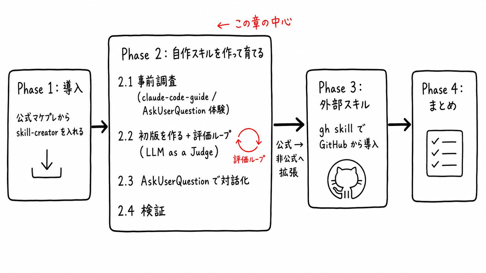
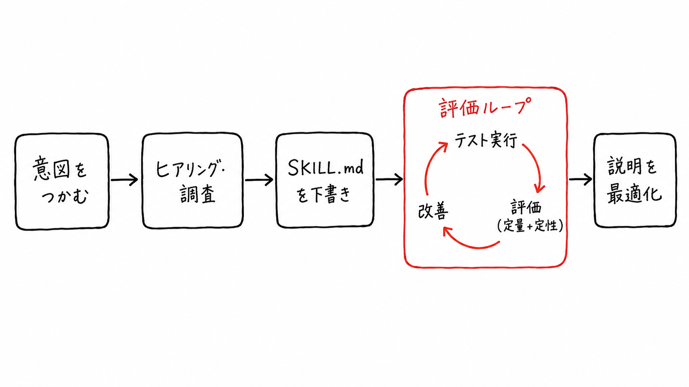
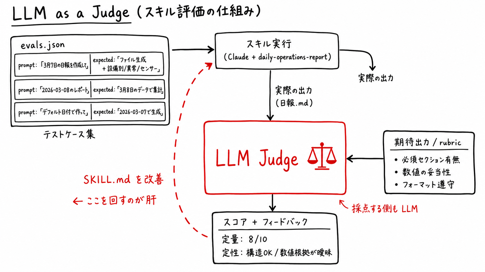
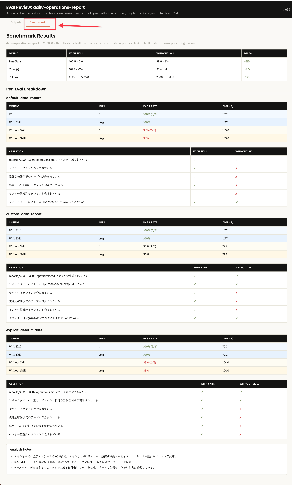
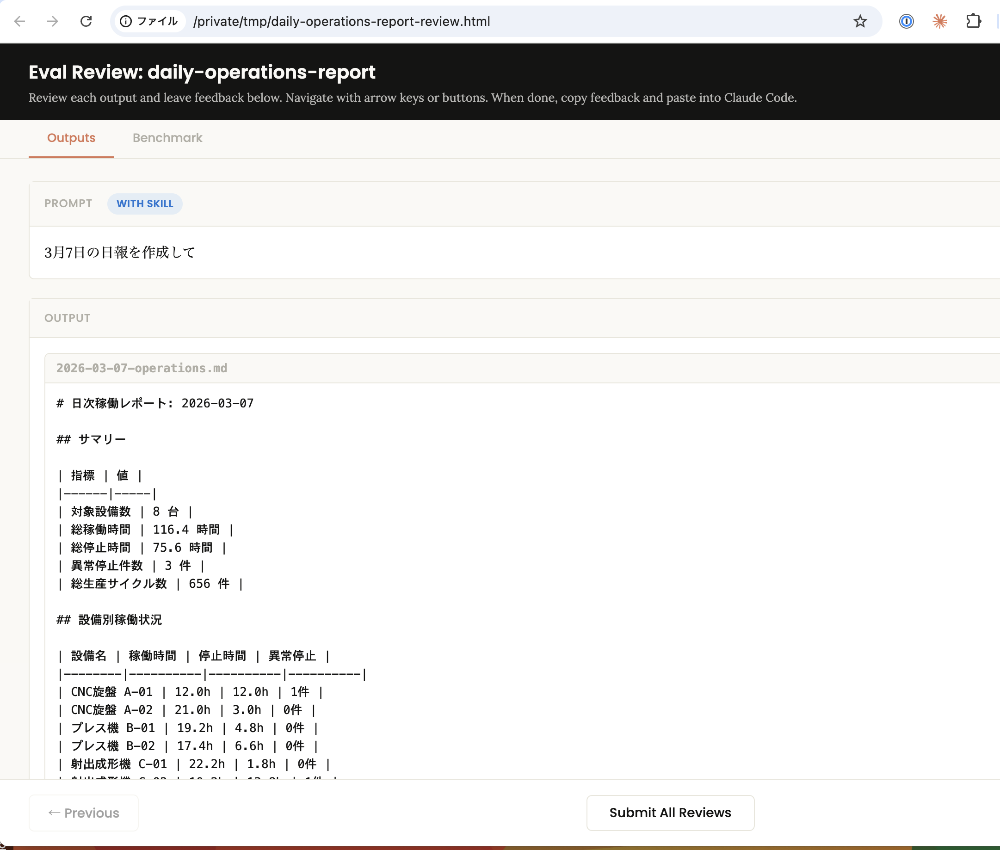
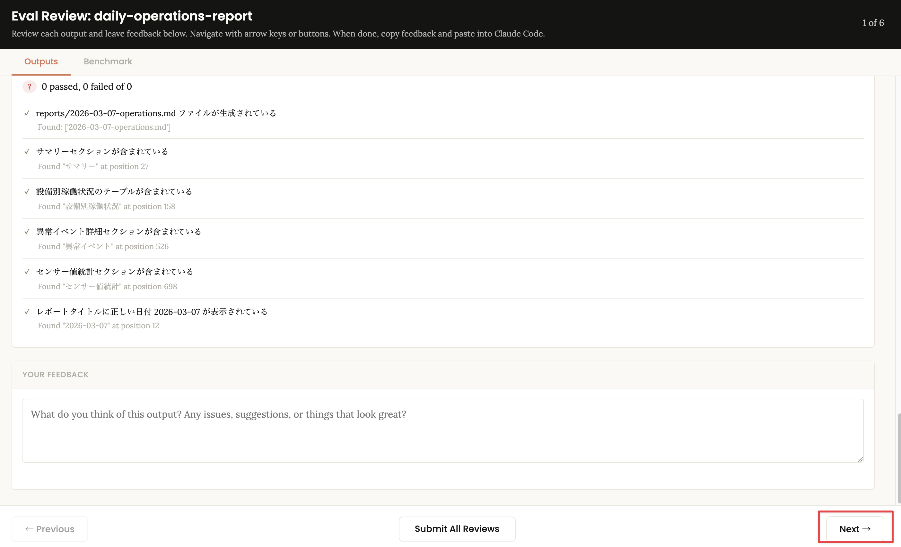

# ch3-skill-creator: Agent Skills - skill-creator によるスキル開発

## 概要

ch2 で構築した設備ダッシュボードをそのまま題材に、Agent Skills の以下の流れを 4 つの Phase で体験します。中心は **Phase 2 の自作スキル開発（評価ループ込み）** です。



- Phase 1: skill-creator を導入する ── Claude Code 公式マーケットプレイスからインストール
- Phase 2: 自作スキルを作って育てる ── 「事前調査 → 初版 + 評価ループ → 対話化 → 検証」のサイクル
- Phase 3: 外部スキルを扱う ── 公式マケプレ外のスキルを `gh skill` で導入
- Phase 4: まとめ

### Agent Skills とは

Agent Skills は、AI エージェントに新しい能力を追加するためのポータブルな命令パッケージです（[agentskills.io](https://agentskills.io) 標準）。Claude Code では `.claude/skills/<name>/SKILL.md` を配置するだけで、コンテキストに応じて自動的にスキルが活性化します。

1. Discovery（発見）: 起動時にスキル名と説明のみを読み込む（〜100 語/skill）
2. Activation（活性化）: リクエストがスキルの説明にマッチすると、本文全体を読み込む
3. Execution（実行）: `scripts/` や `references/` を必要に応じて読み込む

本章では `skill-creator` を使って設備稼働日報を出力する自作スキル（daily-operations-report）を作成し、Progressive Disclosure（Level 1/2/3）を意識したレビューサイクルで改善します。

### 前提

- ch2 で作成した設備ダッシュボード（`app.py`, `pages/01_equipment_dashboard.py`）が存在する
- Claude Code がインストール済み
- （Phase 3 用）GitHub CLI v2.90.0+。導入方法は [SETUP.md](../SETUP.md) §9 を参照

---

## Phase 1: skill-creator を導入する（約8分｜経過 約8分）

Anthropic 公式の [`anthropics/skills`](https://github.com/anthropics/skills) リポジトリは Claude Code のプラグインマーケットプレイスとして登録できます。`/plugin marketplace add` と `/plugin install` のスラッシュコマンドだけで `skill-creator` を導入します。追加ツールは不要です。

### 1.1. 環境セットアップ（約3分）

#### 章ディレクトリに移動

この章は専用の Python 設定を持ちます。必ず章ディレクトリを開いた状態で作業してください。

```bash
cd ch3-skill-creator
```

#### Streamlit アプリケーションの起動（ch2 完成状態の確認）

```bash
uv sync
uv run python db/seed.py
uv run streamlit run app.py
```

`http://localhost:8501` でダッシュボードが表示されることを確認してください（ch2 と同じ内容）。

### 1.2. 公式マーケットプレイスを追加（約2分）

Claude Code を起動します。

```bash
claude
```

Anthropic 公式の `anthropics/skills` を marketplace として登録します。

```text
/plugin marketplace add anthropics/skills
```

登録されたことを確認します。

```text
/plugin marketplace list
```

`anthropic-agent-skills` が表示されれば成功です。

> [!NOTE]
> タグ運用しているマーケットプレイスなら `<owner>/<repo>#<タグ>` の形でバージョンを固定できます（`anthropics/skills` は現時点でタグ未運用のため、`main` 追従になります）。

### 1.3. skill-creator をインストール（約2分）

```text
/plugin install example-skills@anthropic-agent-skills
```

インストールスコープを聞かれたら Project（`.claude/settings.json` に記録）を選ぶと、チームで共有できる形になります。

### 1.4. 認識確認（約1分）

```text
/plugin list
```

`skill-creator@anthropic-agent-skills` が enabled の状態で表示されていればOKです。`/` を入力して補完候補に `skill-creator` が現れることも確認してください。

#### チェック項目

- [ ] `/plugin marketplace list` に `anthropic-agent-skills` が登録されていること
- [ ] `/plugin list` で `skill-creator@anthropic-agent-skills` が enabled であること
- [ ] `/` 補完に `skill-creator` が表示されること

---

## Phase 2: 自作スキルを作って育てる（約27分｜経過 約35分）

「作る → 出す → 直す → 対話化」のサイクルでスキルを育てます。先に Phase 2.1 で必要な仕様知識を仕入れてから、Phase 2.2 以降の実装に入ります。

### 2.1. 事前調査（約7分）

後の Phase で使う知識を、メインセッションを汚さずに先に揃えておきます。

#### claude-code-guide で Agent Skills の仕様を調べる（約4分）

Claude Code 組み込みサブエージェントの `claude-code-guide` を呼んで、後で使う仕様をまとめて調べさせます。

```text
claude-code-guide を使って、SKILL.md の YAML frontmatter で指定できる項目と、
AskUserQuestion ツールの使い方（引数構造と典型的な使いどころ）を教えてください。
```

#### AskUserQuestion を直接体験する（約3分）

`AskUserQuestion` をスキルに組み込めると、**AI に独断させたくない判断ポイント**（対象日が無い / 既存ファイルと衝突する など）で、確定した選択肢から人間に決めさせる**安全な分岐**をスキル内に作れます。これが無いスキルは「自由入力 → AI が勝手に解釈 → 意図しない上書き」を起こしがちです。

Phase 2.3 で daily-operations-report にこの分岐を組み込みますが、その前に素のツールを 1 度呼んで挙動を確認します。AskUserQuestion には**単一選択 / 複数選択 / preview 付き比較 / 推奨ラベル**といった機能差があるため、3 問それぞれで別の機能を試して引き出しを増やします。

Claude Code に以下を入力します。

```text
AskUserQuestion を使って、以下の 3 問を一度に聞いてください。
それぞれ異なる機能を試したいので、必ず指定の構成にしてください。

1.【単一選択 + 各選択肢に description】
   質問: 日報の出力先ディレクトリはどこが良いですか？
   選択肢: reports/, output/, docs/reports/
   各選択肢に「なぜそれが向くか」の description を 1 行ずつ付けてください。

2.【複数選択 (multiSelect: true)】
   質問: 日報に含めたい補足セクションをすべて選んでください。
   選択肢: 異常停止サマリ, センサー値推移, 担当者シフト集計, 翌日の予定

3.【preview 付き + Recommended ラベル】
   質問: SKILL.md frontmatter のサンプルとしてどれを採用しますか？
   選択肢を 3 つ用意し、それぞれ preview に YAML スニペット (4〜6 行) を入れてください。
   推奨案を先頭に置き、ラベル末尾に "(Recommended)" を付けてください。

回答をもらったら「了解しました」とだけ返してください。
```

回答内容は使いません。3 問それぞれで UI が違うこと（チップ単一選択 / チェックボックス複数選択 / 右側プレビューの side-by-side）を目で確認してください。

#### チェック項目

- [ ] 1 問目で各選択肢に description が表示されること
- [ ] 2 問目で複数選択できる UI（チェックボックス相当）になっていること
- [ ] 3 問目で選択肢を切り替えると右側 / 下に YAML プレビューが出ること（先頭に "(Recommended)" 付き）

### 2.2. 初版を作る（約11分）

ch2 の SQLite DB（`data/factory.db`）を題材に、指定日 24 時間分の設備稼働レポートを Markdown で出力するスキルを作ります。seed データの期間は 2026-03-01 〜 2026-03-08 なので、対象日は 2026-03-07 に固定します。

#### skill-creator に依頼（約8分）

skill-creator は以下のような流れでスキルを育てる前提で作られています。中央の **評価ループ** が肝で、テスト実行 → 評価（定量＋定性）→ 改善を回し続けることで、初版で粗かったスキルが実運用に耐える品質に上がります。Phase 2.2 以降を進めるときはこのメンタルモデルを意識してください。



Claude Code で以下を入力します。

```text
/skill-creator を使って、以下の要件のスキルを作成してください。

- スキル名: daily-operations-report
- 目的: data/factory.db から指定日 24 時間分の設備稼働データを集計し、日報を Markdown で出力する（既定の対象日は 2026-03-07、任意日を引数で受け取れる設計）
- 集計内容:
  - 設備別の稼働時間 / 停止時間 / 異常停止件数
  - 期間中の総生産数
  - 主要センサー値（temperature, vibration など）の平均/最大
- 出力: `reports/YYYY-MM-DD-operations.md` に保存
- 実装先: .claude/skills/daily-operations-report/ 配下
```

次のフェーズに進む

> AI: 次のステップとして、テストケースを作って評価ループを回すこともできますが、どうしますか？

```text
お願いします。
```

skill-creator はここから **LLM as a Judge** という方式で評価を回します。テストプロンプトをスキル付き Claude に投げて出力を集め、それを別の LLM（Judge）が `expected_output` と照合してスコアと指摘を返します。Judge 自身も LLM なので自然文の出力でも採点でき、その結果が SKILL.md 改善のインプットになるのが肝です。



#### eval-viewer で結果を確認する

skill-creator は `eval-viewer/generate_review.py` を実行し、評価結果をブラウザで確認できる HTML を出力します。**最初に Benchmark タブを開いて定量結果を確認し、そのあとで Outputs タブの個別出力を見る**順序が効率的です（マクロで合否傾向を掴んでからミクロで原因を探る）。

##### 1. Benchmark タブで全体感を掴む

最上部の集計表で **WITH SKILL と WITHOUT SKILL の Pass Rate / Time / Tokens** を比較します。Delta（差分）が小さければスキルの効きが弱い、大きければスキルが価値を出している、というシグナルです。さらに Per-Eval Breakdown で各テストケースの合否、ASSERTION 表で個別チェック項目の ✓/✗、最下部の Analysis Notes で skill-creator のサマリ所感が読めます。



Per-Eval Breakdown に並ぶ 3 つの eval はそれぞれ別の「言い回しのバリエーション」をテストしています。プロンプトと意図のマッピングを把握しておくと、どのケースが落ちたときに何を疑えばよいかが分かります。

| eval 名               | プロンプト                                                           | テスト意図                                                           |
| --------------------- | -------------------------------------------------------------------- | -------------------------------------------------------------------- |
| default-date-report   | 「3月7日の日報を作成して」                                           | 日付を日本語（M月D日）で指定した場合に正しく解釈して使えるか         |
| custom-date-report    | 「2026-03-08の設備稼働レポートを出力してほしい」                     | デフォルト以外の日付（ISO 形式）を指定した場合に正しく処理できるか   |
| explicit-default-date | 「工場の日次オペレーションレポートを作って。デフォルトの日付でいい」 | 日付を明示せず「デフォルトで」と言った場合に 2026-03-07 が使われるか |

##### 2. Outputs タブで個別ケースを精査する

Benchmark で気になったケース（特に WITHOUT が落ちて WITH が通っているもの）を Outputs タブで開き、プロンプトと出力本文を確認します。



下部にはアサーション一覧があり、Judge が rubric 各項目（必須セクションの有無、日付一致など）を ✓/✗ で自動採点した結果が並びます。さらに `YOUR FEEDBACK` 欄から人間のコメントを足し、両方を SKILL.md 改善のインプットにします。



eval-viewer には **3 prompts × 2 modes = 6 件** が並びます。WITHOUT SKILL は盲検 A/B 比較の片割れとして置かれており（`agents/comparator.md` の Blind Comparator がどちらがスキル付きか伏せて勝者を判定します）、フィードバックは原則 **WITH SKILL のみ** に書きます。WITHOUT を見て「想定以上に良い / 悪い」「Comparator の判定と感覚がズレる」と感じた時だけ、その違和感を書き残してください ── アサーション設計やスキル要否を見直すシグナルになります。

各ケースを Next で送って全件レビューしたら **Submit All Reviews** で確定し、出力されたフィードバックを Claude Code に貼り戻して SKILL.md 改稿に進みます。

#### 生成されたスキルを確認

eval ループを経て、skill-creator は **Progressive Disclosure**（3 レベルの遅延ロード設計）に沿った構造でスキルを出します。重い情報は Level 3 に退避し、Level 2 の SKILL.md 本文は短く保たれているのが理想です。

- Level 1 / Metadata（name + description）— 起動時に全スキル分が system prompt に常駐。〜100 語/skill に抑える
- Level 2 / SKILL.md 本文 — trigger 時のみ全文ロード。500 行未満が推奨
- Level 3 / Bundled Resources（`scripts/`, `references/`, `assets/`） — 本文から参照された時だけ読込。scripts は実行のみで context を食わない

期待される構成例:

```
.claude/skills/daily-operations-report/
├── SKILL.md                      # Level 2: 高レベルガイド (短く保つ)
├── references/
│   └── schema.md                 # Level 3: DB スキーマ・SQL サンプル
├── scripts/
│   └── aggregate.py              # Level 3: 集計ロジック本体
└── assets/
    └── report-template.md        # Level 3: 出力テンプレート
```

実物を確認します。

```bash
ls .claude/skills/daily-operations-report/
cat .claude/skills/daily-operations-report/SKILL.md
```

#### 初版で日報を出力する（約3分）

Claude Code で以下を入力します。

```text
2026-03-07 の稼働日報を出力してください
```

`daily-operations-report` スキルが自動でトリガーされ、`reports/2026-03-07-operations.md` が生成されます。

#### チェック項目

- [ ] `.claude/skills/daily-operations-report/SKILL.md` が存在すること
- [ ] SKILL.md 本文が短く保たれ、`scripts/` `references/` `assets/` に詳細が退避されていること
- [ ] description が「日報を出力したいときに使う」と明確に伝わる記述になっていること
- [ ] 指定ディレクトリに日報 `.md` が生成されていること
- [ ] 設備別の稼働率・停止件数・生産数が含まれていること

### 2.3. AskUserQuestion で対話化する（約6分）

Phase 2.2 で骨組みと評価が整ったので、最後に「最小の指示で動くスキル」から「実運用で任せられる対話型スキル」へ進化させます。

`AskUserQuestion` は選択肢を明示して対話するツールです。自由入力よりモデルの暴走を抑え再現性が上がるため、運用フローに組み込みたいスキルでは第一選択になります。

Phase 2.1 で調べた引数構造を頭に置きつつ、skill-creator にリファクタを依頼します。

> [!IMPORTANT]
> このフェーズも Plan モードで実行してください（`Shift+Tab` で `plan mode on`）。

```text
/skill-creator で .claude/skills/daily-operations-report/ に AskUserQuestion を使った
対話確認を追加してください。以下の2シナリオで使います。

1. 対象日の指定が無い場合: seed データが存在する期間（2026-03-01 〜 2026-03-08）から選ばせる
2. 同じ日付のレポートが既に reports/ にある場合: 「上書き / 別名で保存 / 中断」の3択を出す
```

skill-creator が差分を提案するので、内容を確認して適用します。

#### 動作確認: 対象日を省略したプロンプト

```text
昨日の稼働日報を出力してください
```

対象日の選択肢 UI が出ることを確認してください（2026-03-01 〜 2026-03-08 から選ばせる）。

#### 動作確認: 既存レポートと同じ日付を指定

```text
2026-03-07 の稼働日報を出力してください
```

（前のフェーズで既に `reports/2026-03-07-operations.md` が存在している前提）上書き / 別名で保存 / 中断 の3択 UI が出ることを確認してください。

#### 動作確認: 改善版で最終形

```text
2026-03-08 の稼働日報を出力してください
```

新しい日付で実行し、Progressive Disclosure に沿った構造 × AskUserQuestion の対話確認が合わさった実運用寄りのスキルになっていることを確認します。

#### チェック項目

- [ ] `SKILL.md` または `scripts/` に `AskUserQuestion` の呼び出しが記述されていること
- [ ] 対象日を省略すると 2026-03-01 〜 2026-03-08 の選択肢 UI が出ること
- [ ] 既存日付を指定したときに上書き確認ダイアログが出ること

### 2.4. Phase 2 検証（約3分）

#### チェック項目

- [ ] `.claude/skills/daily-operations-report/` が存在すること
- [ ] `daily-operations-report` が Progressive Disclosure の 3 レベルを活用した構造になっていること
- [ ] `daily-operations-report` に `AskUserQuestion` による対話確認が組み込まれていること
- [ ] `claude-code-guide` を使って仕様調査した経験があること（メインセッションとは別タスクで動くことを体感済み）

---

## Phase 3: 外部スキルを扱う（約5分｜経過 約40分）

Phase 1〜2 では Claude Code 公式マケプレにあるスキルを扱いました。Phase 3 はそこに無い**任意の GitHub リポジトリのスキル**を取り込むためのツールとして `gh skill` を扱います。`gh skill install` は `--pin <SHA / タグ>` で特定コミットに固定して取得でき、配布元の `main` が後日改変されても自分の環境は影響を受けない運用ができます。

なお、別実装として vercel-labs/skills には `skills-lock.json` という manifest で skill の版管理を行う事例もあります（本ハンズオンでは紹介のみ）。

> [!NOTE]
> 事前に [SETUP.md §9](../SETUP.md) を見て GitHub CLI v2.90.0+ を用意してください。`gh skill` は Public Preview のため仕様変更の可能性があります。本章執筆時点で利用可能なサブコマンドは `install / preview / update / search / publish` です（**`list` と `uninstall` は存在しません**）。

#### 外部スキルのリスクと対策

外部スキルは GitHub による署名検証を経ていないため 2 種類のリスクがあります。`gh skill` はそれぞれに対応する仕組みを **GitHub プリミティブ（タグ / リリース / コミット SHA）** を活用して提供します。

| リスク                                                                        | 対策                                              | 防げるシナリオ                                                                            |
| ----------------------------------------------------------------------------- | ------------------------------------------------- | ----------------------------------------------------------------------------------------- |
| **コンテンツリスク**（プロンプトインジェクション・悪意あるスクリプトの混入）  | `gh skill preview` でインストール前に中身を確認   | 配布物を読んで「変な instructions / スクリプトが無い」と確認する                          |
| **サプライチェーンリスク**（後日コミットが改変される / 悪意ある PR が merge） | `gh skill install --pin <タグ or SHA>` で固定導入 | `main` ブランチの後日改変、リポジトリ乗っ取り、悪意ある version bump から自分の環境を守る |

### 3.1. preview で中身を確認する（コンテンツリスク対策）

```bash
gh skill preview anthropics/skills mcp-builder
```

`SKILL.md` 本文と bundled resources の内容が表示されます。意図不明な instructions やスクリプトが無いか目視確認してください。

### 3.2. インストール（pin でサプライチェーンリスク対策）

中身を確認できたら導入します。**実運用では `--pin <SHA>` か `--pin <タグ>` を付けてバージョンを固定**してください。pin することで、配布元の `main` が後日改変されても自分の環境は影響を受けません。

`anthropics/skills` リポジトリは現時点でタグ・リリースが切られていないので、ハンズオンでは **コミット SHA** で固定します。最新コミット SHA は GitHub API で取得できます。

```bash
# 1. 最新コミット SHA（短縮形）を取得
gh api repos/anthropics/skills/commits/main --jq '.sha[0:7]'
# → 例: d211d43

# 2. その SHA に固定して install
gh skill install anthropics/skills mcp-builder --agent claude-code --pin d211d43
```

スコープを聞かれたら **Project** を選ぶと `.claude/skills/<skill>/` 配下に配置されます。インストール完了時の出力に `Installed mcp-builder (from anthropics/skills@<full-SHA>)` と固定先が表示されるので、その SHA で動いていることが確認できます。

インストール済みかどうかはファイルシステムか Claude Code の `/` 補完で確認します（`gh skill list` は無いため）。

```bash
ls .claude/skills/
```

### 3.3. 更新

更新は **対象スキル名を明示** して実行します（`gh skill install` で metadata 付きで入っているため、引数指定だけで OK）。

```bash
gh skill update mcp-builder
```

> [!NOTE]
> `--all` で全件更新もできますが、`/plugin install` や手動配置で入った metadata 無しのスキルがあると、1 件ずつ「source repository は？」と質問されます。ハンズオン中は今回入れたものだけ指定するのが楽です。

> [!NOTE]
> `--pin` で固定したスキルは update から自動でスキップされます（意図せず新バージョンに上書きされない、サプライチェーン対策の一部）。pin を解除して最新まで追従させたいときは `gh skill update <skill> --unpin` を使います。

### 3.4. 削除

`gh skill` に `uninstall` サブコマンドは無いため、ファイルシステムから直接削除します。

```bash
rm -rf .claude/skills/mcp-builder
```

### チェック項目

- [ ] `gh skill preview` で SKILL.md の中身を確認した
- [ ] `ls .claude/skills/` にインストールしたスキルが表示されること
- [ ] Claude Code の `/` 補完に当該スキルが現れること
- [ ] `gh skill update <skill>` が metadata 質問なしで完走すること

---

## Phase 4: まとめ

- 公式マケプレ（`/plugin install`）が第一選択。Anthropic 公式のスキルはこれで入る
- GitHub の任意リポジトリのスキルは `gh skill` で pin 導入
- スキルは「作る → 出す → 直す → 対話化」のサイクルで育てる。初版で完璧を狙わず、Progressive Disclosure を意識した 2 パス構造で改善する

どちらの導入方法を使っても最終的には `.claude/skills/<name>/SKILL.md` が配置され、Claude Code から同じ使い心地になります。配布元と管理粒度で使い分けてください。
