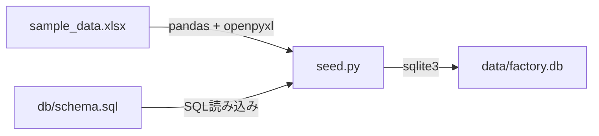
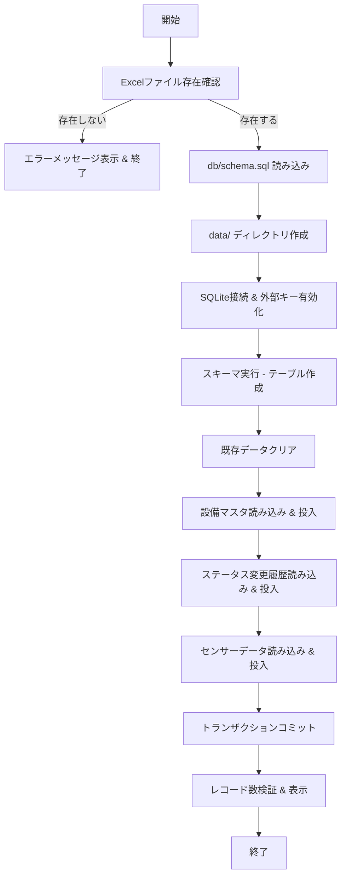
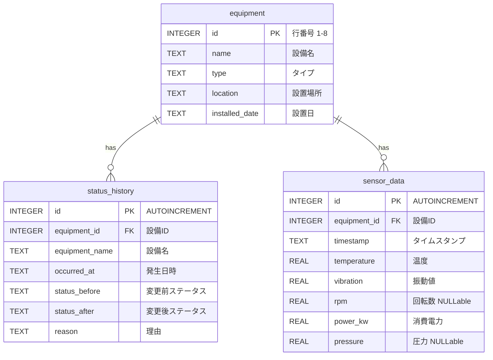

# 設計ドキュメント: factory-dashboard-seed

## 概要（Overview）

本設計は、製造設備ダッシュボードアプリのデータ基盤となるシードスクリプト（`seed.py`）とDBスキーマ（`db/schema.sql`）を定義する。

Excelファイル（`sample_data.xlsx`）に格納された3種類のデータ（設備マスタ・ステータス変更履歴・センサーデータ）を読み込み、SQLiteデータベース（`data/factory.db`）に投入する。seed.pyはハードコードされたデータ定数を一切持たず、全データをExcelから動的に読み込む。

### 主要な設計判断

1. **スキーマの外部ファイル化**: `db/schema.sql` にCREATE TABLE文を分離し、seed.pyとダッシュボードアプリの両方から参照可能にする
2. **冪等実行**: seed.pyは何度実行しても同じ結果を得られるよう、既存データをクリアしてから再投入する
3. **トランザクション管理**: 全データ投入を単一トランザクションで実行し、部分的な投入を防止する
4. **外部キー制約の有効化**: SQLiteはデフォルトで外部キー制約が無効のため、接続時に明示的に有効化する

## アーキテクチャ（Architecture）

### システム構成



### 処理フロー



### ディレクトリ構成

```
project-root/
├── seed.py              # シードスクリプト（メインエントリポイント）
├── sample_data.xlsx     # Excelデータソース
├── pyproject.toml       # プロジェクト設定
├── db/
│   └── schema.sql       # DBスキーマ定義（CREATE TABLE文）
└── data/
    └── factory.db       # SQLiteデータベース（seed.py実行時に生成）
```

## コンポーネントとインターフェース（Components and Interfaces）

### seed.py の内部構成

seed.pyは単一ファイルのスクリプトとして実装し、以下の関数で構成する。


#### 関数一覧

| 関数名 | 引数 | 戻り値 | 責務 |
|---|---|---|---|
| `main()` | なし | `None` | エントリポイント。全体の処理フローを制御する |
| `load_excel(path: Path)` | Excelファイルパス | `dict[str, pd.DataFrame]` | Excelの3シートを読み込み、DataFrameの辞書を返す |
| `validate_columns(sheets: dict[str, pd.DataFrame])` | シート辞書 | `None` | 各シートの必須カラムを検証する。不足時は例外を送出 |
| `init_db(db_path: Path, schema_path: Path)` | DBパス, スキーマパス | `sqlite3.Connection` | DB接続を作成し、外部キー有効化とスキーマ実行を行う |
| `clear_tables(conn: sqlite3.Connection)` | DB接続 | `None` | 全テーブルの既存データを削除する |
| `seed_equipment(conn, df: pd.DataFrame)` | DB接続, DataFrame | `None` | 設備マスタデータを投入する |
| `seed_status_history(conn, df: pd.DataFrame)` | DB接続, DataFrame | `None` | ステータス変更履歴データを投入する |
| `seed_sensor_data(conn, df: pd.DataFrame)` | DB接続, DataFrame | `None` | センサーデータを投入する |
| `verify_counts(conn: sqlite3.Connection)` | DB接続 | `bool` | 各テーブルのレコード数を検証・表示する |

#### Excelシート名とカラムのマッピング

seed.pyは以下のシート名を使用してExcelの各シートを識別する:

| Excelシート名 | DBテーブル名 | カラムマッピング |
|---|---|---|
| `設備マスタ` | `equipment` | 設備名→name, タイプ→type, 設置場所→location, 設置日→installed_date |
| `ステータス変更履歴` | `status_history` | 設備ID→equipment_id, 設備名→equipment_name, 発生日時→occurred_at, 変更前ステータス→status_before, 変更後ステータス→status_after, 理由→reason |
| `センサーデータ` | `sensor_data` | 設備ID→equipment_id, タイムスタンプ→timestamp, temperature→temperature, vibration→vibration, rpm→rpm, power_kw→power_kw, pressure→pressure |

#### 外部ライブラリ

| ライブラリ | 用途 |
|---|---|
| `pandas` | Excel読み込み、DataFrame操作 |
| `openpyxl` | pandasのExcelエンジン |
| `sqlite3` | Python標準ライブラリ。SQLiteデータベース操作 |

### db/schema.sql

DDL（Data Definition Language）のみを含むSQLファイル。`CREATE TABLE IF NOT EXISTS` 構文を使用し、冪等なテーブル作成を実現する。

## データモデル（Data Models）

### ER図



### テーブル定義詳細

#### equipment テーブル

| カラム名 | 型 | 制約 | 説明 |
|---|---|---|---|
| `id` | INTEGER | PRIMARY KEY | Excelの行番号（1〜8） |
| `name` | TEXT | NOT NULL | 設備名（例: CNC旋盤 A-01） |
| `type` | TEXT | NOT NULL | 設備タイプ（CNC旋盤, プレス機, 射出成形機, 溶接ロボット） |
| `location` | TEXT | NOT NULL | 設置場所（例: A棟1F） |
| `installed_date` | TEXT | NOT NULL | 設置日（ISO 8601形式: YYYY-MM-DD） |

#### status_history テーブル

| カラム名 | 型 | 制約 | 説明 |
|---|---|---|---|
| `id` | INTEGER | PRIMARY KEY AUTOINCREMENT | 自動採番 |
| `equipment_id` | INTEGER | NOT NULL, FK → equipment(id) | 設備ID |
| `equipment_name` | TEXT | NOT NULL | 設備名（冗長保持） |
| `occurred_at` | TEXT | NOT NULL | 発生日時（ISO 8601形式） |
| `status_before` | TEXT | NOT NULL | 変更前ステータス |
| `status_after` | TEXT | NOT NULL | 変更後ステータス |
| `reason` | TEXT | NOT NULL | 理由 |

#### sensor_data テーブル

| カラム名 | 型 | 制約 | 説明 |
|---|---|---|---|
| `id` | INTEGER | PRIMARY KEY AUTOINCREMENT | 自動採番 |
| `equipment_id` | INTEGER | NOT NULL, FK → equipment(id) | 設備ID |
| `timestamp` | TEXT | NOT NULL | タイムスタンプ（ISO 8601形式） |
| `temperature` | REAL | NOT NULL | 温度（℃） |
| `vibration` | REAL | NOT NULL | 振動値 |
| `rpm` | REAL | NULL許容 | 回転数（CNC旋盤のみ） |
| `power_kw` | REAL | NOT NULL | 消費電力（kW） |
| `pressure` | REAL | NULL許容 | 圧力（プレス機・射出成形機のみ） |

### インデックス定義

| テーブル | インデックス名 | カラム | 目的 |
|---|---|---|---|
| `status_history` | `idx_status_history_equipment_id` | `equipment_id` | 設備単位の履歴検索 |
| `sensor_data` | `idx_sensor_data_equipment_id` | `equipment_id` | 設備単位のセンサーデータ検索 |
| `sensor_data` | `idx_sensor_data_equipment_timestamp` | `equipment_id, timestamp` | 時系列クエリの効率化 |


## 正当性プロパティ（Correctness Properties）

*プロパティとは、システムの全ての有効な実行において真であるべき特性や振る舞いのことである。プロパティは、人間が読める仕様と機械が検証可能な正当性保証の橋渡しとなる。*

### Property 1: 設備IDの整合性

*任意の* seed.py実行後のデータベースにおいて、equipmentテーブルの全レコードのidは1から始まる連番であり、status_historyテーブルおよびsensor_dataテーブルの全レコードのequipment_idは、equipmentテーブルに存在するidのいずれかと一致すること。

**Validates: Requirements 2.2, 6.3**

### Property 2: センサーデータのNULL許容性と設備タイプの整合性

*任意の* sensor_dataレコードにおいて、対応するequipmentレコードのtypeが「CNC旋盤」の場合のみrpmが非NULLであり、typeが「プレス機」または「射出成形機」の場合のみpressureが非NULLであること。

**Validates: Requirements 4.3**

### Property 3: シード実行の冪等性

*任意の* 有効なExcelデータソースに対して、seed.pyを2回連続で実行した場合、2回目の実行後のデータベースの全テーブルのレコード数および内容が1回目の実行後と同一であること。

**Validates: Requirements 6.5**

## エラーハンドリング（Error Handling）

### エラー分類と対応

| エラー種別 | 発生条件 | 対応 | 終了コード |
|---|---|---|---|
| ファイル不在 | `sample_data.xlsx` が存在しない | エラーメッセージを表示して終了 | 1 |
| スキーマ不在 | `db/schema.sql` が存在しない | エラーメッセージを表示して終了 | 1 |
| カラム不足 | Excelシートに必須カラムが不足 | 不足カラム名を含むエラーメッセージを表示して終了 | 1 |
| DBエラー | テーブル作成・データ投入中のSQLiteエラー | トランザクションをロールバックし、エラー詳細を表示して終了 | 1 |
| レコード数不一致 | 投入後のレコード数が期待値と異なる | 警告メッセージを表示（正常終了） | 0 |

### エラーハンドリングの実装方針

1. **早期リターン**: ファイル不在・カラム不足は処理開始前に検出し、早期に終了する
2. **try-except**: DB操作は `try-except` ブロックで囲み、例外発生時にロールバックを実行する
3. **sys.exit()**: エラー時は `sys.exit(1)` で非ゼロの終了コードを返す
4. **警告と致命的エラーの区別**: レコード数不一致は警告（処理は正常終了）、それ以外は致命的エラー（処理を中断）

### エラーメッセージの形式

```
[ERROR] sample_data.xlsx が見つかりません: {path}
[ERROR] db/schema.sql が見つかりません: {path}
[ERROR] シート「{sheet_name}」に必須カラムが不足しています: {missing_columns}
[ERROR] データベースエラー: {error_detail}
[WARNING] レコード数が期待値と一致しません: {table_name} (期待: {expected}, 実際: {actual})
```

## テスト戦略（Testing Strategy）

### テストフレームワーク

| 種別 | ライブラリ | 用途 |
|---|---|---|
| ユニットテスト | `pytest` | 具体的なexample、edge case、エラー条件の検証 |
| プロパティベーステスト | `hypothesis` | 全入力に対する普遍的プロパティの検証 |

### テスト構成

```
tests/
├── test_seed.py          # ユニットテスト
└── test_seed_props.py    # プロパティベーステスト
```

### ユニットテスト（pytest）

ユニットテストは具体的なexampleとedge caseに焦点を当てる。プロパティベーステストが多数の入力をカバーするため、ユニットテストは最小限に留める。

| テスト | 検証内容 | 対応要件 |
|---|---|---|
| `test_schema_has_all_tables` | schema.sqlに3つのCREATE TABLE文が含まれること | 1.4, 2.1, 3.1, 4.1 |
| `test_schema_if_not_exists` | schema.sqlにIF NOT EXISTS句が含まれること | 6.2 |
| `test_equipment_not_null_constraints` | equipmentテーブルの全カラムにNOT NULL制約があること | 2.3 |
| `test_foreign_key_status_history` | status_historyのequipment_idに外部キー制約があること | 3.2 |
| `test_foreign_key_sensor_data` | sensor_dataのequipment_idに外部キー制約があること | 4.2 |
| `test_indexes_exist` | 必要なインデックスが全て作成されていること | 3.3, 4.4 |
| `test_seed_creates_db_file` | seed.py実行後にdata/factory.dbが作成されること | 6.1 |
| `test_foreign_keys_enabled` | SQLite接続で外部キー制約が有効化されていること | 6.6 |
| `test_record_counts` | 各テーブルのレコード数が期待値と一致すること | 7.1, 7.2 |
| `test_error_missing_excel` | Excelファイル不在時にエラーメッセージと非ゼロ終了コード | 8.1 |
| `test_error_db_failure` | DBエラー時にロールバックとエラーメッセージ | 8.2 |
| `test_error_missing_columns` | カラム不足時にエラーメッセージ | 8.3 |
| `test_warning_count_mismatch` | レコード数不一致時に警告メッセージ | 7.3 |

### プロパティベーステスト（hypothesis）

各プロパティテストは最低100回のイテレーションで実行する。各テストには設計ドキュメントのプロパティ番号を参照するタグコメントを付与する。

| テスト | 対応プロパティ | タグ |
|---|---|---|
| `test_prop_equipment_id_integrity` | Property 1 | Feature: factory-dashboard-seed, Property 1: 設備IDの整合性 |
| `test_prop_sensor_null_type_consistency` | Property 2 | Feature: factory-dashboard-seed, Property 2: センサーデータのNULL許容性と設備タイプの整合性 |
| `test_prop_seed_idempotency` | Property 3 | Feature: factory-dashboard-seed, Property 3: シード実行の冪等性 |

#### プロパティテストの実装方針

- **Property 1**: hypothesisで設備ID（1〜8）をランダム生成し、seed実行後のDBに対してequipment_idの参照整合性を検証する
- **Property 2**: hypothesisでsensor_dataレコードをランダムにサンプリングし、対応するequipmentのtypeに基づいてrpm/pressureのNULL/非NULLを検証する
- **Property 3**: seed.pyを2回実行し、全テーブルの内容が同一であることを検証する。hypothesisの `@given` でテスト実行回数を制御する

### テスト実行

```bash
# ユニットテスト
pytest tests/test_seed.py -v

# プロパティベーステスト
pytest tests/test_seed_props.py -v

# 全テスト
pytest tests/ -v
```
