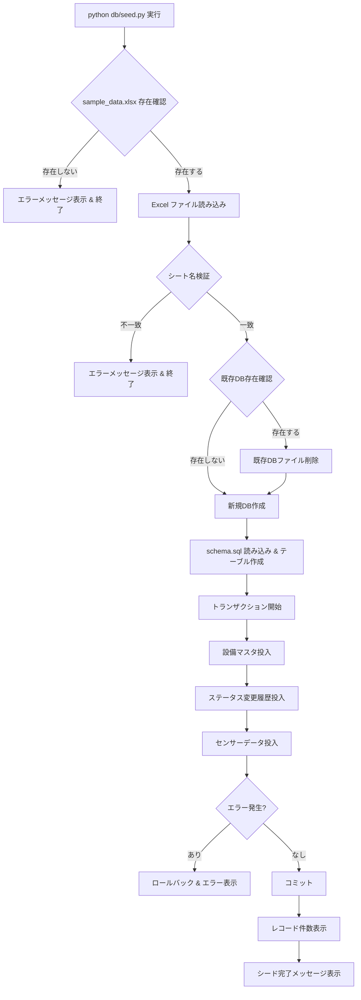
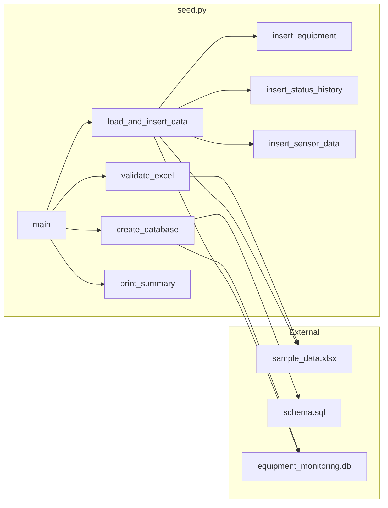
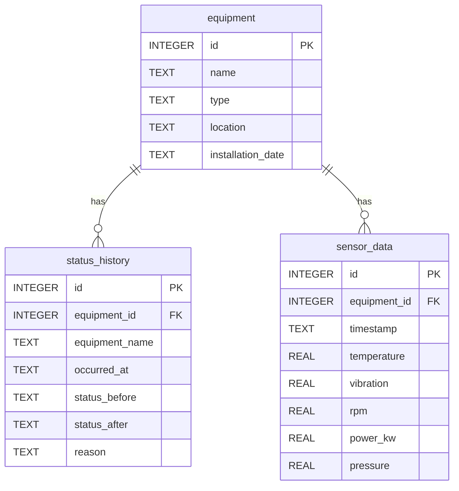

# 設計ドキュメント: 製造設備監視ダッシュボード データ基盤

## Overview

本設計は、製造設備監視ダッシュボードのデータ基盤を構築するためのシードスクリプト（`db/seed.py`）とDBスキーマ（`db/schema.sql`）を定義する。

Excel ファイル（`sample_data.xlsx`）を唯一のデータソースとし、3シート（設備マスタ・ステータス変更履歴・センサーデータ）の全データを SQLite データベースへ投入する。ハードコードされたデータ定数は一切持たない。

### 処理フロー



## Architecture

### ディレクトリ構成

```
project-root/
├── sample_data.xlsx          # データソース（Excel）
├── pyproject.toml
├── db/
│   ├── schema.sql            # DDL定義（テーブル・インデックス）
│   └── seed.py               # シードスクリプト
└── tests/
    └── test_seed.py           # 検証テスト
```

### モジュール構成

`db/seed.py` は単一スクリプトとして設計し、以下の責務を持つ関数群で構成する。外部ライブラリへの依存は `openpyxl`（Excel読み込み）と Python 標準ライブラリの `sqlite3`・`pathlib` のみ。



## Components and Interfaces

### 関数一覧

#### `main() -> None`
エントリーポイント。全体の処理フローを制御する。

#### `validate_excel(excel_path: Path) -> Workbook`
- Excel ファイルの存在確認とシート名検証を行う
- 期待するシート名: `設備マスタ`, `ステータス変更履歴`, `センサーデータ`
- 検証失敗時は `SystemExit` を送出して処理を終了する
- 成功時は `openpyxl.Workbook` オブジェクトを返す

#### `create_database(db_path: Path, schema_path: Path) -> sqlite3.Connection`
- 既存DBファイルが存在する場合は削除する
- 新規DBを作成し、`schema.sql` を読み込んでテーブル・インデックスを作成する
- 外部キー制約を有効化（`PRAGMA foreign_keys = ON`）する
- `sqlite3.Connection` オブジェクトを返す

#### `insert_equipment(ws: Worksheet, cursor: sqlite3.Cursor) -> int`
- 設備マスタシートの全行を読み込み、行インデックス（0始まり）+ 1 を `id` として設定する
- 投入件数を返す

#### `insert_status_history(ws: Worksheet, cursor: sqlite3.Cursor) -> int`
- ステータス変更履歴シートの全行を読み込み、テーブルへ投入する
- 投入件数を返す

#### `insert_sensor_data(ws: Worksheet, cursor: sqlite3.Cursor) -> int`
- センサーデータシートの全行を読み込み、テーブルへ投入する
- NaN 値は Python の `None` に変換して SQL の NULL として投入する
- 投入件数を返す

#### `load_and_insert_data(wb: Workbook, conn: sqlite3.Connection) -> dict[str, int]`
- 単一トランザクション内で3テーブルへのデータ投入を実行する
- エラー発生時はロールバックし、例外を再送出する
- 各テーブルの投入件数を辞書で返す: `{"equipment": N, "status_history": N, "sensor_data": N}`

#### `print_summary(counts: dict[str, int]) -> None`
- 各テーブルのレコード件数を標準出力に表示する
- 「シード完了」メッセージを表示する

### NaN 値の処理

openpyxl で Excel を読み込む際、空セルは `None` として取得される。ただし、Excel 上で数式エラーや特殊な値が入っている場合に備え、以下のロジックで NaN を検出・変換する:

```python
import math

def to_sql_value(value):
    """Excel セル値を SQL 投入用の値に変換する"""
    if value is None:
        return None
    if isinstance(value, float) and math.isnan(value):
        return None
    return value
```

## Data Models

### schema.sql

```sql
-- 設備マスタ
CREATE TABLE IF NOT EXISTS equipment (
    id                INTEGER PRIMARY KEY,
    name              TEXT NOT NULL,
    type              TEXT NOT NULL,
    location          TEXT NOT NULL,
    installation_date TEXT NOT NULL
);

-- ステータス変更履歴
CREATE TABLE IF NOT EXISTS status_history (
    id              INTEGER PRIMARY KEY AUTOINCREMENT,
    equipment_id    INTEGER NOT NULL,
    equipment_name  TEXT NOT NULL,
    occurred_at     TEXT NOT NULL,
    status_before   TEXT NOT NULL,
    status_after    TEXT NOT NULL,
    reason          TEXT NOT NULL,
    FOREIGN KEY (equipment_id) REFERENCES equipment(id)
);

-- センサーデータ
CREATE TABLE IF NOT EXISTS sensor_data (
    id            INTEGER PRIMARY KEY AUTOINCREMENT,
    equipment_id  INTEGER NOT NULL,
    timestamp     TEXT NOT NULL,
    temperature   REAL,
    vibration     REAL,
    rpm           REAL,
    power_kw      REAL,
    pressure      REAL,
    FOREIGN KEY (equipment_id) REFERENCES equipment(id)
);

-- インデックス
CREATE INDEX IF NOT EXISTS idx_status_history_equip_time
    ON status_history(equipment_id, occurred_at);

CREATE INDEX IF NOT EXISTS idx_sensor_data_equip_time
    ON sensor_data(equipment_id, timestamp);
```

### テーブル間リレーション



### Excel → DB カラムマッピング

| Excel シート | Excel カラム | DB テーブル | DB カラム | 変換ロジック |
|---|---|---|---|---|
| 設備マスタ | （行インデックス+1） | equipment | id | 0始まりインデックス + 1 |
| 設備マスタ | 設備名 | equipment | name | そのまま |
| 設備マスタ | タイプ | equipment | type | そのまま |
| 設備マスタ | 設置場所 | equipment | location | そのまま |
| 設備マスタ | 設置日 | equipment | installation_date | 文字列としてそのまま |
| ステータス変更履歴 | 設備ID | status_history | equipment_id | そのまま（整数） |
| ステータス変更履歴 | 設備名 | status_history | equipment_name | そのまま |
| ステータス変更履歴 | 発生日時 | status_history | occurred_at | ISO8601文字列としてそのまま |
| ステータス変更履歴 | 変更前ステータス | status_history | status_before | そのまま |
| ステータス変更履歴 | 変更後ステータス | status_history | status_after | そのまま |
| ステータス変更履歴 | 理由 | status_history | reason | そのまま |
| センサーデータ | 設備ID | sensor_data | equipment_id | そのまま（整数） |
| センサーデータ | タイムスタンプ | sensor_data | timestamp | ISO8601文字列としてそのまま |
| センサーデータ | temperature | sensor_data | temperature | NaN → NULL |
| センサーデータ | vibration | sensor_data | vibration | NaN → NULL |
| センサーデータ | rpm | sensor_data | rpm | NaN → NULL |
| センサーデータ | power_kw | sensor_data | power_kw | NaN → NULL |
| センサーデータ | pressure | sensor_data | pressure | NaN → NULL |

