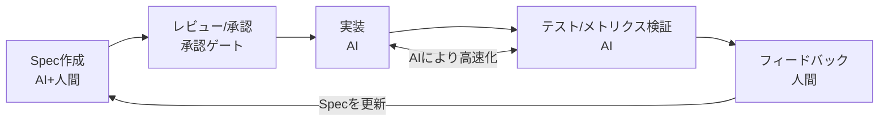

# ch1: Spec駆動開発 - プロジェクト基盤 & DB

## 概要

製造設備モニタリングダッシュボードのデータ基盤を構築します。

Excelファイル(`sample_data.xlsx`) が用意されています。こちらを解析して、

* テーブルを作成する `schema.sql`
  * 設備マスタ
  * センサー時系列データ
  * ステータス変更履歴
* テーブルへ投入するスクリプト `seed.py`

## 体験すること

KiroのSpec駆動ワークフローを使い、製造設備モニタリングダッシュボードのデータ基盤を構築します。
Vibeモードでのデータ解析、Specモードでの仕様策定（要件定義→設計→タスク分解）、タスク実行によるコード生成を一連の流れで体験します。

### Spec駆動開発とは

Spec駆動開発は、AIに対して構造化された仕様書を入力として与え、コードを生成させる開発手法です。自然言語プロンプトから即座にコードを生成するVibe Codingとは異なり、Requirements（要件定義）→ Design（設計）→ Tasks（タスク分解）の3ステップで進行します。成果物はバージョン管理されるMarkdownファイルとして永続化されます。

### Spec駆動開発の課題

Spec駆動開発にはいくつかの課題が指摘されています。

- 要件→設計→実装という順序的プロセスがウォーターフォールに似ており、ソフトウェア開発の非決定的な性質と相性が悪い
- 単純なバグ修正が4つのユーザーストーリー・16の受け入れ基準に膨張するなど、小さな変更に対して過剰になりやすい
- コードの進化に合わせて仕様を同期し続けるメンテナンスコストが増大する
- 包括的な仕様を与えても、AIエージェントが指示を誤解・無視するケースがある
- LLMの出力は確率的であり、Specどおりに実装される保証はない。実装後の正確性を検証する仕組みが未整備で、テストやコードレビューは人間が担う必要がある
- 既存の開発プロセスを変えずにSDDを導入した場合、Specレビューという重い工程が単純に1つ追加されるだけになる


### それでもSpec駆動が重要な理由

SDDはウォーターフォールではなく、繰り返しを前提としたループ構造です。AIが実装→テスト→フィードバックのサイクルを高速化することで、日単位での反復が可能になります。



このループ構造には2つの重要なポイントがあります。

1つ目は検証可能性です。Specの振る舞い仕様がユニットテストと結びつくことで、Specから下流の検証まで自動化されます。理想的にはコードレビューを大幅に軽減できます。

2つ目はフィードバックループです。Specは一度きりのものではなく、仮説と要件を一時的にFixした反復プロセスです。フィードバックから得られた知見をSpecに反映し、永続的な仕様として蓄積していきます。このサイクルが短いことを前提に成り立っている考え方です。

歴史的にも、COBOL（1959年）は「英語でプログラムを書ける」ことを目指しましたが、プログラマーは不要にならず、仕事がより高い抽象度へ移行しました。MDD（2000年代）やNo-Code（2010年代）も同様のパターンを辿っています。Spec駆動開発もコードをなくすことが目的ではなく、AIに渡す前に意図を構造化し、高速なフィードバックループの中で仕様を洗練させていく手法です。

## 1. Vibeモードでエクセルの内容を解析する

### 1.1. モード選択
* Vibeモードを選択
* モデルがOpus 4.6になっていることを確認


### 1.2. エクセル解析プロンプトを入力

> [!IMPORTANT]
> こちらはコピペをせずに直に入力してください。以下の画像のように`#`を使ってファイル選択するのがポイントです。以下のプロンプトを入力します。

```text
#sample_data.xlsx を添付します。

以下の観点で構造を分析してください。

1. シート一覧と各シートの役割
2. 各シートのカラム構成（列名・データ型・サンプル値）
3. シート間の関連性（IDの参照関係など）
4. データの件数や値の傾向

結果はシートごとにまとめてください。
```


* [ ] エクセルシートと比較して、ざっくりあっていることを確認してください


### 1.4. 解析結果をSteeringに登録する

以下のプロンプトを入力して、解析結果をSteeringに登録します。

```text
上記の解析結果をSteeringに登録してください。
```

`.kiro/steering/sample-data-analysis.md` が作成されていることを確認してください。


> [!NOTE]
> 今回は機能紹介も含めてSteeringに登録しています。そのまま内容をコピーして渡しても問題ないです。ただしエクセルフォーマットなどは、今後も活用する可能性が高いケースは、このようにxxxエクセルの仕様ということで登録すると効率がよくなります。

* [ ] 出力された内容がSteeringにざっくり書かれていることを確認してください

## 2. SpecモードでSQLiteに登録するseed.pyを作成する

### 2.1. モード選択

* Specモードを選択
* モデルがOpus 4.6になっていることを確認
* Requirementsを選択

````text
エクセルをインプットに、データを投入する seed.py を作成します。
seed.py にハードコードされたデータ定数は一切持たせず、全てのデータをExcelから読み込んでください。
Excelのシート構造の詳細はSteeringを参照してください。

## 作りたいもの

製造設備の稼働状況をリアルタイムで監視するダッシュボードアプリのデータ基盤です。シードスクリプトで初期データを投入します。

## 技術スタック

- Python 3.12以上
- SQLite（ファイルベースDB）

## specに含めてほしい内容

1. ディレクトリ構成
2. DBスキーマ定義 — Excelのデータ構造をもとにCREATE TABLE文を設計
3. シードデータ投入ロジック
4. 検証方法 — 動作確認コマンド
````

### 2.2. 要件定義書(requirements.md) の作成

* 作成されたら、Open Previewでマークダウンをレビュー
* 今回はハンズオンのためレビューは以下のみ確認で問題ないです(後の進行に影響はないため)
  * seed.pyやdata/factory.dbが作成されること
  * テーブルが3つ作成されること

1. 要件 1: ディレクトリ構成とプロジェクト構造
2. 要件 2: DBスキーマ定義 — 設備マスタテーブル
3. 要件 3: DBスキーマ定義 — ステータス変更履歴テーブル
4. 要件 4: DBスキーマ定義 — センサーデータテーブル
5. 要件 5: Excelデータ読み込みロジック
6. 要件 6: シードデータ投入ロジック
7. 要件 7: データ整合性の検証
8. 要件 8: エラーハンドリング

### 2.3. 設計ファイル(design.md) の作成

* 作成されたら、Open Previewでマークダウンをレビュー
* 今回はハンズオンのためレビューは以下のみ確認で問題ないです(後の進行に影響はないため)
  * seed.pyやdata/factory.dbが作成されること
  * テーブルが3つ作成されること

Continueを押下し、Generate Tasksを押下します。


### 2.3. 設計ファイル(task.md) の作成

作成したら、Sonnet 4.6に変更してタスクを進めます。


* タスクは一つずつ実行してください
* タスクが全て終わるまでトライしてみてください

```
自分でテストしたい場合、テストの実行方法とSQLiteの実行方法両方教えて
```

## 3. 検証

エクセルの内容がDBに入っていることがざっくり確認できること

```bash
# シードスクリプト単体実行
uv run python db/seed.py

# テスト実行（現在はフィクスチャのみ）
uv run pytest tests/test_seed.py -v

# sqlite3 CLIで接続
sqlite3 db/equipment_monitoring.db

# よく使うクエリ
.tables                          -- テーブル一覧
.schema equipment                -- スキーマ確認

SELECT COUNT(*) FROM equipment;
SELECT COUNT(*) FROM status_history;
SELECT COUNT(*) FROM sensor_data;

SELECT * FROM equipment;
SELECT * FROM sensor_data WHERE equipment_id = 1 LIMIT 5;

-- 外部キー確認
PRAGMA foreign_key_list(status_history);

.quit
```

